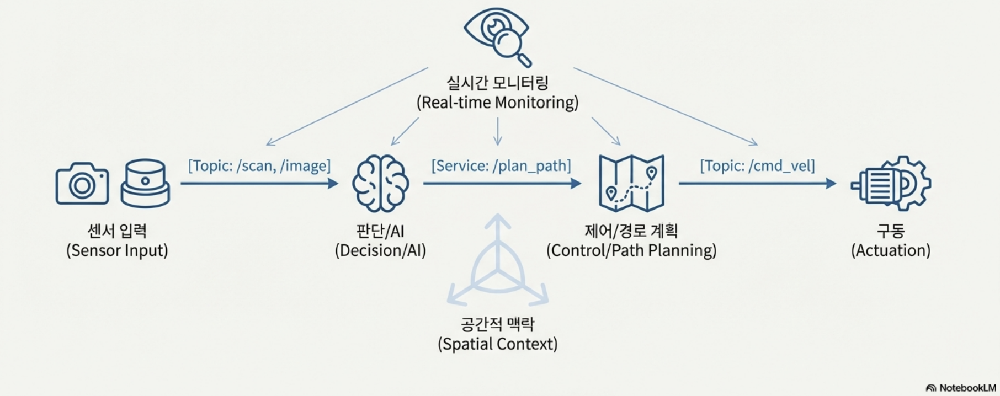
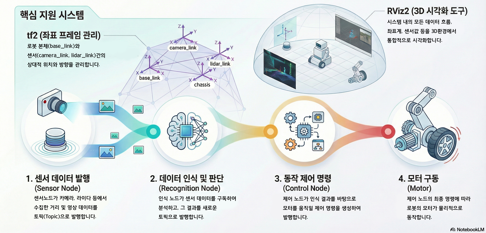

# 01 ROS2의 이해

## 01_1 ROS2 개요

ROS2는 로봇의 '뇌'와 '몸'을 연결하는 신경망 같은 플랫폼입니다. 센서가 보고, AI가 판단하고, 모터가 움직이는 모든 과정을 하나의 통신 시스템으로 묶어 로봇이 유기적으로 동작하게 돕습니다. 조금 더 구체적으로는, 분산 컴퓨팅 기반의 로봇 개발 프레임워크로서, 각 기능을 독립적인 노드(Node)로 구성하고 이들 간의 실시간 데이터 통신을 지원하여 복잡한 로봇 시스템의 통합 관리를 가능하게 합니다.

> ※ 여기서 말하는 신경망은 AI의 신경망이 아니라, 로봇 내부 기능들을 연결하는 통신 구조를 의미합니다.

## 01_2 ROS2의 핵심 구성 요소

ROS2의 핵심 구성 요소는 다음과 같습니다.

| 구성 요소 | 역할 |
|---|---|
| 노드(Node) | 로봇 기능을 담당하는 실행 프로그램 |
| 통신 방식(Topic/Service/Action) | 노드들이 데이터를 주고받는 방식(DDS 기반) |
| 좌표 체계(tf2) | 로봇과 센서의 위치·방향 관계 관리 |
| 시각화(RViz2) | 로봇 데이터를 3D 화면으로 확인 |

ROS 2는 각 기능을 독립적인 '노드'로 분리하여 관리합니다. 센서 노드가 데이터를 발행하면, 인식 노드가 이를 구독하여 판단하고, 제어 노드가 최종 명령을 모터로 전달합니다. 이 모든 과정은 RViz2를 통해 실시간으로 모니터링되며, tf2가 제공하는 정확한 위치 정보를 바탕으로 정밀하게 수행됩니다.

### 1. 노드(Node)

ROS2에서 노드는 하나의 기능을 담당하는 프로그램 단위이며, 여러 노드가 동시에 실행되며 서로 협력합니다. 예를 들어, 카메라 노드가 촬영한 영상을 AI 노드가 분석하고, 그 결과를 바퀴 제어 노드가 전달받아 로봇을 움직입니다.

대표적인 노드의 예는 다음과 같습니다.

- 카메라 노드
- 라이다 노드
- 인공지능 노드
- 바퀴 제어 노드

### 2. 통신 방식 (Topic/Service/Action)

ROS2에서 통신 방식은 Topic, Service, Action 세 가지가 있습니다.

| 통신 방식 | 특징 | 사용 예 |
|---|---|---|
| 토픽(Topic) | 계속 전달되는 데이터 | 센서 값, 영상, 속도 |
| 서비스(Service) | 한 번 요청 → 한 번 응답 | 상태 확인 |
| 액션(Action) | 완료까지 시간이 걸리는 작업 | 이동, 물체 집기 |

#### ▶ 토픽(Topic): 멈추지 않는 데이터 스트림

토픽은 멈추지 않는 데이터 스트림을 주고받을 때 사용하는 통신 방식으로 한쪽(Publisher)에서 계속 정보를 보내면, 다른 쪽(Subscriber)이 이를 구독하는 통신 방식입니다. 지속적으로 갱신되는 데이터 송수신에 적합합니다.

예를 들어, 다음과 같은 정보를 주고받기에 적합니다.

- 카메라 영상
- 라이다 거리 데이터
- 로봇 속도 명령

#### ▶ 서비스(Service): 필요할 때만 묻고 답하기

서비스는 요청(Request)을 보내고, 이에 대한 한 번의 응답(Response)을 받으면 통신이 종료되는 통신 방식입니다. 일반적으로 상태 확인처럼 짧은 질의에 적합합니다.

예를 들어, 다음과 같은 데이터를 주고받기에 적합니다.

- 배터리 잔량 확인
- 로봇 현재 작동 모드 확인

#### ▶ 액션(Action): 긴 작업을 맡기고 진행 상황 받기

액션(Action)은 목표(Goal)를 전달하면 작업이 진행되는 동안 중간 진행 상황(Feedback)을 받을 수 있고, 작업이 완료되면 최종 결과(Result)를 전달받는 통신 방식입니다. 또한, 필요할 경우 작업을 중단할 수도 있습니다.

예를 들어, 다음과 같은 동작을 처리할 때 사용됩니다.

- 목표 지점까지 2m 이동하기
- 테이블 위 물체를 집어 옮기기

> **정리:** 일반적으로 ROS2에서 Topic은 센서 데이터나 제어 명령과 같이 지속적으로 갱신되는 정보를 주고받는 데 사용됩니다. Service는 로봇이나 센서의 상태를 조회하거나 설정을 변경할 때 사용되며, Action은 여러 개의 하위 동작으로 구성된 상위 수준의 작업을 제어할 때 사용됩니다.

### 3. 좌표 체계(tf2)

로봇에는 여러 기준 좌표가 존재합니다. 예를 들어, 로봇 본체를 기준으로 한 좌표, 카메라를 기준으로 한 좌표, 지도(Map)를 기준으로 한 좌표 등이 있습니다. tf2는 이러한 여러 좌표 프레임(Frame) 간의 관계를 시간에 따라 트리 구조로 관리하고, 좌표 간 변환을 가능하게 하는 라이브러리입니다.

tf2의 주요 역할은 다음과 같습니다.

- 센서 데이터의 위치를 정확하게 계산
- 서로 다른 좌표 기준의 데이터를 일관되게 해석

### 4. 시각화(RViz2)

RViz2는 ROS2의 대표적인 3D 시각화 도구로, 로봇 내부에서 오가는 다양한 데이터를 화면에서 직접 확인할 수 있게 해줍니다.

RViz2를 사용하면 다음과 같은 항목들을 확인할 수 있습니다.

- 센서 데이터가 정상적으로 들어오는가?
- 좌표(tf)가 올바르게 연결되어 있는가?
- 로봇 모델이 기대한 자세와 위치로 표시되는가?
- 알고리즘 결과(경로, 마커 등)가 의도대로 생성되는가?
