# 02 ROS2 개발 환경 구성하기

> 여기서는 ROS2 프로그래밍에 필요한 개발 환경을 구성합니다.

## 02_1 WSL 설치하기

WSL은 윈도우즈에서 리눅스 환경을 제공하는 가상 환경입니다.

1. cmd를 검색합니다.


2. [명령 프롬프트]를 관리자 권한으로 실행합니다.

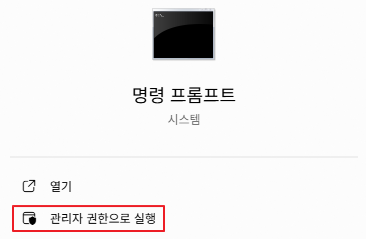

3. 다음과 같이 명령을 실행합니다.

```bash
wsl --install --no-distribution
```

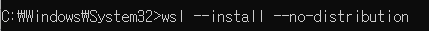

**명령 설명:**

| 명령 | 설명 |
|---|---|
| `wsl --install` | 자동으로 기본 리눅스 배포판(Ubuntu 등)까지 함께 설치 |
| `--no-distribution` | 리눅스 배포판은 설치하지 않고 WSL 기능만 설치. <br> WSL의 런타임(커널, 실행 환경)은 깔리지만, Ubuntu 같은 Linux OS는 포함되지 않음. |

4. 설치 후, PC 재부팅을 수행합니다.

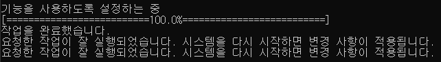

---

## 02_2 Docker 설치하기

* 도커(Docker)는 프로그램을 실행하는 데 필요한 모든 준비물을 한 번에 담아주는 가상 상자라고 생각하면 됩니다.
* 이 상자 안에는 프로그램뿐만 아니라, 실행에 필요한 라이브러리와 설정까지 모두 들어 있습니다.
* 그래서 내 컴퓨터가 Windows이든, Linux이든, 또는 다른 사람의 PC이든 상관없이, 이 상자만 있으면 항상 같은 환경에서 같은 방식으로 프로그램을 실행할 수 있습니다.

1. [docker for windows download]를 검색합니다.


2. 다음 사이트로 들어갑니다.

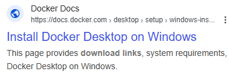

3. 다음 버튼을 클릭하여 프로그램을 다운로드합니다.

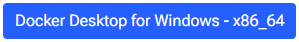

4. 기본 상태로 설치를 진행합니다.

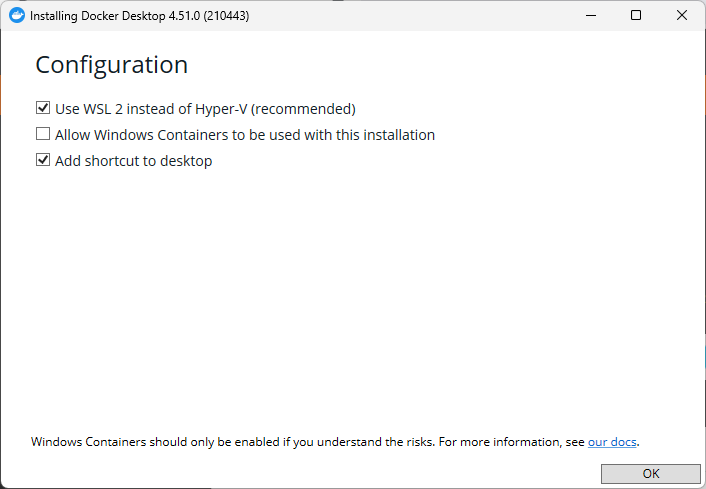

5. 설치 마지막 창에서 [Close and restart] 버튼을 눌러 컴퓨터를 재부팅합니다.

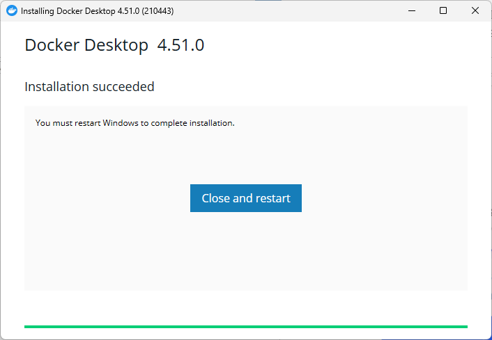

6. 재부팅 후, 다음 창이 뜹니다. [Accept] 버튼을 누릅니다.

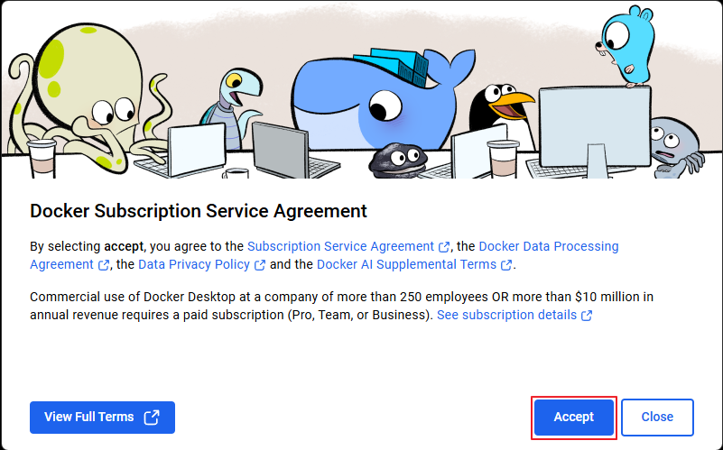

7. 다음 창에서 [Skip] 링크를 누릅니다.

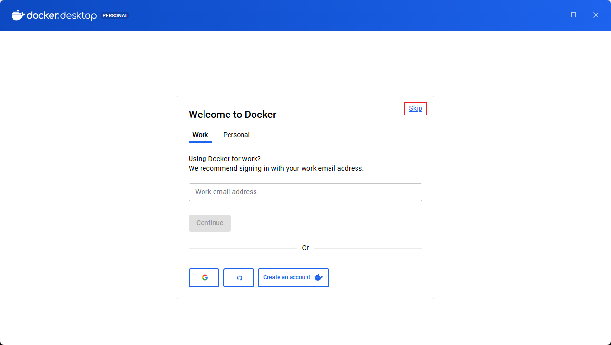

8. 다음 창이 뜨면 도커가 구동됩니다. 창을 닫아줍니다. 도커 프로그램은 백그라운드로 실행되고 있습니다.

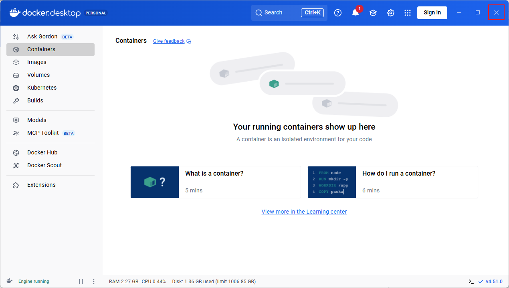

9. 다음 창도 닫아줍니다.

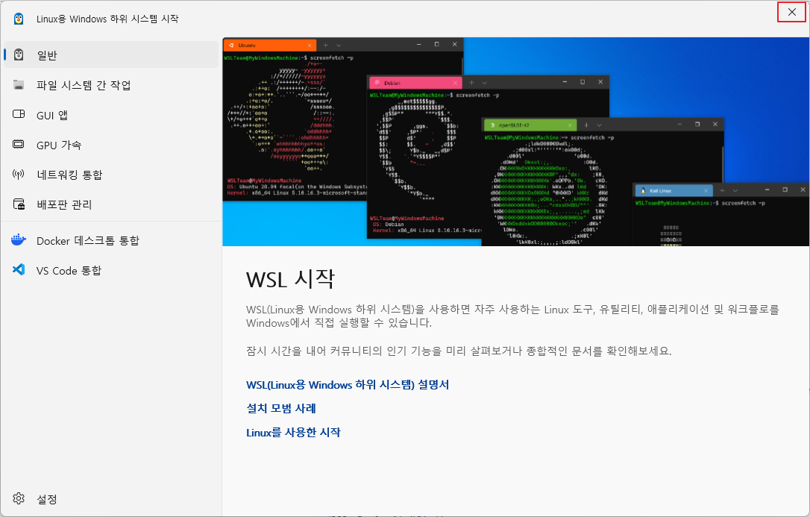

10. 하단 작업창에서  (숨겨진 아이콘 표시)를 클릭한 후, 도커가 백그라운드로 실행되고 있는 것을 확인합니다.

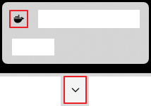

---

## 02_3 VcXsrv 설치하기

* VcXsrv는 Windows 환경에서 리눅스용 GUI 애플리케이션의 화면을 볼 수 있게 해주는 Windows용 X 서버 프로그램입니다.
* WSL이나 원격 리눅스 시스템에서 실행되는 그래픽 프로그램의 출력을 사용자의 Windows 바탕 화면에 띄워주는 역할을 합니다.

1. 다음 사이트에서 VcXsrv 프로그램을 받아 설치합니다.

> https://sourceforge.net/projects/vcxsrv

2. 기본 상태로 설치합니다.

3. VcXsrv 프로그램을 처음으로 실행합니다.

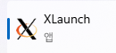

4. Display number를 0으로 설정합니다.

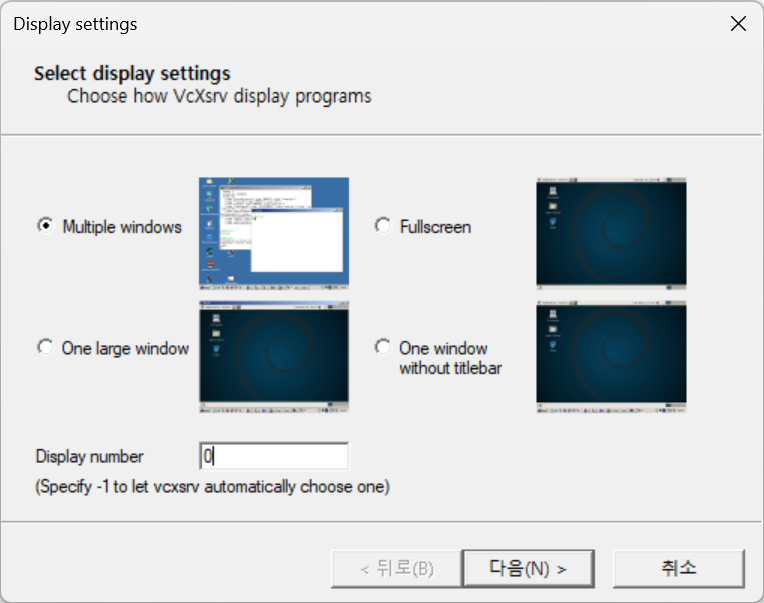

5. 다음 > 다음 > 다음 > 마침 버튼을 차례로 눌러줍니다. VcXsrv 프로그램은 백그라운드로 실행되고 있습니다.

6. 하단 작업창에서 VcXsrv가 백그라운드로 실행되고 있는 것을 확인합니다.

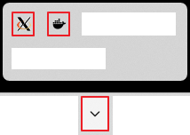

## 02_4 VS Code 설치하기

VS Code(Visual Studio Code)는 마이크로소프트가 개발한 무료이며 가볍고 강력한 코드 편집기입니다. 다양한 프로그래밍 언어(Python, JavaScript, C++ 등)를 지원하며, 디버깅, Git 통합 등의 필수 기능을 기본으로 제공합니다.

1. 다음과 같이 [vscode download]를 검색합니다.


2. 다음 사이트로 들어갑니다.

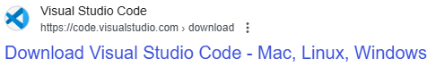

3. 다음과 같이 윈도우즈 용 프로그램을 다운로드 받습니다.

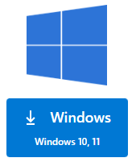

4. 기본 상태로 설치를 진행합니다.

5. [VS Code]를 실행합니다.

6. 다음과 같이 [확장 팩]에서 [Remote Development] 검색한 후 설치합니다.

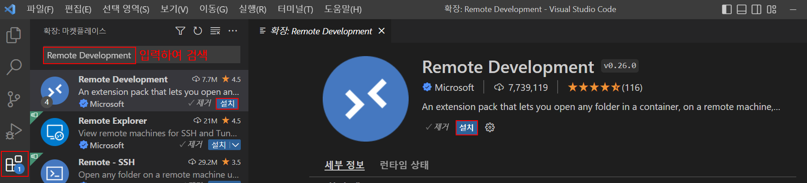

## 02_5 Docker 컨테이너 구동하기

Docker 컨테이너는 프로그램과 실행 환경을 하나로 묶은 격리된 상자입니다. 덕분에 어떤 컴퓨터에서도 동일하게 프로그램을 실행할 수 있습니다. 여기서는 ROS2 jazzy 실행 환경을 지원하는 Docker 이미지를 다운로드 받아 사용합니다.

1. 검색창에서 power를 검색합니다.

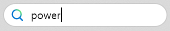

2. [Windows PowerShell] 프로그램을 실행합니다.

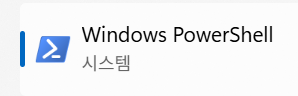

3. 다음과 같이 ros:jazzy 도커 컨테이너를 실행합니다.

```bash
docker run -it --name ros_jazzy1 -p 8765:8765 -v /mnt:/mnt --privileged -v /dev:/dev -e DISPLAY=host.docker.internal:0.0 -e LIBGL_ALWAYS_INDIRECT=0 ros:jazzy
```

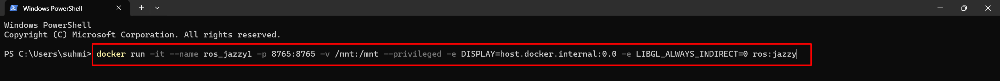

> ※ 도커 컨테이너 최초 실행 시에는 컨테이너 이미지를 다운로드 후, 실행하기 때문에 다소 시간이 걸립니다.

4. ros:jazzy 도커 컨테이너에 접속한 것을 확인합니다.

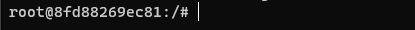


> ※ ros:jazzy 이미지는 우분투(Ubuntu) 24.04(Noble Numbat)을 기본 운영체제(Base OS)로 사용하는 컨테이너 이미지입니다.

```bash
cat /etc/os-release
```

## 02_6 ros2 패키지 설치하기

여기서는 ROS2 jazzy 실행과 시각화, 로봇 상태 관리, 내비게이션, 파일 탐색 및 이미지 처리에 필요한 다양한 패키지를 설치합니다.

1. 다음 쉘에서 ros2 패키지 설치를 진행합니다.


3. 다음과 같이 ros2 패키지를 설치합니다.

```bash
time {
apt update
apt install ros-jazzy-xacro -y
apt install ros-jazzy-rviz2 -y
apt install ros-jazzy-joint-state-publisher-gui -y
apt install ros-jazzy-tf-transformations -y
apt install ros-jazzy-nav2-bringup -y
apt install ros-jazzy-teleop-twist-keyboard -y
apt install ros-jazzy-ros-gz -y
apt install ros-jazzy-gz-ros2-control -y
apt install ros-jazzy-ros2controlcli -y
apt install ros-jazzy-ros2-control -y
apt install ros-jazzy-ros2-controllers -y
apt install ros-jazzy-twist-stamper -y
apt install xterm -y
apt install nano -y
apt install tree -y
apt install imagemagick -y
}
```

## 02_7 .bashrc 설정하기

.bashrc는 Bash 셸이 시작될 때 자동으로 실행되는 설정 파일입니다. 여기에는 환경 변수, 별칭, 경로(PATH) 설정 등 사용자가 원하는 초기 설정을 저장할 수 있습니다.

명령행에서 다음과 같이 입력합니다. 제공되는 스크립트를 복사하여 붙여넣습니다.

```bash
echo "source /opt/ros/jazzy/setup.bash" >> ~/.bashrc
echo 'export GZ_SIM_SYSTEM_PLUGIN_PATH=$GZ_SIM_SYSTEM_PLUGIN_PATH:/opt/ros/jazzy/lib' >> ~/.bashrc
echo "cd" >> ~/.bashrc
source ~/.bashrc
```

> ※ .bashrc는 docker 접속 시 bash 쉘이 읽고 초기화하는 파일입니다.
> ※ ctrl+p, q를 눌러 종료합니다.

## 02_8 Docker 컨테이너 다중 접속하기

ROS2를 구동하려면 여러 프로그램이 필요하므로, 다양한 터미널 창을 사용해야 합니다. 여기서는 Docker 컨테이너에 다중 접속하는 방법을 소개합니다.

1. [실행중인 도커 데스크탑]을 클릭합니다.

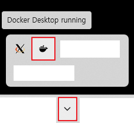

2. [도커 데스크탑]에 컨테이너가 실행중인 것을 확인합니다.

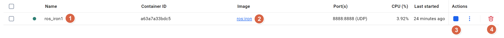


| 번호 | 설명 |
|---|---|
| 1 | 도커 컨테이너의 이름 |
| 2 | 도커 이미지 |
| 3 | 컨테이너의 실행을 멈추거나 다시 시작할 수 있는 버튼 |
| 4 | 도커 컨테이너를 더 이상 사용하지 않고 지우고자 할 경우 사용 |

3. [Windows PowerShell] 창을 선택하고 [shift + alt + -(빼기)]를 누릅니다.

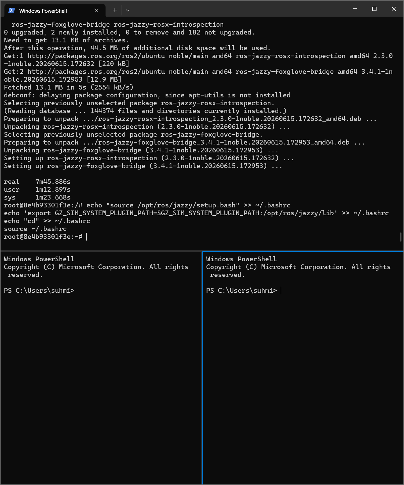

> ※ [PowerShell]을 닫고자 할 경우엔 exit 명령을 입력한 후, 엔터키를 누릅니다.

4. 명령을 입력하여 ros_jazzy1 도커 컨테이너에 접속합니다.

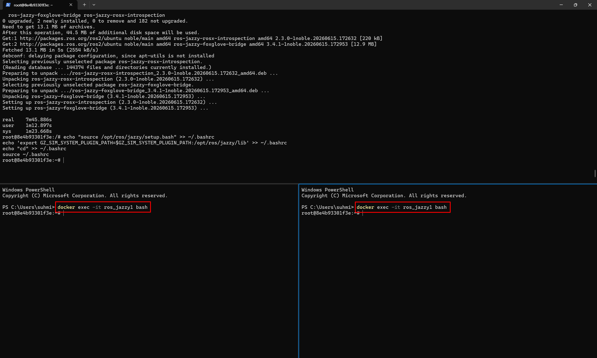

```bash
docker exec -it ros_jazzy1 bash
```

5. [PowerShell]이 더 필요한 경우 [+] 버튼을 누릅니다.

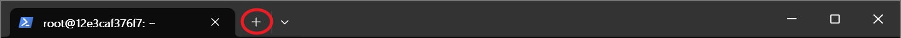

6. [Windows PowerShell] 탭이 추가됩니다.

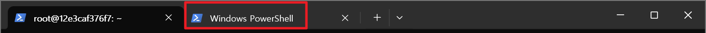

7. [shift + alt + -(빼기)]를 눌러 창을 하나 추가한 후, 같은 방식으로 ros_jazzy1 도커 컨테이너에 접속해 봅니다.

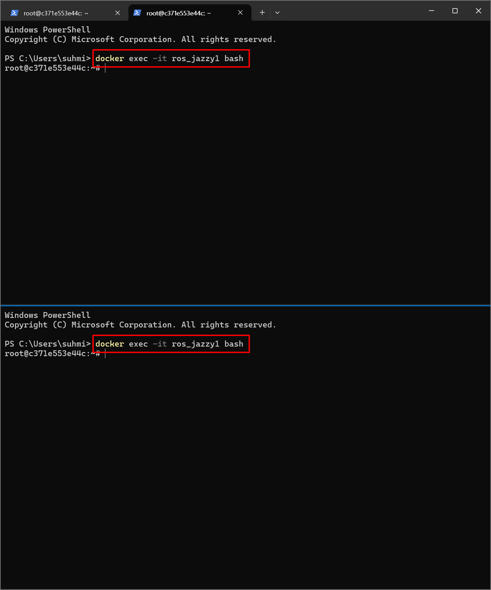

> ※ 이 책에서는 명령을 수행하기 위해 여러 개의 쉘이 필요합니다. 쉘은 PowerShell을 이용하여 띄우거나 VS Code를 이용하여 띄울 수 있습니다.

## 02_9 VS Code로 ros:jazzy에 접속하기

이후의 ROS2 프로그래밍은 VS Code를 통해 수행합니다. VS Code로 앞에서 설치한 ros:jazzy에 접속해야 합니다.

1. VS Code를 실행합니다.

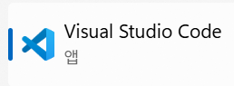

2. [View]-[Command Palette...] 메뉴를 선택합니다.

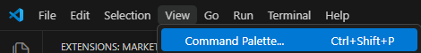

3. [Dev Containers: Attach to Running Container]을 검색하여 선택합니다.

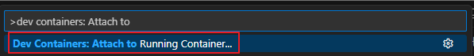

4. 경고 창이 뜨면 [Got It] 버튼을 누릅니다.

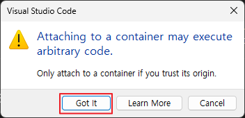

5. 현재 실행중인 도커 컨테이너 이름이 뜹니다. [엔터] 키를 눌러 선택합니다.

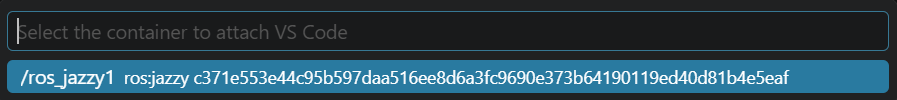

6. 새로 창이 뜹니다. 처음엔 설정 시간이 몇 분 정도 걸립니다. 설정이 끝나면 다음과 같은 창이 뜹니다.

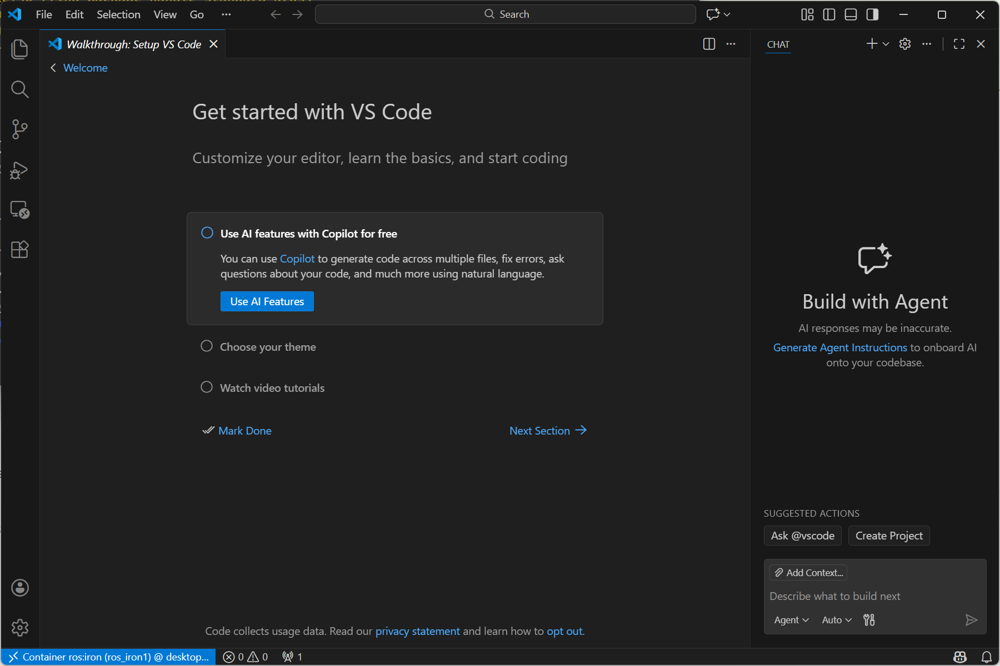

7. [File]-[Open Folder...] 메뉴를 선택합니다.

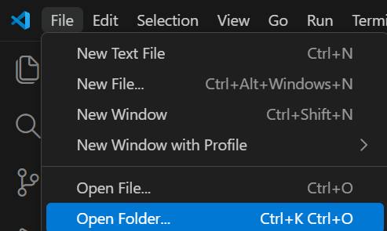

8. /root/를 선택한 후, [OK] 버튼을 누릅니다.

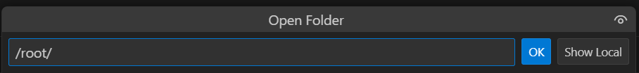

9. 폴더가 열리는 것을 확인합니다.

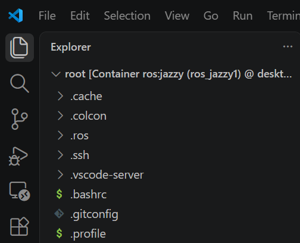

> ※ 현재 /root 디렉토리가 열린 상태입니다. 이 디렉토리 아래에서 모든 작업을 수행합니다.

10. [View]--[Terminal] 메뉴를 선택합니다.

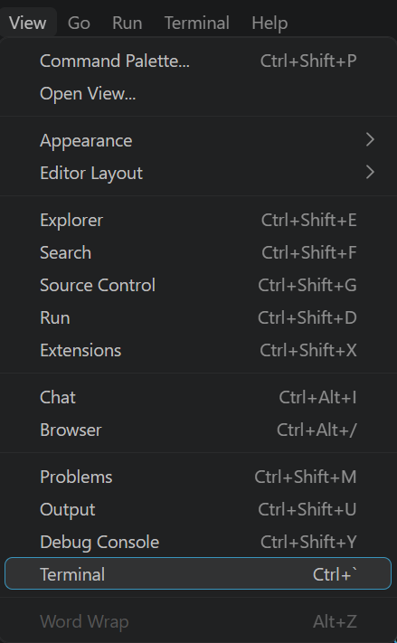

11. 터미널이 열립니다.

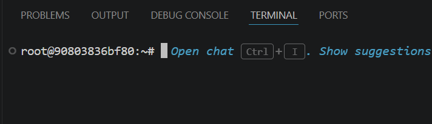

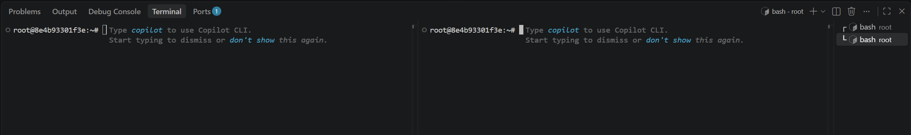
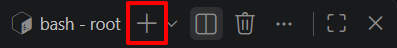

> ※ VS Code에서는 `docker exec -it ros_jazzy1 bash` 명령을 사용하지 않아도 됩니다.

12. 추가로 쪼개진 터미널이 필요할 경우 Split Terminal 아이콘을 눌러줍니다.

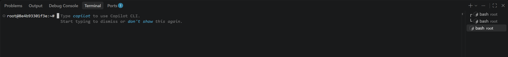

13. 터미널을 닫을 경우는 exit 명령을 입력해 줍니다.

14. 새로운 터미널이 필요할 경우 New Terminal 아이콘을 눌러줍니다.

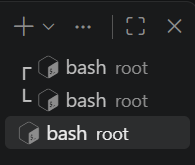

15. 쉘을 옮겨다니기 위해서는 우측의 아이콘을 이용합니다.

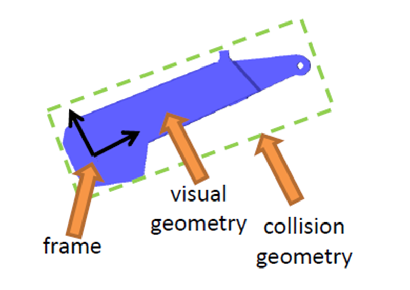
