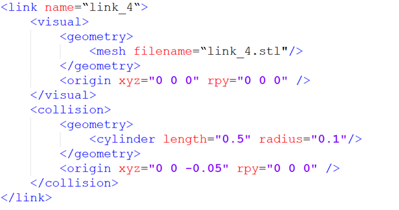
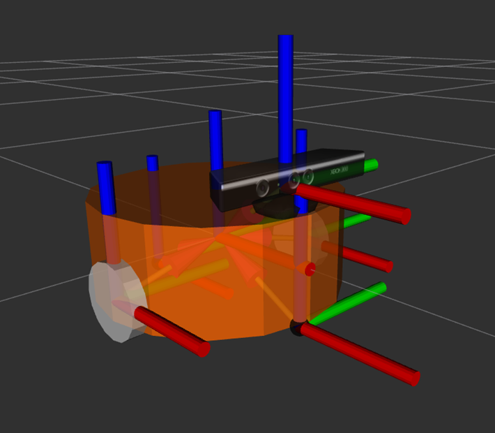
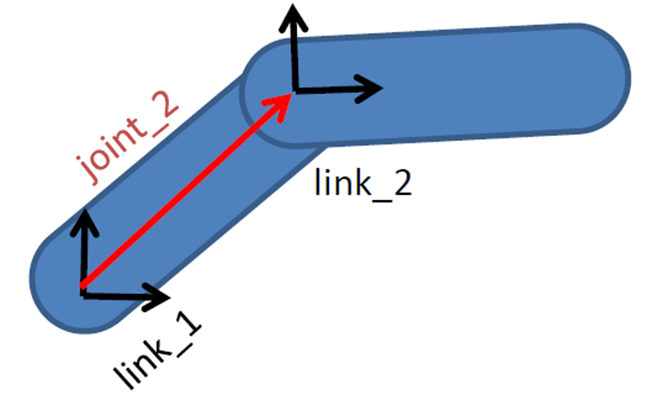
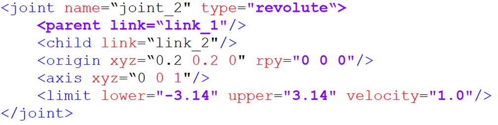
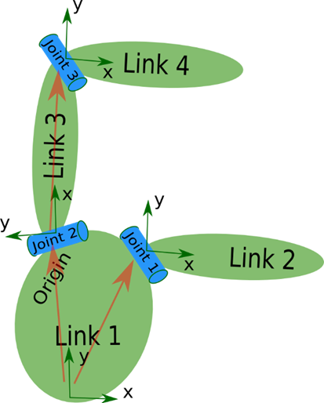
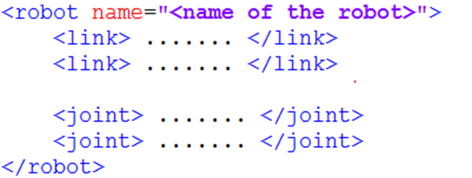

# 03 URDF의 이해

## 03_1 URDF 개요

ROS에서 사용하는 로봇 모델링 방식을 URDF라고 하며, Unified Robot Description Format의 약자입니다. URDF는 로봇의 기하학적 형태, 질량 특성뿐 아니라 로봇을 구성하는 각 관절(Joint)의 특성까지 명확하게 표현할 수 있습니다. URDF 모델 파일은 XML 형식을 사용합니다.

로봇 모델링 과정은 모델링 언어를 사용하여 로봇의 각 구성 요소를 명확하게 정의한 다음, 정의된 아이디어에 따라 그것들을 결합하는 과정이라고 할 수 있습니다.

## 03_2 URDF 문법 살펴보기

### 링크(Link) 기술하기

`<link>` 태그는 로봇의 강체(rigid body) 부분의 외형과 물리적 속성을 기술하는 데 사용됩니다. 외형에는 크기, 색상, 형태가 포함되고, 물리적 속성에는 질량(mass), 관성 행렬(inertia matrix), 충돌(collision) 파라미터 등이 포함됩니다.

링크를 기술한 내용을 살펴보겠습니다.

link 태그의 name은 링크의 이름을 나타냅니다. 우리는 이 이름을 원하는 대로 지정할 수 있으며, 이후에 조인트를 링크와 연결할 때 사용됩니다.

link의 첫 번째 섹션은 로봇의 외형(appearance)을 설명합니다.

- `<geometry>`는 기하학적 형태를 나타냅니다. `<mesh>`는 3D 소프트웨어에서 미리 제작한 외형을 불러오는 데 사용됩니다.
- `<origin>`은 초기 위치에 대한 좌표계의 오프셋을 나타내며, x, y, z 방향의 평행이동과 roll, pitch, yaw 회전을 포함합니다.

두 번째 섹션인 `<collision>`은 충돌 관련 파라미터를 설명합니다.

- `<visual>`은 로봇의 외형, 즉 시각적인 표현을 설명합니다.
- `<collision>`은 로봇이 움직이는 동안 외부와의 접촉(충돌)을 어떻게 판단할지를 설명합니다.

이동 로봇의 경우, link는 로봇의 바디(body), 바퀴(wheel), 그리고 기타 구성 요소들을 표현하는 데도 사용할 수 있습니다.

### 조인트(Joint) 기술하기

로봇 모델의 모든 강체(rigid body)는 결국 조인트(joint)를 통해 연결되어야 하며, 이를 통해 서로 상대적인 움직임을 생성할 수 있습니다.

URDF에서 조인트는 다음과 같은 6가지 운동 유형을 가집니다.

| 유형 | 설명 | 예시 |
|---|---|---|
| **Continuous** | 회전 운동. 특정 축을 기준으로 무한히 회전 가능 | 전동차나 자동차의 바퀴 |
| **Revolute** | 회전 조인트이지만 회전 범위가 제한됨 | 로봇 팔의 두 링크를 연결하는 조인트 |
| **Prismatic** | 슬라이딩 조인트. 특정 축을 따라 직선 이동 가능 | 선형 모터(linear actuator) |
| **Fixed** | 어떠한 움직임도 허용하지 않음. 매우 자주 사용됨 | 로봇 본체에 고정된 카메라 링크 |
| **Floating** | 공간에서 6자유도 운동을 허용 | 비교적 특수한 경우 |
| **Planar** | 평면 상에서의 운동을 허용 | 흔히 사용되지 않음 |

URDF 모델에서 각 링크는 XML 형식으로 기술되며, 조인트의 이름과 운동 방식과 같은 정보가 포함됩니다.

- **parent 태그**: 부모 링크를 설명합니다.
- **child 태그**: 자식 링크를 설명하며, 부모 링크를 기준으로 상대적으로 움직이는 링크입니다.
- **origin**: 두 링크 좌표계 사이의 관계를 나타냅니다.
- **axis**: 조인트의 운동 축을 나타내는 단위 벡터입니다. 예를 들어 z가 1이면, 양의 z축을 기준으로 회전함을 의미합니다.
- **limit**: 조인트의 운동 제한을 나타내며, 최소 위치, 최대 위치, 최대 속도 등이 포함됩니다.

### 완전한 로봇 모델 기술하기

모든 link와 joint 태그를 통해 로봇의 각 부품이 기술되고 서로 연결됩니다. 이들을 하나의 robot 태그 안에 배치하면 완전한 로봇 모델이 구성됩니다.

> URDF 모델을 볼 때는, 처음부터 각 코드 블록의 세부 사항에 매달릴 필요가 없습니다. 먼저 link와 joint를 찾아 로봇이 어떤 구성 요소로 이루어져 있는지 파악합니다. 그리고 전체 구조를 이해한 후에 세부 사항을 살펴보는 것이 좋습니다.
