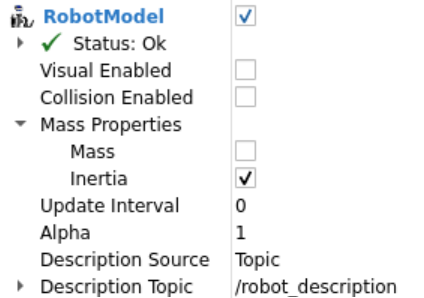
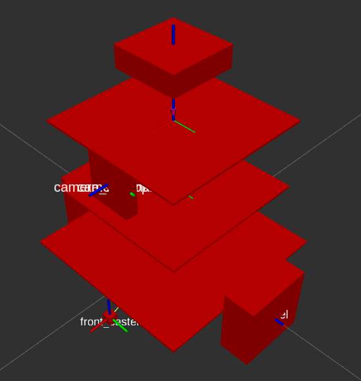
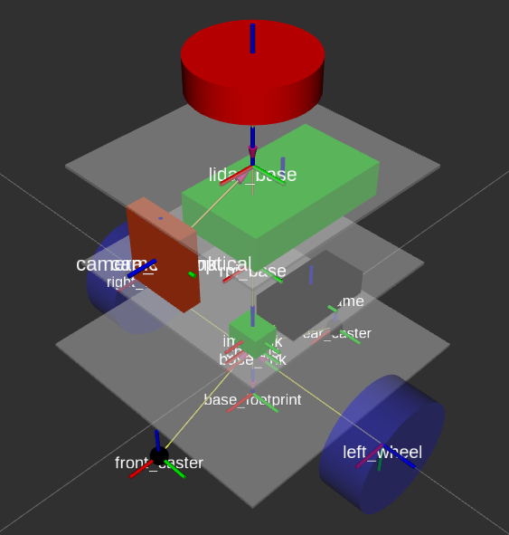

# 04_16 inertial 태그 추가하기

* 여기서는 inertial 태그를 추가합니다. inertial 태그는 링크의 질량과 관성 모멘트, 그리고 무게중심 위치(origin)를 정의하는 요소로,
* 가제보 물리 엔진이 로봇의 움직임과 힘의 반응을 계산하는 데 사용됩니다.
* 이 값이 없거나 부정확하면 시뮬레이션에서 로봇이 비정상적으로 튕기거나 쓰러지는 등 불안정한 거동이 나타날 수 있습니다.

## 1. 파일을 작성합니다.

**inertial_macros.xacro**

```xml
<?xml version="1.0"?>
<robot xmlns:xacro="http://www.ros.org/wiki/xacro" >

    <!-- Specify some standard inertial calculations -->
    <!-- https://en.wikipedia.org/wiki/List_of_moments_of_inertia -->

    <xacro:macro name="inertial_sphere" params="mass radius *origin">
        <inertial>
            <xacro:insert_block name="origin"/>
            <mass value="${mass}" />
            <inertia ixx="${(2/5) * mass * (radius*radius)}" ixy="0.0" ixz="0.0"
                    iyy="${(2/5) * mass * (radius*radius)}" iyz="0.0"
                    izz="${(2/5) * mass * (radius*radius)}" />
        </inertial>
    </xacro:macro>  


    <xacro:macro name="inertial_box" params="mass x y z *origin">
        <inertial>
            <xacro:insert_block name="origin"/>
            <mass value="${mass}" />
            <inertia ixx="${(1/12) * mass * (y*y+z*z)}" ixy="0.0" ixz="0.0"
                    iyy="${(1/12) * mass * (x*x+z*z)}" iyz="0.0"
                    izz="${(1/12) * mass * (x*x+y*y)}" />
        </inertial>
    </xacro:macro>


    <xacro:macro name="inertial_cylinder" params="mass length radius *origin">
        <inertial>
            <xacro:insert_block name="origin"/>
            <mass value="${mass}" />
            <inertia ixx="${(1/12) * mass * (3*radius*radius + length*length)}" ixy="0.0" ixz="0.0"
                    iyy="${(1/12) * mass * (3*radius*radius + length*length)}" iyz="0.0"
                    izz="${(1/2) * mass * (radius*radius)}" />
        </inertial>
    </xacro:macro>

</robot>
```

> 본 관성(inertial) 계산 매크로는 ROS2 커뮤니티에 널리 알려진 표준 패턴을 기반으로 하며, Articulated Robotics 튜토리얼의 구성을 참고했습니다.

## 2. 예제를 수정합니다. (전체 robot_core_diffdrive.xacro 파일에 inertial 태그가 추가됩니다.)

**robot_core_diffdrive.xacro**

```xml
<?xml version="1.0"?>
<robot xmlns:xacro="http://www.ros.org/wiki/xacro">

    <xacro:include filename="inertial_macros.xacro"/>

    <material name="white">
        <color rgba="1 1 1 0.5"/>
    </material>

    <material name="orange">
        <color rgba="1 0.3 0.1 1"/>
    </material>

    <material name="blue">
        <color rgba="0.2 0.2 1 0.5"/>
    </material>

    <material name="black">
        <color rgba="0 0 0 1"/>
    </material>

    <material name="green">
        <color rgba="0 1 0 1"/>
    </material>

    <material name="red">
        <color rgba="1 0 0 1"/>
    </material>

    <!-- BASE LINK -->

    <link name="base_link">
    </link>

    <!-- CHASSIS -->
    
    <joint name="chassis_joint" type="fixed">
        <parent link="base_link"/>
        <child link="chassis"/>
        <origin xyz="0 0 0.0058" rpy="0 0 0"/>
    </joint>

    <link name="chassis">
        <visual>
            <geometry>
                <box size="0.15 0.15 0.0016"/>
            </geometry>
            <material name="white"/>
        </visual>
        <collision>
            <geometry>
                <box size="0.15 0.15 0.0016"/>
            </geometry>
        </collision>        
        <xacro:inertial_box mass="0.3" x="0.15" y="0.15" z="0.0016">
            <origin xyz="0 0 0" rpy="0 0 0"/>
        </xacro:inertial_box>
    </link>

    <!-- LEFT WHEEL -->

    <joint name="left_wheel_joint" type="continuous">
        <parent link="base_link"/>
        <child link="left_wheel"/>
        <origin xyz="0 0.0907 0" rpy="-${pi/2} 0 0"/>
        <axis xyz="0 0 1"/>
    </joint>

    <link name="left_wheel">
        <visual>
            <geometry>
                <cylinder length="0.026" radius="0.0325" />
            </geometry>
            <material name="blue"/>
        </visual>
        <collision>
            <geometry>
                <cylinder length="0.026" radius="0.0325" />
            </geometry>
        </collision>        
        <xacro:inertial_cylinder mass="0.06" length="0.026" radius="0.0325">
            <origin xyz="0 0 0" rpy="0 0 0"/>
        </xacro:inertial_cylinder>
    </link>

    <!-- RIGHT WHEEL -->

    <joint name="right_wheel_joint" type="continuous">
        <parent link="base_link"/>
        <child link="right_wheel"/>
        <origin xyz="0 -0.0907 0" rpy="${pi/2} 0 0"/>
        <axis xyz="0 0 -1"/>
    </joint>

    <link name="right_wheel">
        <visual>
            <geometry>
                <cylinder length="0.026" radius="0.0325" />
            </geometry>
            <material name="blue"/>
        </visual>
        <collision>
            <geometry>
                <cylinder length="0.026" radius="0.0325" />
            </geometry>
        </collision>    
        <xacro:inertial_cylinder mass="0.06" length="0.026" radius="0.0325">
            <origin xyz="0 0 0" rpy="0 0 0"/>
        </xacro:inertial_cylinder>
    </link>

    <!-- FRONT CASTER -->

    <joint name="front_caster_joint" type="fixed">
        <parent link="chassis"/>
        <child link="front_caster"/>
        <origin xyz="0.0695 0 -0.0333" rpy="0 0 0"/>
    </joint>

    <link name="front_caster">
        <visual>
            <geometry>
                <sphere radius="0.005" />
            </geometry>
            <material name="black"/>
        </visual>
        <collision>
            <geometry>
                <sphere radius="0.005" />
            </geometry>
        </collision>
        <xacro:inertial_sphere mass="0.005" radius="0.005">
            <origin xyz="0 0 0" rpy="0 0 0"/>
        </xacro:inertial_sphere>
    </link>

    <!-- REAR CASTER -->

    <joint name="rear_caster_joint" type="fixed">
        <parent link="chassis"/>
        <child link="rear_caster"/>
        <origin xyz="-0.0695 0 -0.0333" rpy="0 0 0"/>
    </joint>

    <link name="rear_caster">
        <visual>
            <geometry>
                <sphere radius="0.005" />
            </geometry>
            <material name="black"/>
        </visual>        
        <collision>
            <geometry>
                <sphere radius="0.005" />
            </geometry>
        </collision>
        <xacro:inertial_sphere mass="0.005" radius="0.005">
            <origin xyz="0 0 0" rpy="0 0 0"/>
        </xacro:inertial_sphere>
    </link>

    <!-- ESP32S3DEVKITC1 -->

    <joint name="esp32s3_joint" type="fixed">
        <parent link="chassis"/>
        <child link="esp32s3_frame"/>
        <origin xyz="-0.045 0 0.008" rpy="0 0 0"/>
    </joint>
    <link name="esp32s3_frame">
        <visual>
            <geometry>
                <box size="0.056 0.028 0.016"/>
            </geometry>
            <material name="black"/>
        </visual>
        <collision>
            <geometry>
                <box size="0.056 0.028 0.016"/>
            </geometry>
        </collision>
        <xacro:inertial_box mass="0.01" x="0.056" y="0.028" z="0.016">
            <origin xyz="0 0 0" rpy="0 0 0"/>
        </xacro:inertial_box>
    </link>

    <!-- IMU -->

    <joint name="imu_joint" type="fixed">
        <parent link="chassis"/>
        <child link="imu_link"/>
        <origin xyz="0 0 0.008" rpy="0 0 0"/>
    </joint>
    <link name="imu_link">
        <visual>
            <geometry>
                <box size="0.0155 0.02 0.0126"/>
            </geometry>
            <material name="green"/>
        </visual>
        <collision>
            <geometry>
                <box size="0.0155 0.02 0.0126"/>
            </geometry>
        </collision>
        <xacro:inertial_box mass="0.01" x="0.0155" y="0.02" z="0.0126">
            <origin xyz="0 0 0" rpy="0 0 0"/>
        </xacro:inertial_box>
    </link>

    <!-- RPI BASE -->

    <joint name="rpi_base_joint" type="fixed">
        <parent link="chassis"/>
        <child link="rpi_base"/>
        <origin xyz="0 0 0.0566" rpy="0 0 0"/>
    </joint>
    <link name="rpi_base">
        <visual>
            <geometry>                
                <box size="0.12 0.12 0.0016"/>
            </geometry>
            <material name="white"/>
        </visual>
        <collision>
            <geometry>                
                <box size="0.12 0.12 0.0016"/>
            </geometry>
        </collision>
        <xacro:inertial_box mass="0.05" x="0.12" y="0.12" z="0.0016">
            <origin xyz="0 0 0" rpy="0 0 0"/>
        </xacro:inertial_box>
    </link>	

    <!-- RPI5 -->

    <joint name="rpi_joint" type="fixed">
        <parent link="rpi_base"/>
        <child link="rpi_frame"/>
        <origin xyz="-0.02 0 0.0316" rpy="0 0 0"/>
    </joint>
    <link name="rpi_frame">
        <visual>
            <geometry>
                <box size="0.085 0.049 0.0192"/>
            </geometry>
            <material name="green"/>
        </visual>
        <collision>
            <geometry>
                <box size="0.085 0.049 0.0192"/>
            </geometry>
        </collision>
        <xacro:inertial_box mass="0.15" x="0.085" y="0.049" z="0.0192">
            <origin xyz="0 0 0" rpy="0 0 0"/>
        </xacro:inertial_box>
    </link>

    <!-- LIDAR BASE -->

    <joint name="lidar_base_joint" type="fixed">
        <parent link="rpi_base"/>
        <child link="lidar_base"/>
        <origin xyz="0 0 0.0566" rpy="0 0 0"/>
    </joint>
    <link name="lidar_base">
        <visual>
            <geometry>                
                <box size="0.12 0.12 0.0016"/>
            </geometry>
            <material name="white"/>
        </visual>
        <collision>
            <geometry>                
                <box size="0.12 0.12 0.0016"/>
            </geometry>
        </collision>
        <xacro:inertial_box mass="0.05" x="0.12" y="0.12" z="0.0016">
            <origin xyz="0 0 0" rpy="0 0 0"/>
        </xacro:inertial_box>
    </link>

    <!-- LIDAR -->

    <joint name="laser_joint" type="fixed">
        <parent link="lidar_base"/>
        <child link="laser_frame"/>
        <origin xyz="0 0 0.047" rpy="0 0 0"/>
    </joint>

    <link name="laser_frame">
        <visual>
            <geometry>
                <cylinder radius="0.0296" length="0.016"/>
            </geometry>
            <material name="red"/>
        </visual>
        <collision>
            <geometry>
                <cylinder radius="0.0296" length="0.016"/>
            </geometry>
        </collision>
        <xacro:inertial_cylinder mass="0.15" radius="0.0296" length="0.016">
            <origin xyz="0 0 0" rpy="0 0 0"/>
        </xacro:inertial_cylinder>
    </link>

    <!-- CAMERA FRAME -->

    <joint name="camera_joint" type="fixed">
        <parent link="lidar_base"/>
        <child link="camera_link"/>
        <origin xyz="0.055 0 -0.02" rpy="0 0 0"/>
    </joint>

    <link name="camera_link">
        <visual>        
            <geometry>
                <box size="0.01 0.034 0.04"/>
            </geometry>
            <material name="orange"/>
        </visual>
        <collision>        
            <geometry>
                <box size="0.01 0.034 0.04"/>
            </geometry>
        </collision>
        <xacro:inertial_box mass="0.02" x="0.01" y="0.034" z="0.04">
            <origin xyz="0 0 0" rpy="0 0 0"/>
        </xacro:inertial_box>
    </link>      

    <!-- CAMERA OPTICAL -->
    
    <joint name="camera_optical_joint" type="fixed">
        <parent link="camera_link"/>
        <child link="camera_link_optical"/>
        <origin xyz="0 0 0" rpy="${-pi/2} 0 ${-pi/2}"/>
    </joint>

    <link name="camera_link_optical">
    </link>

    <!-- BASE_FOOTPRINT LINK -->

    <joint name="base_footprint_joint" type="fixed">
        <parent link="base_footprint"/>
        <child link="base_link"/>
        <origin xyz="0 0 0.0325" rpy="0 0 0"/>
    </joint>

    <link name="base_footprint">
    </link>

</robot>
```

## 3. URDF 파일을 저장한 후, 명령을 재구동합니다.

```
ros2 run robot_state_publisher robot_state_publisher --ros-args -p robot_description:="$(xacro /root/myros_sketch/robot.urdf.xacro)"
```

## 4. RViz2 좌측 하단에 있는 reset 버튼을 누릅니다.


## 5. RobotModel에서 Visual Enabled 항목과 Collision Enabled 항목을 언체크하고, Mass Properties의 Mass 항목은 체크, Inertia 항목은 언체크하고 결과를 확인합니다.

 

## 6. Visual Enabled 항목과 Collision Enabled 항목을 언체크하고, Mass Properties의 Mass 항목은 언체크, Inertia 항목은 체크하고 결과를 확인합니다.

 

## 7. Visual Enabled 항목은 체크, Collision Enabled 항목은 언체크, Mass Properties의 Mass 항목과 Inertia 항목은 언체크하여 최초 상태로 돌려 놓습니다.


## 8. 표시되는 것을 확인합니다.


