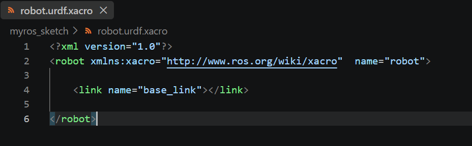
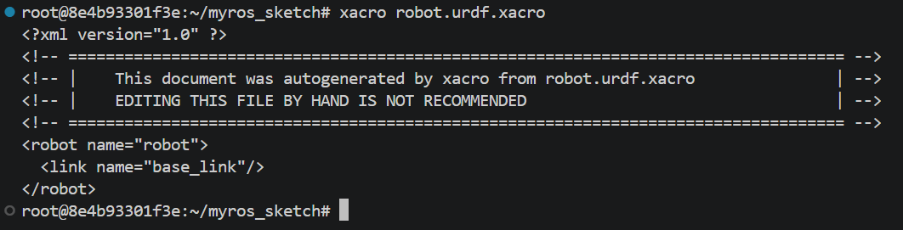
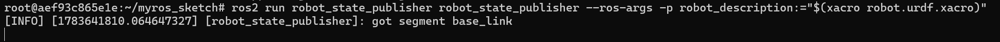
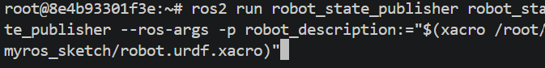

# 04_2 base_link 정의하기

먼저 URDF 파일에 base_link를 정의합니다.

> **base_link**는 로봇 모델에서 가장 기본이 되는 기준 링크로, 모든 다른 링크의 기준점 역할을 합니다. <br> 차동 구동 로봇의 경우 일반적으로 양쪽 바퀴 축의 중간 지점을 base_link로 설정합니다.

<br>

---

<br>

## base_link 정의하기

### 1. 파일을 작성합니다.

**robot.urdf.xacro**

```xml
<?xml version="1.0"?>
<robot xmlns:xacro="http://www.ros.org/wiki/xacro"  name="robot">

    <link name="base_link"></link>

</robot>
```

### 2. 파일을 닫았다 다시 열어줍니다.



### 3. 문법을 체크해 봅니다.

```bash
xacro /root/myros_sketch/robot.urdf.xacro
```
문법에 문제가 없을 경우 파일의 내용이 화면에 출력됩니다.




<br>

---

<br>

## robot_state_publisher 실행하기

* 다음은 robot_state_publisher를 실행합니다. robot_state_publisher는 URDF를 기반으로 조인트 상태를 받아 각 링크의 좌표 변환(TF)을 계산합니다. 
* 즉, URDF는 구조 정보를 제공하고, robot_state_publisher는 이 정보를 사용해 실시간 로봇 상태를 발행하는 역할을 합니다.

### 1. 명령을 실행합니다.

```bash
ros2 run robot_state_publisher robot_state_publisher --ros-args -p robot_description:="$(xacro /root/myros_sketch/robot.urdf.xacro)"
```

### 2. 그러면 다음과 같이 실행됩니다.




<br>

---

<br>

## robot_core_diffdrive.xacro 파일 포함하기

### 1. urdf 파일을 수정합니다.

**robot.urdf.xacro**

```xml
<?xml version="1.0"?>
<robot xmlns:xacro="http://www.ros.org/wiki/xacro"  name="robot">

    <xacro:include filename="robot_core_diffdrive.xacro" />

</robot>
```

### 2. 파일을 작성합니다.

**robot_core_diffdrive.xacro**

```xml
<?xml version="1.0"?>
<robot xmlns:xacro="http://www.ros.org/wiki/xacro">

    <material name="white">
        <color rgba="1 1 1 0.5"/>
    </material>

    <material name="orange">
        <color rgba="1 0.3 0.1 1"/>
    </material>

    <material name="blue">
        <color rgba="0.2 0.2 1 0.5"/>
    </material>

    <material name="black">
        <color rgba="0 0 0 1"/>
    </material>

    <material name="green">
        <color rgba="0 1 0 1"/>
    </material>

    <material name="red">
        <color rgba="1 0 0 1"/>
    </material>

    <!-- BASE LINK -->

    <link name="base_link">
    </link>

</robot>
```

### 3. 수정한 2개 파일을 저장한 후, 명령을 재구동합니다.

```
ros2 run robot_state_publisher robot_state_publisher --ros-args -p robot_description:="$(xacro /root/myros_sketch/robot.urdf.xacro)"
```



> ※ ctrl+c키를 눌러 수행중인 프로그램을 종료한 후, 윗 방향 키(page up)를 누르면 이전에 수행했던 명령이 자동으로 입력됩니다.

