# 04_3 chassis_joint, chassis 추가하기

다음은 chassis_joint와 chassis를 정의합니다. 이 책에서 다루는 chassis는 메인보드가 됩니다.

> **chassis_joint**는 base_link와 차체(chassis)를 연결하는 관절로, 두 링크 간의 상대적 위치와 자세 관계를 정의합니다.

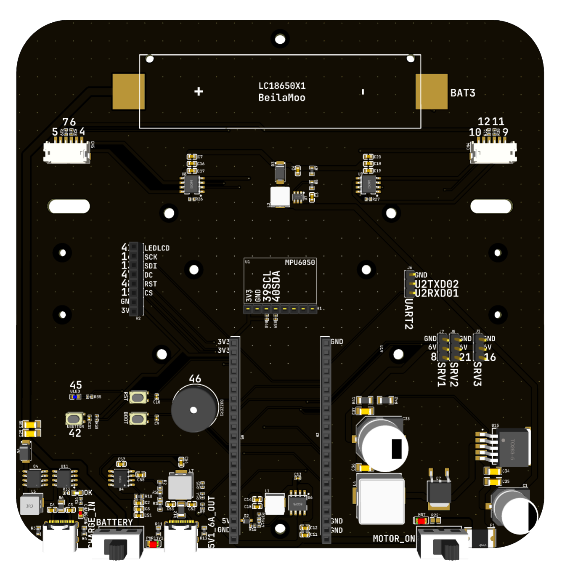

URDF에서 base_link와 chassis_joint 요소를 정의하면 로봇 구조의 최상위 프레임과 차체 연결 방식이 명확하게 설정됩니다.

## 1. 내용을 계속해서 추가합니다.

**robot_core_diffdrive.xacro**

```xml
    ...

    <!-- CHASSIS -->
    
    <joint name="chassis_joint" type="fixed">
        <parent link="base_link"/>
        <child link="chassis"/>
        <origin xyz="0 0 0.0058" rpy="0 0 0"/>
    </joint>

    <link name="chassis">
    </link>

</robot>
```

이 책에서 사용하는 모터는 N20 DC 모터로 다음과 같은 규격을 가집니다.

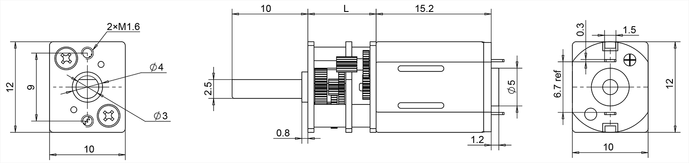

* 모터의 높이는 10mm, 메인보드 PCB의 두께는 1.6mm입니다.
* 모터의 중심축으로부터 메인보드의 중심까지 5mm + 0.8mm = 5.8mm입니다.
* 다음은 chassis_joint가 base_link로부터 z축으로 5.8mm 위쪽에 있음을 나타냅니다.
* 숫자의 단위는 m(미터)입니다.

```xml
<origin xyz="0 0 0.0058" rpy="0 0 0"/>
```

> ※ 참고로, 로봇의 앞쪽이 +x, 왼쪽이 +y입니다.

## 2. URDF 파일을 저장한 후, 명령을 재구동하여 정상적으로 수행되는 것을 확인합니다.

```
ros2 run robot_state_publisher robot_state_publisher --ros-args -p robot_description:="$(xacro /root/myros_sketch/robot.urdf.xacro)"
```

<br>

---

<br>


# RViz2 실행하고 시각화 설정하기

* 다음은 RViz2를 실행하고 시각화 설정을 해 줍니다.
* Rviz2는 robot_state_publisher가 발행하는 TF 정보를 받아 로봇의 현재 위치와 자세를 시각화합니다.

## 1. ② 명령창에서 명령을 수행합니다.

```bash
rviz2
```

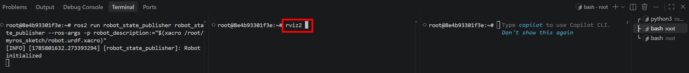

## 2. 다음과 같이 rvz2 프로그램이 실행됩니다.

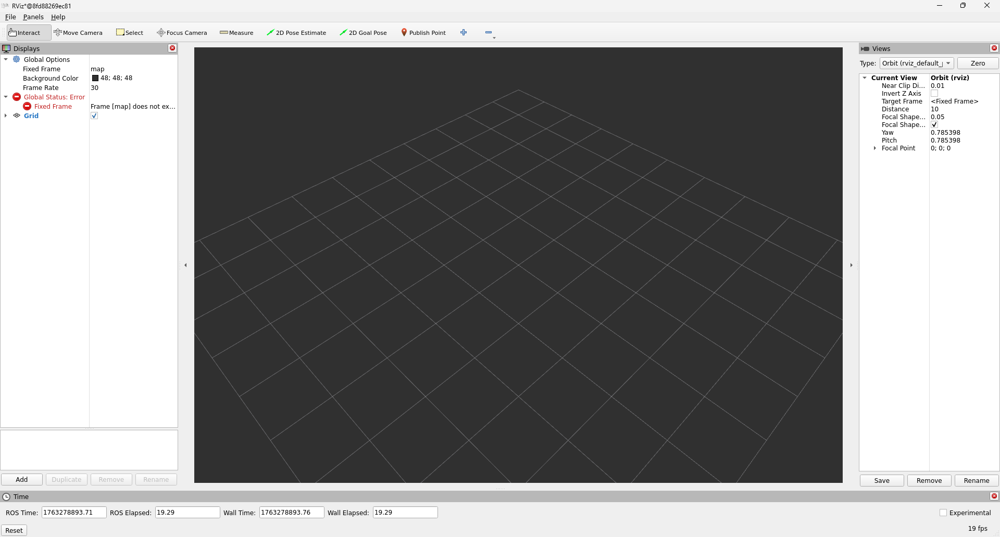

> ※ rviz2 창을 윈도우 상에서 띄우기 위해, VcXsrv 프로그램이 백그라운드로 실행되고 있어야 합니다.

## 3. 다음과 같이 설정합니다.

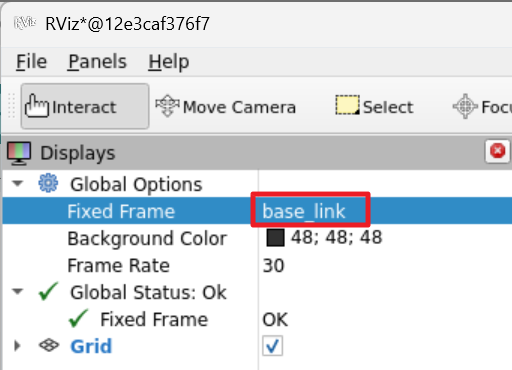

## 4. 좌측 하단에서 [Add] 버튼을 찾아 클릭합니다.


## 5. 다음과 같이 스크롤바를 아래로 내려 [TF]를 선택하고, [OK] 버튼을 누릅니다. 

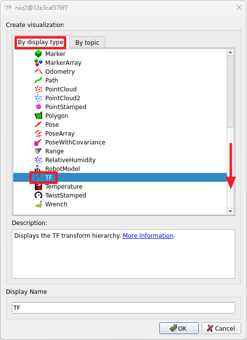

## 6. 다음 순서로 설정을 해 줍니다. 그러면 오른쪽과 같이 TF를 볼 수 있습니다.

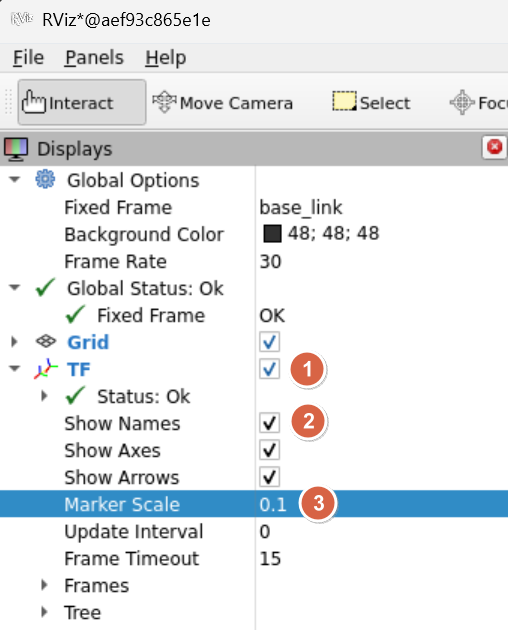  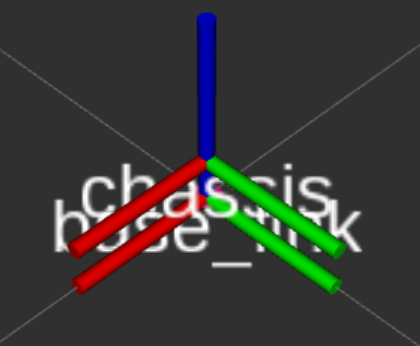

> ※ 마우스 휠을 이용하여 그림을 확대할 수 있습니다. RViz2에서 격자 하나의 크기는 1m x 1m입니다.

## 7. 다음 내용을 계속해서 추가합니다.

**robot_core_diffdrive.xacro**

```xml
    ...

    <!-- CHASSIS -->
    
    <joint name="chassis_joint" type="fixed">
        <parent link="base_link"/>
        <child link="chassis"/>
        <origin xyz="0 0 0.0058" rpy="0 0 0"/>
    </joint>

    <link name="chassis">
        <visual>
            <geometry>
                <box size="0.15 0.15 0.0016"/>
            </geometry>
            <material name="white"/>
        </visual>
    </link>

</robot>
```

## 8. URDF 파일을 저장한 후, 다음 명령을 재구동합니다. 

```
ros2 run robot_state_publisher robot_state_publisher --ros-args -p robot_description:="$(xacro /root/myros_sketch/robot.urdf.xacro)"
```

## 9. rviz2 창 좌측 하단에 있는 다음 버튼을 눌러줍니다.

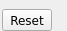

## 10. 다음과 같이 [Add] 버튼을 한 번 더 눌러줍니다.


> ※ base_link는 로봇의 기준이 되는 가장 기본 링크로, chassis는 로봇의 본체를 나타내는 링크로, 이동 로봇에서는 바퀴와 센서가 장착되는 중심 구조입니다.

## 11. 다음과 같이 스크롤바를 아래로 내려 [RobotModel]을 선택하고, [OK] 버튼을 누릅니다.

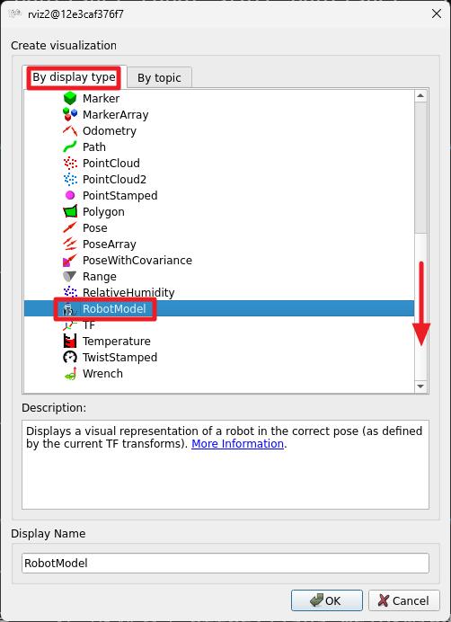

## 12. 다음 순서로 설정을 해 줍니다. 그러면 오른쪽과 같이 RobotModel을 볼 수 있습니다.

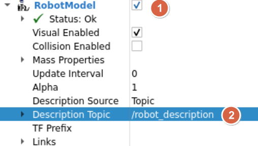 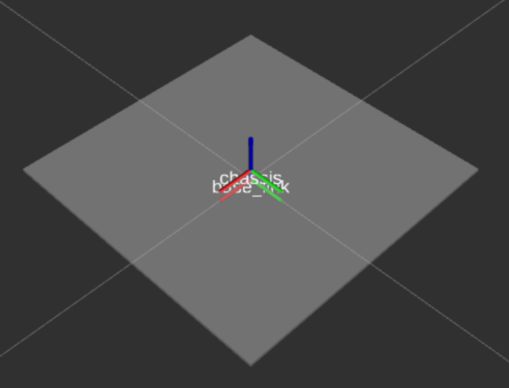

> ※ ➋에서 설정한 /robot_description 토픽은 다음 명령에 빨갛게 표시된 매개변수입니다.

```
ros2 run robot_state_publisher robot_state_publisher --ros-args -p robot_description:="$(xacro /root/myros_sketch/robot.urdf.xacro)"
```

> ※ base_link는 로봇의 기준이 되는 가장 기본 링크로, 다른 모든 링크의 참조 기준이 됩니다. <br> chassis는 로봇의 본체를 나타내는 링크로, 이동 로봇에서는 바퀴와 센서가 장착되는 중심 구조입니다. <br> 일반적으로 chassis는 base_link에 연결되어 로봇의 전체 구조와 움직임을 표현하는 기준이 됩니다.


## 13. 다음과 같이 [File]--[Save Config As] 메뉴를 선택합니다.

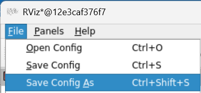


## 14. 다음과 같은 순서로 myros_sketch 폴더 아래 view_bot.rviz로 저장합니다.

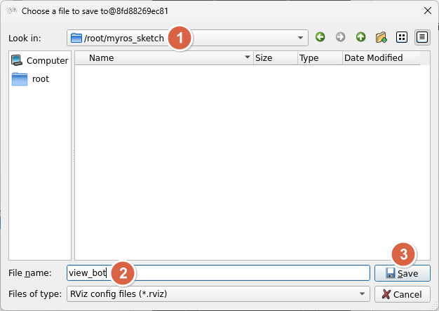

## 15. rviz2 프로그램을 종료한 후, ➁ 창에서 다음과 같이 옵션을 주어 재구동해 봅니다.

```bash
rviz2 -d /root/myros_sketch/view_bot.rviz
```

## 16. 다음과 같이 바로 전에 저장했던 설정 상태로 뜨는 것을 확인합니다.


