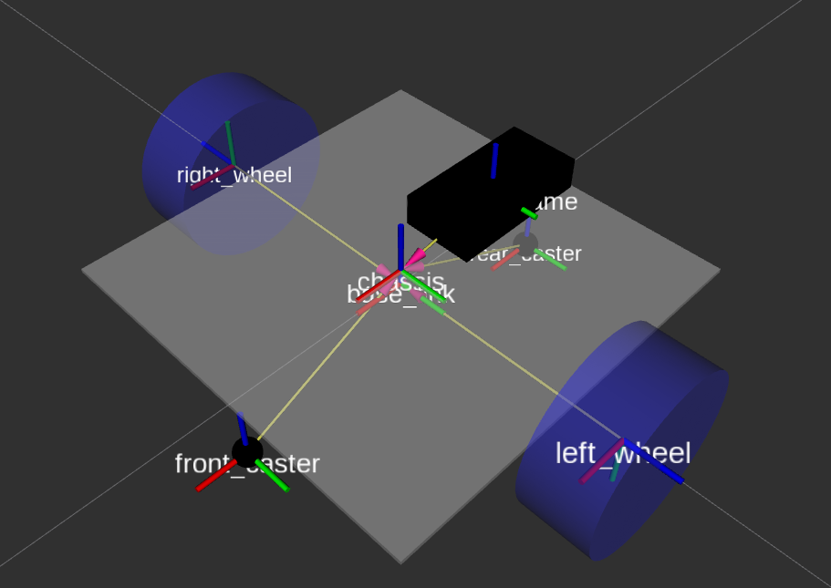

## 04_9 rpi_joint, rpi_frame 추가하기

라즈베리파이5와 관련된 rpi_joint, rpi_frame을 추가합니다.

1. 내용을 계속해서 추가합니다.

**robot_core_diffdrive.xacro**

```xml
    ...

    <!-- RPI5 -->

    <joint name="rpi_joint" type="fixed">
        <parent link="rpi_base"/>
        <child link="rpi_frame"/>
        <origin xyz="-0.02 0 0.0316" rpy="0 0 0"/>
    </joint>
    <link name="rpi_frame">
        <visual>
            <geometry>
                <box size="0.085 0.049 0.0192"/>
            </geometry>
            <material name="green"/>
        </visual>
    </link>

</robot>
```

2. URDF 파일을 저장한 후, 명령을 재구동합니다.

3. RViz2 좌측 하단에 있는 reset 버튼을 누릅니다.

4. 표시되는 것을 확인합니다.


