# 04 URDF로 로봇 구조 정의하기

> 여기서는 앞에서 살펴본 URDF 문법을 이용하여 로봇의 구조와 모양을 정의해 봅니다.

**URDF 작성 순서:**

1. rviz2 시각화를 위한 visual 태그
2. 가제보 시뮬레이션을 위한 collision, inertial 태그

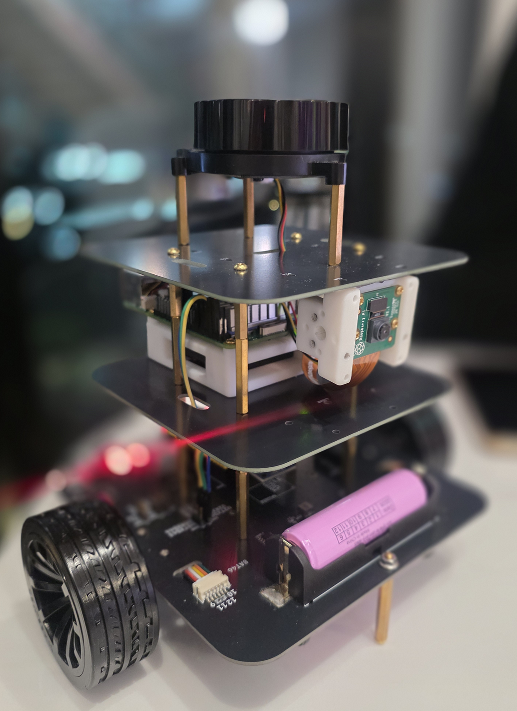

## 04_1 myros_sketch 폴더 및 기본 파일 생성하기

다음은 ROS2 프로그래밍 파일을 저장할 myros_sketch 폴더를 생성한 후, 로봇 관련 파일을 생성합니다.

1. 명령을 수행합니다.

```bash
mkdir ~/myros_sketch
cd ~/myros_sketch
touch robot.urdf.xacro
touch robot_core_diffdrive.xacro
touch inertial_macros.xacro
touch ros2_control_diffdrive_gz.xacro
touch diffdrive_controllers.yaml
touch gz_bridge.yaml
touch lidar.xacro
touch camera.xacro
```

> ※ 여기서 수행하는 명령은 VS Code 터미널 또는 PowerShell에서 ros_jazzy1에 접속해서 합니다.

2. VS Code에서 myros_sketch 폴더와 생성된 파일을 확인합니다.

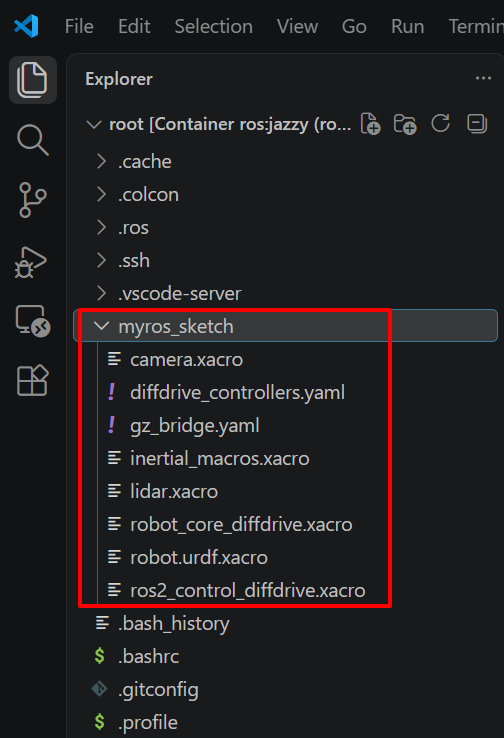

3. 3개의 명령창을 준비합니다.


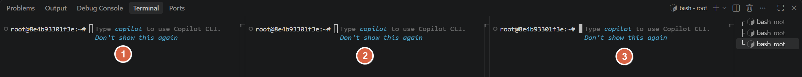

> ※ 이후에 이 3개의 명령창에 다음 명령들을 차례대로 수행하며 실습을 진행합니다.

```
ros2 run robot_state_publisher robot_state_publisher --ros-args -p robot_description:="$(xacro /root/myros_sketch/robot.urdf.xacro)"
rviz2 -d /root/myros_sketch/view_bot.rviz
ros2 run joint_state_publisher_gui joint_state_publisher_gui
```

## 04_2 base_link 정의하기

먼저 URDF 파일에 base_link를 정의합니다.

> **base_link**는 로봇 모델에서 가장 기본이 되는 기준 링크로, 모든 다른 링크의 기준점 역할을 합니다. 차동 구동 로봇의 경우 일반적으로 양쪽 바퀴 축의 중간 지점을 base_link로 설정합니다.

### base_link 정의하기

1. 파일을 작성합니다.

**robot.urdf.xacro**

```xml
<?xml version="1.0"?>
<robot xmlns:xacro="http://www.ros.org/wiki/xacro"  name="robot">

    <link name="base_link"></link>

</robot>
```

2. 파일을 닫았다 다시 열어줍니다.


3. 문법을 체크해 봅니다.

```bash
xacro /root/myros_sketch/robot.urdf.xacro
```
문법에 문제가 없을 경우 파일의 내용이 화면에 출력됩니다.


### robot_state_publisher 실행하기

robot_state_publisher는 URDF를 기반으로 조인트 상태를 받아 각 링크의 좌표 변환(TF)을 계산합니다.

1. 명령을 실행합니다.

```bash
ros2 run robot_state_publisher robot_state_publisher --ros-args -p robot_description:="$(xacro /root/myros_sketch/robot.urdf.xacro)"
```

2. 그러면 다음과 같이 실행됩니다.


---

### robot_core_diffdrive.xacro 파일 포함하기

1. urdf 파일을 수정합니다.

**robot.urdf.xacro**

```xml
<?xml version="1.0"?>
<robot xmlns:xacro="http://www.ros.org/wiki/xacro"  name="robot">

    <xacro:include filename="robot_core_diffdrive.xacro" />

</robot>
```

2. 파일을 작성합니다.

**robot_core_diffdrive.xacro**

```xml
<?xml version="1.0"?>
<robot xmlns:xacro="http://www.ros.org/wiki/xacro">

    <material name="white">
        <color rgba="1 1 1 0.5"/>
    </material>

    <material name="orange">
        <color rgba="1 0.3 0.1 1"/>
    </material>

    <material name="blue">
        <color rgba="0.2 0.2 1 0.5"/>
    </material>

    <material name="black">
        <color rgba="0 0 0 1"/>
    </material>

    <material name="green">
        <color rgba="0 1 0 1"/>
    </material>

    <material name="red">
        <color rgba="1 0 0 1"/>
    </material>

    <!-- BASE LINK -->

    <link name="base_link">
    </link>

</robot>
```

3. 수정한 2개 파일을 저장한 후, 명령을 재구동합니다.

```
ros2 run robot_state_publisher robot_state_publisher --ros-args -p robot_description:="$(xacro /root/myros_sketch/robot.urdf.xacro)"
```


> ※ ctrl+c키를 눌러 수행중인 프로그램을 종료한 후, 윗 방향 키(page up)를 누르면 이전에 수행했던 명령이 자동으로 입력됩니다.

---

## 04_3 chassis_joint, chassis 추가하기

다음은 chassis_joint와 chassis를 정의합니다. 이 책에서 다루는 chassis는 메인보드가 됩니다.

> **chassis_joint**는 base_link와 차체(chassis)를 연결하는 관절로, 두 링크 간의 상대적 위치와 자세 관계를 정의합니다.


1. 내용을 계속해서 추가합니다.

**robot_core_diffdrive.xacro**

```xml
    ...

    <!-- CHASSIS -->
    
    <joint name="chassis_joint" type="fixed">
        <parent link="base_link"/>
        <child link="chassis"/>
        <origin xyz="0 0 0.0058" rpy="0 0 0"/>
    </joint>

    <link name="chassis">
    </link>

</robot>
```

이 책에서 사용하는 모터는 N20 DC 모터로 다음과 같은 규격을 가집니다.


모터의 높이는 10mm, 메인보드 PCB의 두께는 1.6mm입니다. 모터의 중심축으로부터 메인보드의 중심까지 5mm + 0.8mm = 5.8mm입니다.

```xml
<origin xyz="0 0 0.0058" rpy="0 0 0"/>
```

> ※ 참고로, 로봇의 앞쪽이 +x, 왼쪽이 +y입니다.

2. URDF 파일을 저장한 후, 명령을 재구동하여 정상적으로 수행되는 것을 확인합니다.

### RViz2 실행하고 시각화 설정하기

RViz2는 robot_state_publisher가 발행하는 TF 정보를 받아 로봇의 현재 위치와 자세를 시각화합니다.

1. ② 명령창에서 명령을 수행합니다.

```bash
rviz2
```


> ※ rviz2 창을 윈도우 상에서 띄우기 위해, VcXsrv 프로그램이 백그라운드로 실행되고 있어야 합니다.

2. RViz2 설정을 합니다.


3. 좌측 하단에서 [Add] 버튼을 찾아 클릭합니다.


4. 스크롤바를 아래로 내려 [TF]를 선택하고, [OK] 버튼을 누릅니다.


5. 설정을 합니다. TF를 볼 수 있습니다.


> ※ 마우스 휠을 이용하여 그림을 확대할 수 있습니다. RViz2에서 격자 하나의 크기는 1m x 1m입니다.

6. chassis에 visual을 추가합니다.

**robot_core_diffdrive.xacro**

```xml
    ...

    <!-- CHASSIS -->
    
    <joint name="chassis_joint" type="fixed">
        <parent link="base_link"/>
        <child link="chassis"/>
        <origin xyz="0 0 0.0058" rpy="0 0 0"/>
    </joint>

    <link name="chassis">
        <visual>
            <geometry>
                <box size="0.15 0.15 0.0016"/>
            </geometry>
            <material name="white"/>
        </visual>
    </link>

</robot>
```

7. URDF 파일을 저장한 후, 명령을 재구동합니다.

8. RViz2에서 [Add] 버튼을 한 번 더 눌러줍니다.


9. [RobotModel]을 선택하고, [OK] 버튼을 누릅니다.


10. 설정을 합니다. RobotModel을 볼 수 있습니다.


> ※ base_link는 로봇의 기준이 되는 가장 기본 링크로, chassis는 로봇의 본체를 나타내는 링크로, 이동 로봇에서는 바퀴와 센서가 장착되는 중심 구조입니다.

11. [File]--[Save Config As] 메뉴를 선택합니다.


12. myros_sketch 폴더 아래 view_bot.rviz로 저장합니다.


13. rviz2 프로그램을 종료한 후, 옵션을 주어 재구동해 봅니다.

```bash
rviz2 -d /root/myros_sketch/view_bot.rviz
```


## 04_4 구동축 및 바퀴 추가하기

구동축과 여기에 연결될 바퀴를 추가해 보겠습니다.

- 구동축 조인트: left_joint, right_joint
- 연결되는 바퀴: left_wheel, right_wheel

### left_joint, left_wheel 추가하기

1. 내용을 계속해서 추가합니다.

**robot_core_diffdrive.xacro**

```xml
    ...

    <!-- LEFT WHEEL -->

    <joint name="left_wheel_joint" type="continuous">
        <parent link="base_link"/>
        <child link="left_wheel"/>
        <origin xyz="0 0.0907 0" rpy="0 0 0"/>
    </joint>

    <link name="left_wheel">
    </link>

</robot>
```

이 책에서 사용하는 메인 보드의 크기는 가로, 세로 15cm입니다.


바퀴의 중심까지의 거리는 9.07cm입니다.


### RViz2에서 조인트 생성 여부 확인하기

2. URDF 파일을 저장한 후, 명령을 재구동합니다.

3. RViz2 좌측 하단에 있는 reset 버튼을 누릅니다.

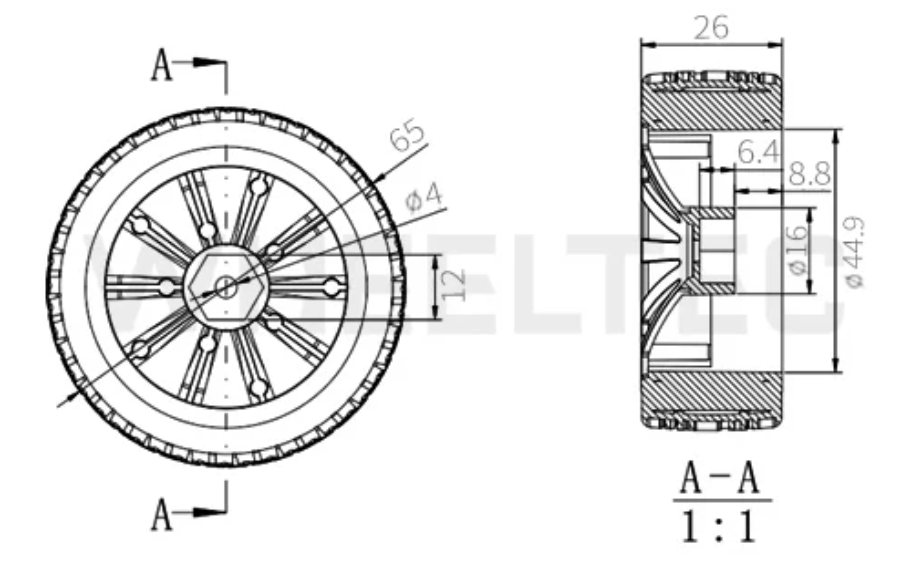

4. 표시되는 것을 확인합니다.


### joint_state_publisher_gui로 조인트 시각화하기

5. ③ 창에서 명령을 수행합니다.

```bash
ros2 run joint_state_publisher_gui joint_state_publisher_gui
```

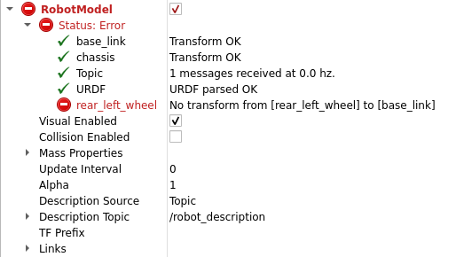

> joint_state_publisher_gui는 ROS에서 로봇 모델의 관절(Joint) 상태 값을 시각적으로 쉽게 조작할 수 있도록 제공하는 도구입니다.

6. 표시되는 것을 확인합니다.

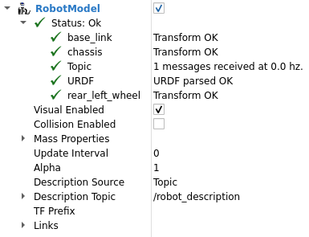

7. joint_state_publisher_gui를 이용해 바퀴 축을 돌려 봅니다.

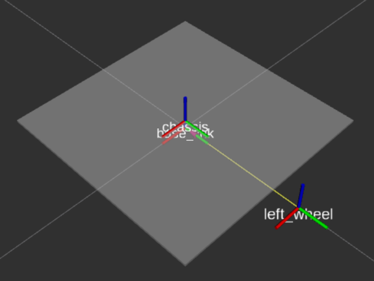

바퀴 축이 수평 X축(빨강축)을 중심으로 회전을 합니다.

### 바퀴 회전축 설정하기

> 일반적으로 바퀴의 회전축은 바퀴 조인트의 z축으로 합니다.

8. 수정합니다.

**robot_core_diffdrive.xacro**

```xml
    ...

    <!-- LEFT WHEEL -->

    <joint name="left_wheel_joint" type="continuous">
        <parent link="base_link"/>
        <child link="left_wheel"/>
        <origin xyz="0 0.0907 0" rpy="0 0 0"/>
        <axis xyz="0 0 1"/>
    </joint>

    <link name="left_wheel">
    </link>

</robot>
```

9. URDF 파일을 저장한 후, 명령을 재구동합니다.

10. RViz2 좌측 하단에 있는 reset 버튼을 누릅니다.

11. joint_state_publisher_gui를 이용해 바퀴 축을 돌려 봅니다.

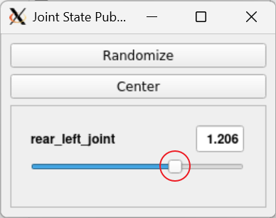

바퀴 축이 수평 Z축(파랑축)을 중심으로 회전을 합니다.

### 바퀴 회전축 방향 설정하기

현재는 바퀴를 장착할 경우, 수평 상태에서 회전을 합니다. 바퀴 회전축을 base_link 기준으로 x축 기준으로 -90도 회전시켜 줍니다.

12. 파일을 수정합니다.

**robot_core_diffdrive.xacro**

```xml
    ...

    <!-- LEFT WHEEL -->

    <joint name="left_wheel_joint" type="continuous">
        <parent link="base_link"/>
        <child link="left_wheel"/>
        <origin xyz="0 0.0907 0" rpy="-${pi/2} 0 0"/>
        <axis xyz="0 0 1"/>
    </joint>

    <link name="left_wheel">
    </link>

</robot>
```

13. URDF 파일을 저장한 후, 명령을 재구동합니다.

14. RViz2 좌측 하단에 있는 reset 버튼을 누릅니다.

15. joint_state_publisher_gui를 이용해 바퀴 축을 돌려 봅니다.

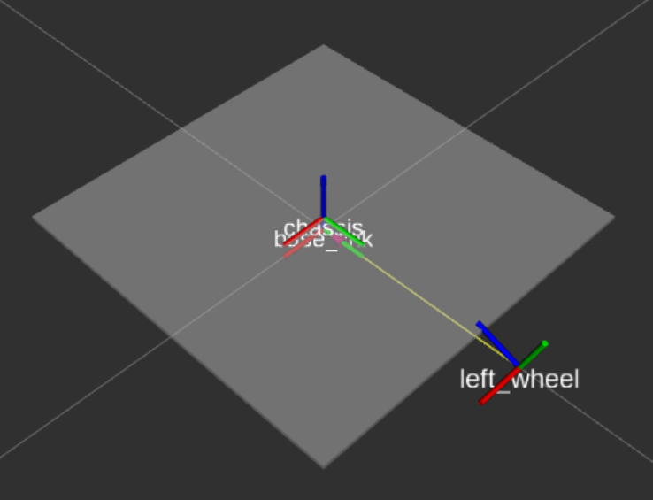

바퀴 축이 정상적으로 회전을 합니다. 양의 방향으로 커질수록 바퀴 축은 전진, 음의 방향으로 커질수록 바퀴 축은 후진 방향으로 회전합니다.

> ※ URDF에서 바퀴 조인트의 축(`<axis>`)은 조인트 자신의 로컬 좌표계를 기준으로 정의합니다. 관례적으로 이 로컬 z축(0 0 1)을 회전축으로 잡고, `<origin>`의 rpy 값으로 조인트 좌표계 자체를 회전시켜, 이 z축이 실제로는 차체 바깥쪽(좌우 방향)을 향하도록 만듭니다.

16. 파일을 수정하여 바퀴 visual을 추가합니다.

**robot_core_diffdrive.xacro**

```xml
    ...

    <!-- LEFT WHEEL -->

    <joint name="left_wheel_joint" type="continuous">
        <parent link="base_link"/>
        <child link="left_wheel"/>
        <origin xyz="0 0.0907 0" rpy="-${pi/2} 0 0"/>
        <axis xyz="0 0 1"/>
    </joint>

    <link name="left_wheel">
        <visual>
            <geometry>
                <cylinder length="0.026" radius="0.0325" />
            </geometry>
            <material name="blue"/>
        </visual>
    </link>

</robot>
```

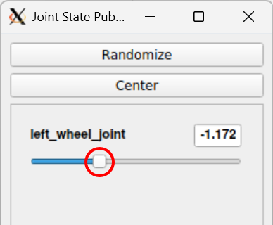

17. URDF 파일을 저장한 후, 명령을 재구동합니다.

18. RViz2 좌측 하단에 있는 reset 버튼을 누릅니다.

19. 표시되는 것을 확인합니다.

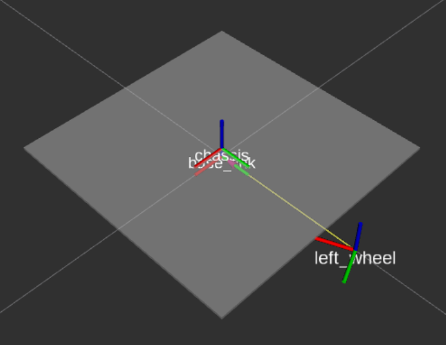

20. joint_state_publisher_gui를 이용해 바퀴 축을 돌려 봅니다.

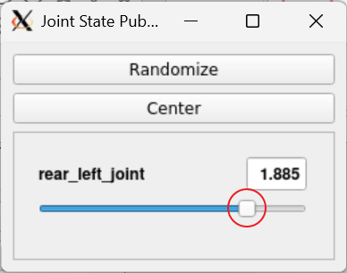

### right_joint, right_wheel 추가하기

다음은 right_joint, right_wheel을 추가합니다.

1. 내용을 계속해서 추가합니다.

**robot_core_diffdrive.xacro**

```xml
    ...

    <!-- RIGHT WHEEL -->

    <joint name="right_wheel_joint" type="continuous">
        <parent link="base_link"/>
        <child link="right_wheel"/>
        <origin xyz="0 -0.0907 0" rpy="${pi/2} 0 0"/>
        <axis xyz="0 0 -1"/>
    </joint>

    <link name="right_wheel">
        <visual>
            <geometry>
                <cylinder length="0.026" radius="0.0325" />
            </geometry>
            <material name="blue"/>
        </visual>
    </link>

</robot>
```

2. URDF 파일을 저장한 후, 명령을 재구동합니다.

3. RViz2 좌측 하단에 있는 reset 버튼을 누릅니다.

4. 표시되는 것을 확인합니다.

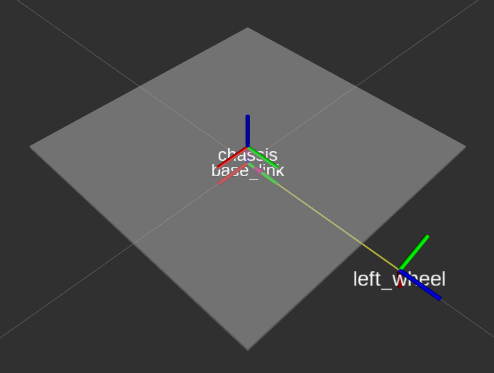

## 04_5 캐스터 추가하기

로봇이 넘어지지 않도록 캐스터를 추가합니다. 이 책에서 사용하는 로봇은 바퀴가 양쪽 중심에 장착되어 있으므로 앞쪽, 뒤쪽에 캐스터를 추가해 줍니다.

### front_caster_joint, front_caster 추가하기

1. 내용을 계속해서 추가합니다.

**robot_core_diffdrive.xacro**

```xml
    ...

    <!-- FRONT CASTER -->

    <joint name="front_caster_joint" type="fixed">
        <parent link="chassis"/>
        <child link="front_caster"/>
        <origin xyz="0.0695 0 -0.0333" rpy="0 0 0"/>
    </joint>

    <link name="front_caster">
        <visual>
            <geometry>
                <sphere radius="0.005" />
            </geometry>
            <material name="black"/>
        </visual>
    </link>

</robot>
```

바퀴 중심축으로부터 chassis(메인 보드)의 Z축 중심까지의 거리는 5.8mm, 바퀴 중심축으로부터 바닥까지의 거리는 32.5mm이고, caster 볼의 반지름은 5mm 가정할 때, (5.8mm + 32.5mm - 5mm) = 33.3mm입니다.

2. URDF 파일을 저장한 후, 명령을 재구동합니다.

3. RViz2 좌측 하단에 있는 reset 버튼을 누릅니다.

4. 표시되는 것을 확인합니다.

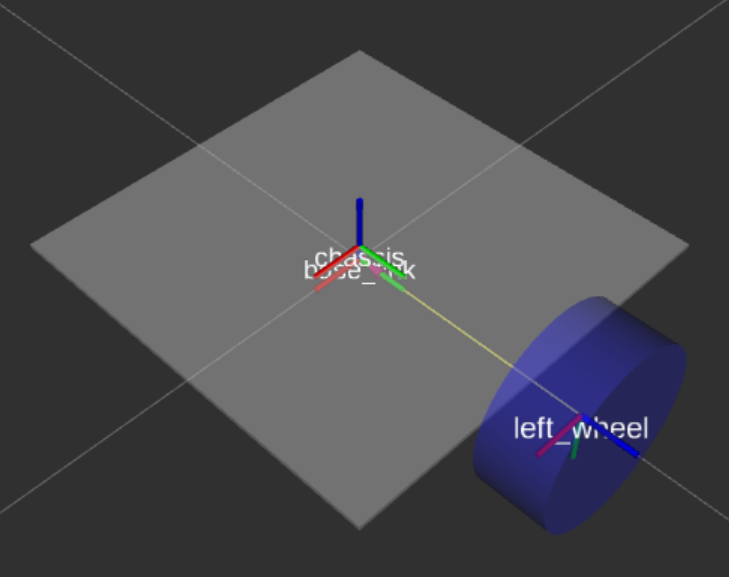

### rear_caster_joint, rear_caster 추가하기

1. 내용을 계속해서 추가합니다.

**robot_core_diffdrive.xacro**

```xml
    ...

    <!-- REAR CASTER -->

    <joint name="rear_caster_joint" type="fixed">
        <parent link="chassis"/>
        <child link="rear_caster"/>
        <origin xyz="-0.0695 0 -0.0333" rpy="0 0 0"/>
    </joint>

    <link name="rear_caster">
        <visual>
            <geometry>
                <sphere radius="0.005" />
            </geometry>
            <material name="black"/>
        </visual>
    </link>

</robot>
```

2. URDF 파일을 저장한 후, 명령을 재구동합니다.

3. RViz2 좌측 하단에 있는 reset 버튼을 누릅니다.

4. 표시되는 것을 확인합니다.

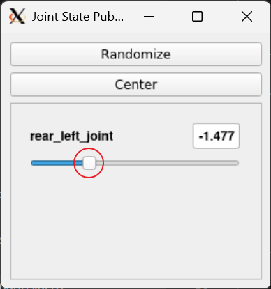

## 04_6 esp32s3_joint, esp32s3_frame 추가하기

1. 내용을 계속해서 추가합니다.

**robot_core_diffdrive.xacro**

```xml
    ...

    <!-- ESP32S3DEVKITC1 -->

    <joint name="esp32s3_joint" type="fixed">
        <parent link="chassis"/>
        <child link="esp32s3_frame"/>
        <origin xyz="-0.045 0 0.008" rpy="0 0 0"/>
    </joint>
    <link name="esp32s3_frame">
        <visual>
            <geometry>
                <box size="0.056 0.028 0.0126"/>
            </geometry>
            <material name="black"/>
        </visual>
    </link>

</robot>
```

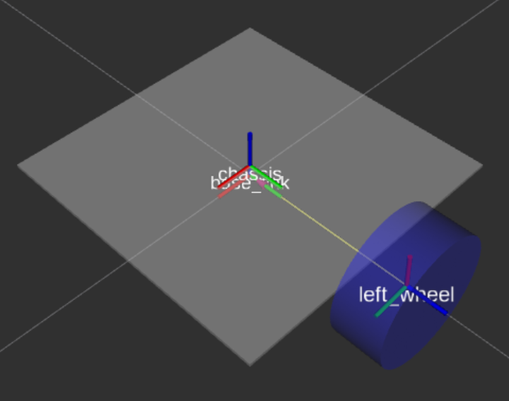

ESP32S3DevKitC의 중심은 메인 보드의 중심으로부터 -X 방향으로 4.5cm 떨어져 있습니다.

2. URDF 파일을 저장한 후, 명령을 재구동합니다.

3. RViz2 좌측 하단에 있는 reset 버튼을 누릅니다.

4. 표시되는 것을 확인합니다.

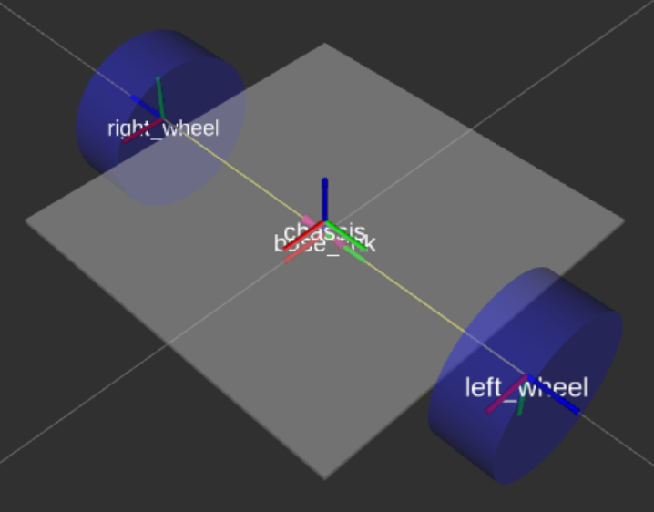

## 04_7 imu_joint, imu_link 추가하기

1. 내용을 계속해서 추가합니다.

**robot_core_diffdrive.xacro**

```xml
    ...

    <!-- IMU -->

    <joint name="imu_joint" type="fixed">
        <parent link="chassis"/>
        <child link="imu_link"/>
        <origin xyz="0 0 0.008" rpy="0 0 0"/>
    </joint>
    <link name="imu_link">
        <visual>
            <geometry>
                <box size="0.0155 0.02 0.0126"/>
            </geometry>
            <material name="green"/>
        </visual>
    </link>

</robot>
```

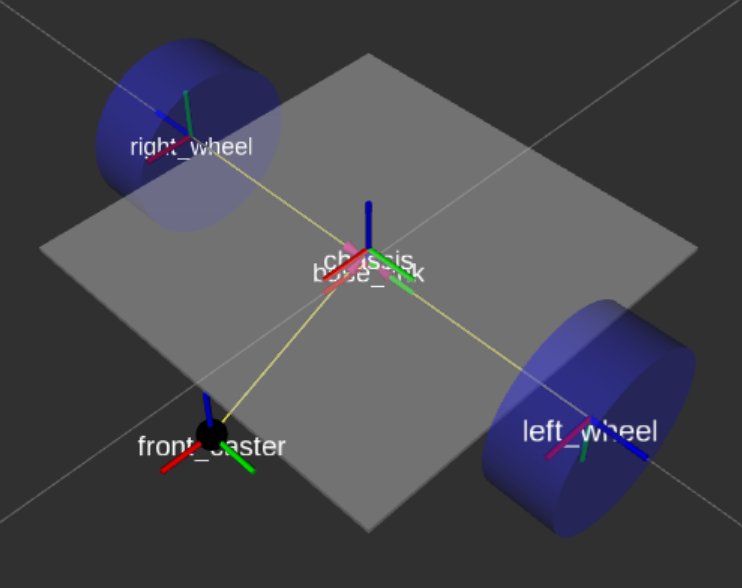

이 책에서 사용하는 IMU는 MPU6050으로 가로 세로 크기는 다음과 같고, 높이는 1.26cm입니다. MPU6050의 중심은 메인 보드의 중심과 같습니다.

2. URDF 파일을 저장한 후, 명령을 재구동합니다.

3. RViz2 좌측 하단에 있는 reset 버튼을 누릅니다.

4. 표시되는 것을 확인합니다.


## 04_8 rpi_base_joint, rpi_base 추가하기

rpi_base에는 라즈베리파이 5를 장착합니다.

1. 내용을 계속해서 추가합니다.

**robot_core_diffdrive.xacro**

```xml
    ...

    <!-- RPI BASE -->

    <joint name="rpi_base_joint" type="fixed">
        <parent link="chassis"/>
        <child link="rpi_base"/>
        <origin xyz="0 0 0.0566" rpy="0 0 0"/>
    </joint>
    <link name="rpi_base">
        <visual>
            <geometry>                
                <box size="0.12 0.12 0.0016"/>
            </geometry>
            <material name="white"/>
        </visual>
    </link>

</robot>
```

2. URDF 파일을 저장한 후, 명령을 재구동합니다.

3. RViz2 좌측 하단에 있는 reset 버튼을 누릅니다.

4. 표시되는 것을 확인합니다.

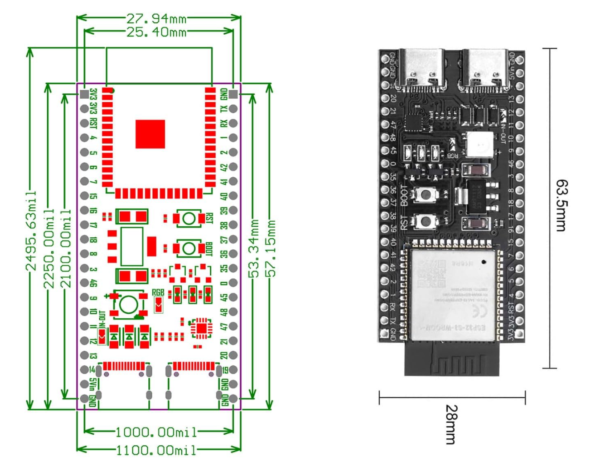

## 04_9 rpi_joint, rpi_frame 추가하기

라즈베리파이5와 관련된 rpi_joint, rpi_frame을 추가합니다.

1. 내용을 계속해서 추가합니다.

**robot_core_diffdrive.xacro**

```xml
    ...

    <!-- RPI5 -->

    <joint name="rpi_joint" type="fixed">
        <parent link="rpi_base"/>
        <child link="rpi_frame"/>
        <origin xyz="-0.02 0 0.0316" rpy="0 0 0"/>
    </joint>
    <link name="rpi_frame">
        <visual>
            <geometry>
                <box size="0.085 0.049 0.0192"/>
            </geometry>
            <material name="green"/>
        </visual>
    </link>

</robot>
```

2. URDF 파일을 저장한 후, 명령을 재구동합니다.

3. RViz2 좌측 하단에 있는 reset 버튼을 누릅니다.

4. 표시되는 것을 확인합니다.


## 04_10 lidar_base_joint, lidar_base_frame 추가하기

라이다가 장착된 lidar_base_joint, lidar_base를 추가합니다.

1. 내용을 계속해서 추가합니다.

**robot_core_diffdrive.xacro**

```xml
    ...

    <!-- LIDAR BASE -->

    <joint name="lidar_base_joint" type="fixed">
        <parent link="rpi_base"/>
        <child link="lidar_base"/>
        <origin xyz="0 0 0.0566" rpy="0 0 0"/>
    </joint>
    <link name="lidar_base">
        <visual>
            <geometry>                
                <box size="0.12 0.12 0.0016"/>
            </geometry>
            <material name="white"/>
        </visual>
    </link>

</robot>
```

2. URDF 파일을 저장한 후, 명령을 재구동합니다.

3. RViz2 좌측 하단에 있는 reset 버튼을 누릅니다.

4. 표시되는 것을 확인합니다.

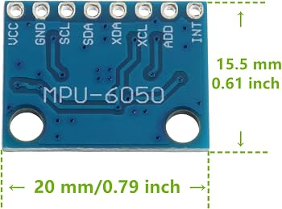

## 04_11 laser_joint, laser_frame 추가하기

라이다와 관련된 laser_joint, laser_frame을 추가합니다.

1. 내용을 계속해서 추가합니다.

**robot_core_diffdrive.xacro**

```xml
    ...

    <!-- LIDAR -->

    <joint name="laser_joint" type="fixed">
        <parent link="lidar_base"/>
        <child link="laser_frame"/>
        <origin xyz="0 0 0.047" rpy="0 0 0"/>
    </joint>

    <link name="laser_frame">
        <visual>
            <geometry>
                <cylinder radius="0.0296" length="0.016"/>
            </geometry>
            <material name="red"/>
        </visual>
    </link>

</robot>
```

라이다 높이는 2.6cm, 지지대는 4cm입니다.

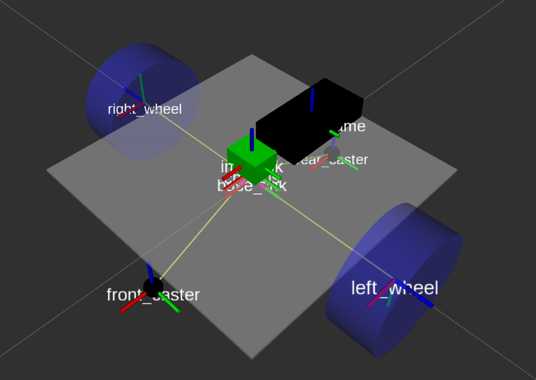

2. URDF 파일을 저장한 후, 명령을 재구동합니다.

3. RViz2 좌측 하단에 있는 reset 버튼을 누릅니다.

4. 표시되는 것을 확인합니다.

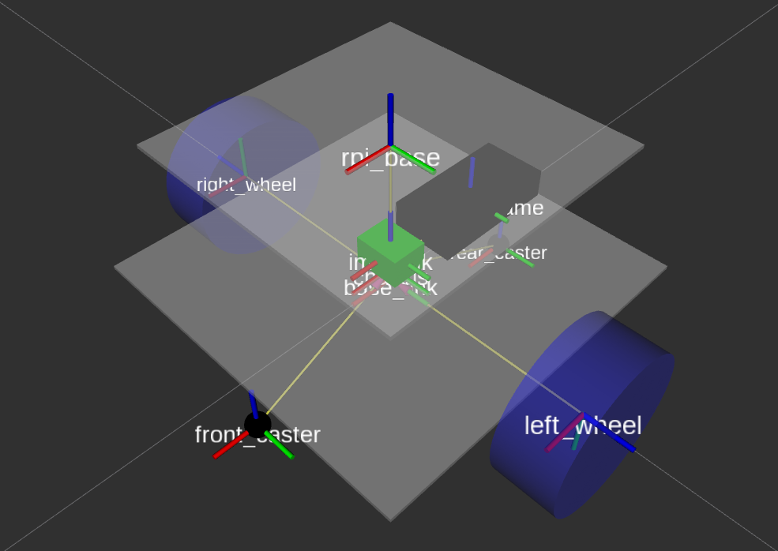

## 04_12 camera_joint, camera_link 추가하기

카메라 몸체입니다.

1. 내용을 계속해서 추가합니다.

**robot.urdf.xacro**

```xml
    ...

    <!-- CAMERA FRAME -->

    <joint name="camera_joint" type="fixed">
        <parent link="lidar_base"/>
        <child link="camera_link"/>
        <origin xyz="0.055 0 -0.02" rpy="0 0 0"/>
    </joint>

    <link name="camera_link">
        <visual>        
            <geometry>
                <box size="0.01 0.034 0.04"/>
            </geometry>
            <material name="orange"/>
        </visual>
    </link>

</robot>
```

2. URDF 파일을 저장한 후, 명령을 재구동합니다.

3. RViz2 좌측 하단에 있는 reset 버튼을 누릅니다.

4. 표시되는 것을 확인합니다.

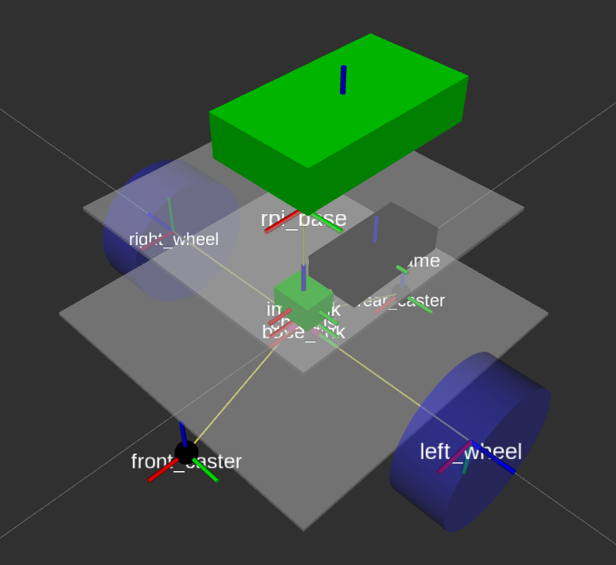

## 04_13 camera_optical_joint, camera_link_optical 추가하기

카메라 렌즈 부분입니다.

1. 내용을 계속해서 추가합니다.

**robot.urdf.xacro**

```xml
    ...        

    <!-- CAMERA OPTICAL -->
    
    <joint name="camera_optical_joint" type="fixed">
        <parent link="camera_link"/>
        <child link="camera_link_optical"/>
        <origin xyz="0 0 0" rpy="${-pi/2} 0 ${-pi/2}"/>
    </joint>

    <link name="camera_link_optical">
    </link>

</robot>
```

camera_link_optical 링크의 경우, 렌즈의 면이 +z 축을 보고 렌즈의 하단이 +y축을 보고, 렌즈의 오른쪽이 +x축을 보도록 해야 합니다.

| 축 | 의미 |
|---|---|
| +z | 카메라가 보는 방향(렌즈가 향하는 쪽, optical axis) |
| +x | 이미지 기준 오른쪽 |
| +y | 이미지 기준 아래쪽 |

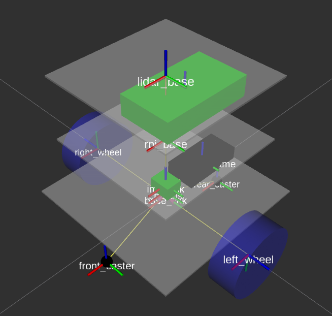

> 이 규약이 따로 존재하는 이유는, 일반 로봇 프레임은 +x 전방, +y 좌측, +z 상방을 쓰는데, 이건 이미지 처리 파이프라인(OpenCV 등)이 기대하는 좌표계와 축이 완전히 다르기 때문입니다.

2. URDF 파일을 저장한 후, 명령을 재구동합니다.

3. RViz2 좌측 하단에 있는 reset 버튼을 누릅니다.

4. 표시되는 것을 확인합니다.

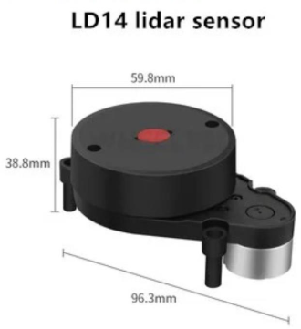

## 04_14 base_footprint_joint, base_footprint 추가하기

base_footprint는 로봇의 지면 기준 좌표계를 나타내는 프레임으로, SLAM이나 내비게이션에서 로봇의 위치 계산과 경로 계획에 사용됩니다.

1. 내용을 계속해서 추가합니다.

**robot.urdf.xacro**

```xml
    ...

    <!-- BASE_FOOTPRINT LINK -->

    <joint name="base_footprint_joint" type="fixed">
        <parent link="base_footprint"/>
        <child link="base_link"/>
        <origin xyz="0 0 0.0325" rpy="0 0 0"/>
    </joint>

    <link name="base_footprint">
    </link>

</robot>
```

2. URDF 파일을 저장한 후, 명령을 재구동합니다.

3. RViz2 좌측 하단에 있는 reset 버튼을 누릅니다.

4. 표시되는 것을 확인합니다.

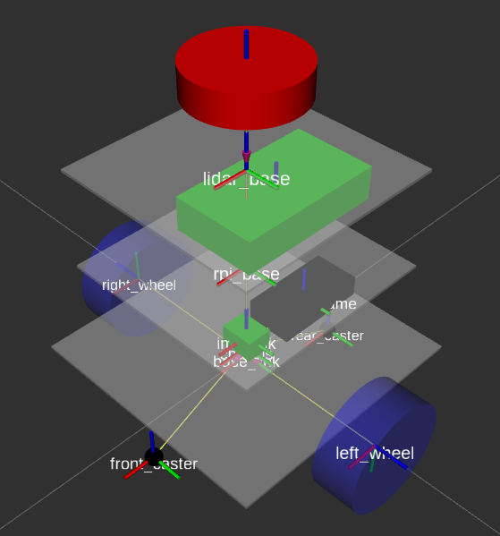

5. RobotModel에서 Visual Enabled 항목을 언체크하고, Collision Enabled 항목을 체크해 봅니다.

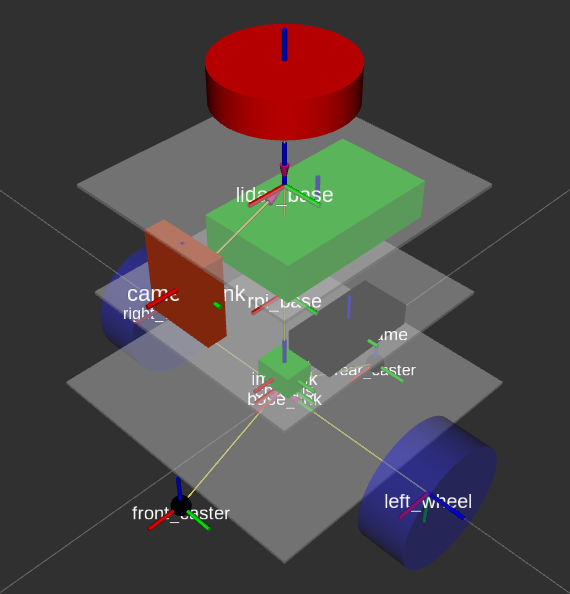

6. 표시되는 것을 확인합니다.

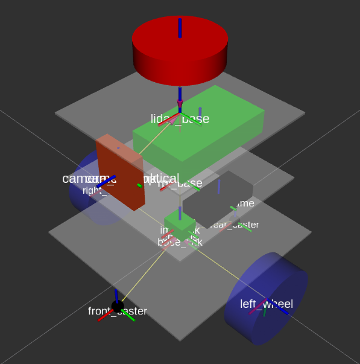

## 04_15 collision 태그 추가하기

collision 태그는 링크의 충돌 영역을 정의합니다. Gazebo 시뮬레이터에서는 이 정보를 이용하여 링크 간의 충돌 여부를 계산합니다.

1. 예제를 수정합니다.

**robot_core_diffdrive.xacro** (전체 파일)

```xml
<?xml version="1.0"?>
<robot xmlns:xacro="http://www.ros.org/wiki/xacro">

    <xacro:include filename="inertial_macros.xacro"/>

    <material name="white">
        <color rgba="1 1 1 0.5"/>
    </material>

    <material name="orange">
        <color rgba="1 0.3 0.1 1"/>
    </material>

    <material name="blue">
        <color rgba="0.2 0.2 1 0.5"/>
    </material>

    <material name="black">
        <color rgba="0 0 0 1"/>
    </material>

    <material name="green">
        <color rgba="0 1 0 1"/>
    </material>

    <material name="red">
        <color rgba="1 0 0 1"/>
    </material>

    <!-- BASE LINK -->
    <link name="base_link">
    </link>

    <!-- CHASSIS -->
    <joint name="chassis_joint" type="fixed">
        <parent link="base_link"/>
        <child link="chassis"/>
        <origin xyz="0 0 0.0058" rpy="0 0 0"/>
    </joint>

    <link name="chassis">
        <visual>
            <geometry>
                <box size="0.15 0.15 0.0016"/>
            </geometry>
            <material name="white"/>
        </visual>
        <collision>
            <geometry>
                <box size="0.15 0.15 0.0016"/>
            </geometry>
        </collision>
    </link>

    <!-- LEFT WHEEL -->
    <joint name="left_wheel_joint" type="continuous">
        <parent link="base_link"/>
        <child link="left_wheel"/>
        <origin xyz="0 0.0907 0" rpy="-${pi/2} 0 0"/>
        <axis xyz="0 0 1"/>
    </joint>

    <link name="left_wheel">
        <visual>
            <geometry>
                <cylinder length="0.026" radius="0.0325" />
            </geometry>
            <material name="blue"/>
        </visual>
        <collision>
            <geometry>
                <cylinder length="0.026" radius="0.0325" />
            </geometry>
        </collision>
    </link>

    <!-- RIGHT WHEEL -->
    <joint name="right_wheel_joint" type="continuous">
        <parent link="base_link"/>
        <child link="right_wheel"/>
        <origin xyz="0 -0.0907 0" rpy="${pi/2} 0 0"/>
        <axis xyz="0 0 -1"/>
    </joint>

    <link name="right_wheel">
        <visual>
            <geometry>
                <cylinder length="0.026" radius="0.0325" />
            </geometry>
            <material name="blue"/>
        </visual>
        <collision>
            <geometry>
                <cylinder length="0.026" radius="0.0325" />
            </geometry>
        </collision>
    </link>

    <!-- FRONT CASTER -->
    <joint name="front_caster_joint" type="fixed">
        <parent link="chassis"/>
        <child link="front_caster"/>
        <origin xyz="0.0695 0 -0.0333" rpy="0 0 0"/>
    </joint>

    <link name="front_caster">
        <visual>
            <geometry>
                <sphere radius="0.005" />
            </geometry>
            <material name="black"/>
        </visual>
        <collision>
            <geometry>
                <sphere radius="0.005" />
            </geometry>
        </collision>
    </link>

    <!-- REAR CASTER -->
    <joint name="rear_caster_joint" type="fixed">
        <parent link="chassis"/>
        <child link="rear_caster"/>
        <origin xyz="-0.0695 0 -0.0333" rpy="0 0 0"/>
    </joint>

    <link name="rear_caster">
        <visual>
            <geometry>
                <sphere radius="0.005" />
            </geometry>
            <material name="black"/>
        </visual>
        <collision>
            <geometry>
                <sphere radius="0.005" />
            </geometry>
        </collision>
    </link>

    <!-- ESP32S3DEVKITC1 -->
    <joint name="esp32s3_joint" type="fixed">
        <parent link="chassis"/>
        <child link="esp32s3_frame"/>
        <origin xyz="-0.045 0 0.008" rpy="0 0 0"/>
    </joint>
    <link name="esp32s3_frame">
        <visual>
            <geometry>
                <box size="0.056 0.028 0.016"/>
            </geometry>
            <material name="black"/>
        </visual>
        <collision>
            <geometry>
                <box size="0.056 0.028 0.016"/>
            </geometry>
        </collision>
    </link>

    <!-- IMU -->
    <joint name="imu_joint" type="fixed">
        <parent link="chassis"/>
        <child link="imu_link"/>
        <origin xyz="0 0 0.008" rpy="0 0 0"/>
    </joint>
    <link name="imu_link">
        <visual>
            <geometry>
                <box size="0.0155 0.02 0.0126"/>
            </geometry>
            <material name="green"/>
        </visual>
        <collision>
            <geometry>
                <box size="0.0155 0.02 0.0126"/>
            </geometry>
        </collision>
    </link>

    <!-- RPI BASE -->
    <joint name="rpi_base_joint" type="fixed">
        <parent link="chassis"/>
        <child link="rpi_base"/>
        <origin xyz="0 0 0.0566" rpy="0 0 0"/>
    </joint>
    <link name="rpi_base">
        <visual>
            <geometry>                
                <box size="0.12 0.12 0.0016"/>
            </geometry>
            <material name="white"/>
        </visual>
        <collision>
            <geometry>                
                <box size="0.12 0.12 0.0016"/>
            </geometry>
        </collision>
    </link>

    <!-- RPI5 -->
    <joint name="rpi_joint" type="fixed">
        <parent link="rpi_base"/>
        <child link="rpi_frame"/>
        <origin xyz="-0.02 0 0.0316" rpy="0 0 0"/>
    </joint>
    <link name="rpi_frame">
        <visual>
            <geometry>
                <box size="0.085 0.049 0.0192"/>
            </geometry>
            <material name="green"/>
        </visual>
        <collision>
            <geometry>
                <box size="0.085 0.049 0.0192"/>
            </geometry>
        </collision>
    </link>

    <!-- LIDAR BASE -->
    <joint name="lidar_base_joint" type="fixed">
        <parent link="rpi_base"/>
        <child link="lidar_base"/>
        <origin xyz="0 0 0.0566" rpy="0 0 0"/>
    </joint>
    <link name="lidar_base">
        <visual>
            <geometry>                
                <box size="0.12 0.12 0.0016"/>
            </geometry>
            <material name="white"/>
        </visual>
        <collision>
            <geometry>                
                <box size="0.12 0.12 0.0016"/>
            </geometry>
        </collision>
    </link>

    <!-- LIDAR -->
    <joint name="laser_joint" type="fixed">
        <parent link="lidar_base"/>
        <child link="laser_frame"/>
        <origin xyz="0 0 0.047" rpy="0 0 0"/>
    </joint>

    <link name="laser_frame">
        <visual>
            <geometry>
                <cylinder radius="0.0296" length="0.016"/>
            </geometry>
            <material name="red"/>
        </visual>
        <collision>
            <geometry>
                <cylinder radius="0.0296" length="0.016"/>
            </geometry>
        </collision>
    </link>    

    <!-- CAMERA FRAME -->
    <joint name="camera_joint" type="fixed">
        <parent link="lidar_base"/>
        <child link="camera_link"/>
        <origin xyz="0.055 0 -0.02" rpy="0 0 0"/>
    </joint>

    <link name="camera_link">
        <visual>        
            <geometry>
                <box size="0.01 0.034 0.04"/>
            </geometry>
            <material name="orange"/>
        </visual>
        <collision>        
            <geometry>
                <box size="0.01 0.034 0.04"/>
            </geometry>
        </collision>
    </link>       

    <!-- CAMERA OPTICAL -->
    <joint name="camera_optical_joint" type="fixed">
        <parent link="camera_link"/>
        <child link="camera_link_optical"/>
        <origin xyz="0 0 0" rpy="${-pi/2} 0 ${-pi/2}"/>
    </joint>

    <link name="camera_link_optical">
    </link>

    <!-- BASE_FOOTPRINT LINK -->
    <joint name="base_footprint_joint" type="fixed">
        <parent link="base_footprint"/>
        <child link="base_link"/>
        <origin xyz="0 0 0.0325" rpy="0 0 0"/>
    </joint>

    <link name="base_footprint">
    </link>

</robot>
```

2. URDF 파일을 저장한 후, 명령을 재구동합니다.

3. RViz2 좌측 하단에 있는 reset 버튼을 누릅니다.

4. RobotModel에서 Visual Enabled 항목을 언체크하고, Collision Enabled 항목을 체크해 봅니다.

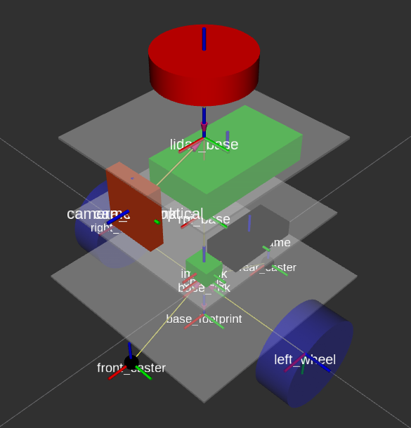

5. 표시되는 것을 확인합니다.


## 04_16 inertial 태그 추가하기

inertial 태그는 링크의 질량과 관성 모멘트, 그리고 무게중심 위치(origin)를 정의하는 요소로, 가제보 물리 엔진이 로봇의 움직임과 힘의 반응을 계산하는 데 사용됩니다.

1. 파일을 작성합니다.

**inertial_macros.xacro**

```xml
<?xml version="1.0"?>
<robot xmlns:xacro="http://www.ros.org/wiki/xacro" >

    <!-- Specify some standard inertial calculations -->
    <!-- https://en.wikipedia.org/wiki/List_of_moments_of_inertia -->

    <xacro:macro name="inertial_sphere" params="mass radius *origin">
        <inertial>
            <xacro:insert_block name="origin"/>
            <mass value="${mass}" />
            <inertia ixx="${(2/5) * mass * (radius*radius)}" ixy="0.0" ixz="0.0"
                    iyy="${(2/5) * mass * (radius*radius)}" iyz="0.0"
                    izz="${(2/5) * mass * (radius*radius)}" />
        </inertial>
    </xacro:macro>  


    <xacro:macro name="inertial_box" params="mass x y z *origin">
        <inertial>
            <xacro:insert_block name="origin"/>
            <mass value="${mass}" />
            <inertia ixx="${(1/12) * mass * (y*y+z*z)}" ixy="0.0" ixz="0.0"
                    iyy="${(1/12) * mass * (x*x+z*z)}" iyz="0.0"
                    izz="${(1/12) * mass * (x*x+y*y)}" />
        </inertial>
    </xacro:macro>


    <xacro:macro name="inertial_cylinder" params="mass length radius *origin">
        <inertial>
            <xacro:insert_block name="origin"/>
            <mass value="${mass}" />
            <inertia ixx="${(1/12) * mass * (3*radius*radius + length*length)}" ixy="0.0" ixz="0.0"
                    iyy="${(1/12) * mass * (3*radius*radius + length*length)}" iyz="0.0"
                    izz="${(1/2) * mass * (radius*radius)}" />
        </inertial>
    </xacro:macro>

</robot>
```

> 본 관성(inertial) 계산 매크로는 ROS2 커뮤니티에 널리 알려진 표준 패턴을 기반으로 하며, Articulated Robotics 튜토리얼의 구성을 참고했습니다.

2. 예제를 수정합니다. (전체 robot_core_diffdrive.xacro 파일에 inertial 태그가 추가됩니다.)

3. URDF 파일을 저장한 후, 명령을 재구동합니다.

4. RViz2 좌측 하단에 있는 reset 버튼을 누릅니다.

5. RobotModel에서 Visual Enabled 항목과 Collision Enabled 항목을 언체크하고, Mass Properties의 Mass 항목은 체크, Inertia 항목은 언체크하고 결과를 확인합니다.

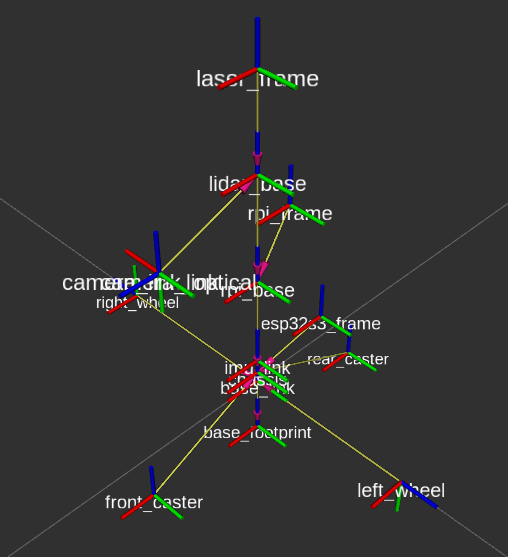

6. Visual Enabled 항목과 Collision Enabled 항목을 언체크하고, Mass Properties의 Mass 항목은 언체크, Inertia 항목은 체크하고 결과를 확인합니다.

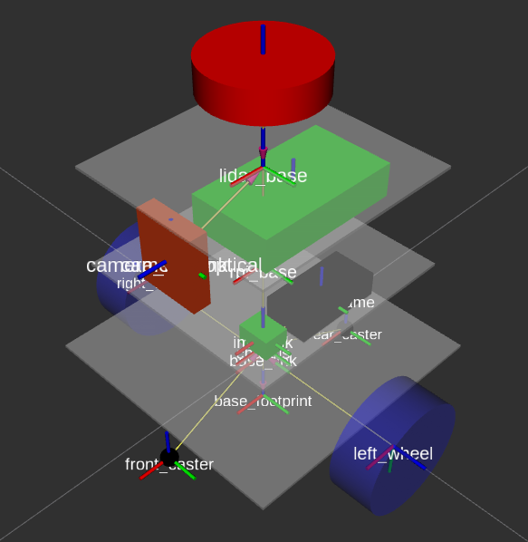

7. Visual Enabled 항목은 체크, Collision Enabled 항목은 언체크, Mass Properties의 Mass 항목과 Inertia 항목은 언체크하여 최초 상태로 돌려 놓습니다.

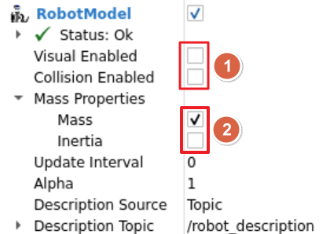

8. 표시되는 것을 확인합니다.

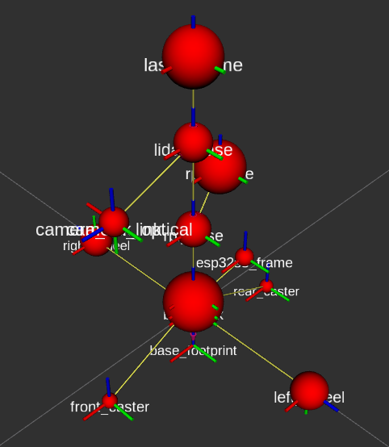
