# 01 가제보에 로봇 생성하고 구동하기

> 앞 장에서 우리는 URDF 파일을 작성하며 RViz2에서 로봇 모델을 완성했습니다. <br> 여기서는 이 URDF 파일을 이용해 Gazebo 가상 환경에 로봇을 생성하고, 물리 시뮬레이션을 위한 설정을 추가해 보겠습니다. <br>이어서 생성된 로봇을 직접 구동하며 주행 상태와 관절 정보를 확인하고, <br> 라이다·카메라 센서 데이터까지 RViz2로 시각화하며 로봇이 정상적으로 동작하는지 확인해 봅니다.

<br>

---

<br>

## 명령창 준비하기

1. 기존에 실행 중인 프로그램을 ctrl+c 종료한 후, clear 명령을 입력합니다.

2. 5개의 명령창을 준비합니다.

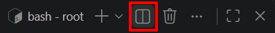

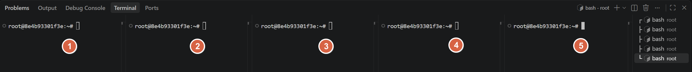

> ※ 이후 5개의 명령창에 다음 명령들을 차례대로 수행하며 실습을 진행합니다.

```
① ros2 run robot_state_publisher robot_state_publisher --ros-args -p robot_description:="$(xacro /root/myros_sketch/robot.urdf.xacro)"
② rviz2 -d /root/myros_sketch/view_bot.rviz
③ ros2 run joint_state_publisher_gui joint_state_publisher_gui
④ gz sim -r -v4 empty.sdf
⑤ ros2 run ros_gz_sim create -topic robot_description -name my_bot -z 0.1
```

<br>

---

<br>

## 01_1 gazebo 구동하고 로봇 생성하기

1. 명령을 수행합니다.

```bash
ros2 run robot_state_publisher robot_state_publisher --ros-args -p robot_description:="$(xacro /root/myros_sketch/robot.urdf.xacro)"
```

2. 창을 쪼개어서 가제보를 구동합니다.

```bash
gz sim -r -v4 empty.sdf
```

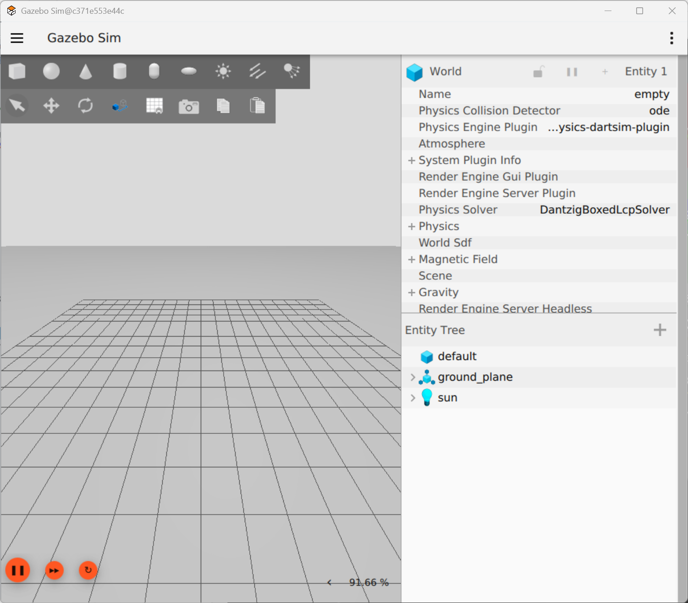

3. 창을 쪼개어 명령을 수행하여 로봇을 생성합니다.

```bash
ros2 run ros_gz_sim create -topic robot_description -name my_bot -z 0.1
```

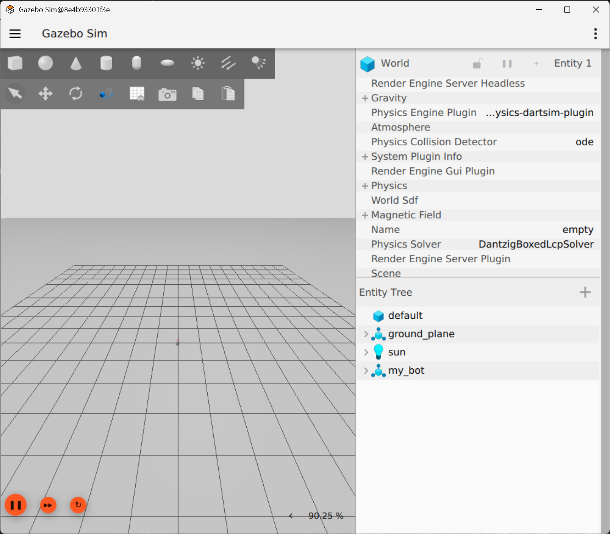

4. 마우스 휠을 이용하여 로봇을 가깝게 당깁니다. 로봇이 투명하게 표시됩니다.

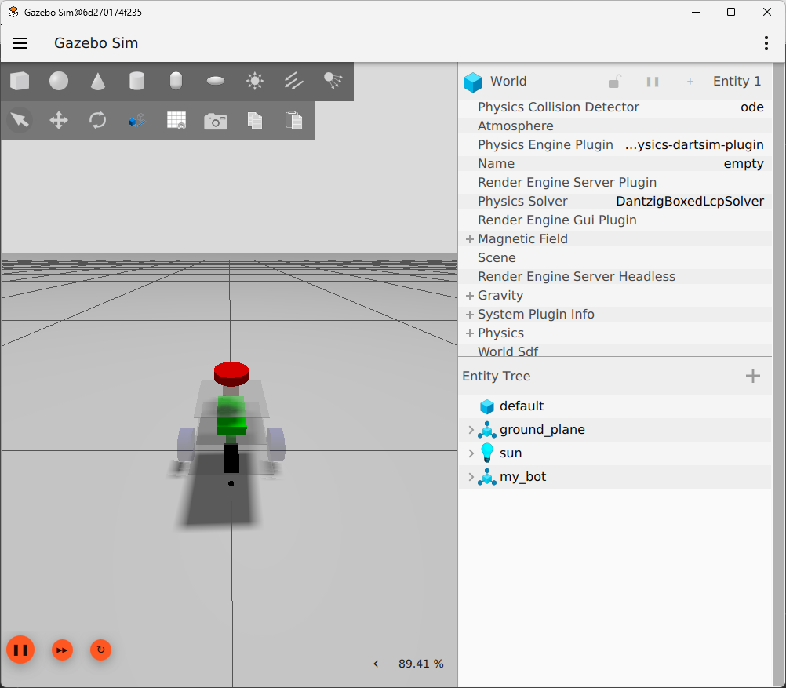

<br>

---

<br>

## 01_2 로봇 색깔 넣기

가제보에 생성되는 로봇에 색깔을 넣어봅니다.

1. 예제를 수정합니다.

**robot_core_diffdrive.xacro**

```xml
    ... 

    <material name="white">
        <color rgba="1 1 1 1"/>
    </material>

    ...

    <material name="blue">
        <color rgba="0.2 0.2 1 1"/>
    </material>

    ... 
```

2. URDF 파일을 저장한 후, 명령을 재구동합니다.

3. 가제보에서  을 눌러 로봇을 제거합니다. 다음 그림을 참조합니다.

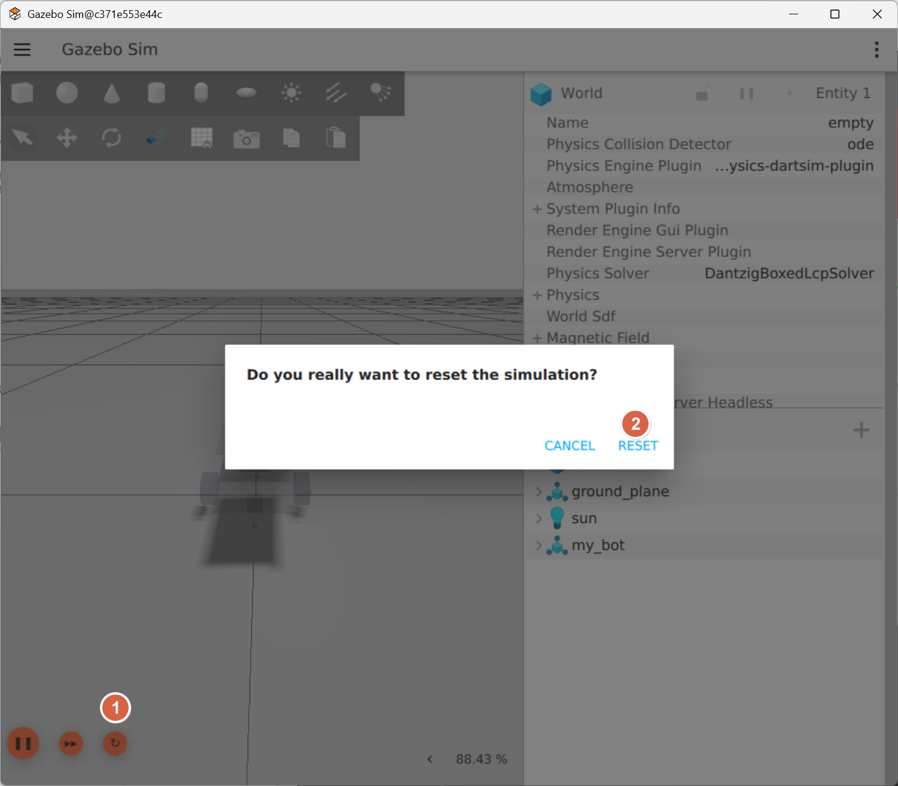

4. 명령을 수행하여 로봇을 다시 생성합니다.

```bash
ros2 run ros_gz_sim create -topic robot_description -name my_bot -z 0.1
```

5. 다음과 같이 ➀ 로봇이 0.1m 뜬 상태에서 생성됩니다. 하단 우측에 ➁  버튼을 눌러 시뮬레이션을 시작합니다.

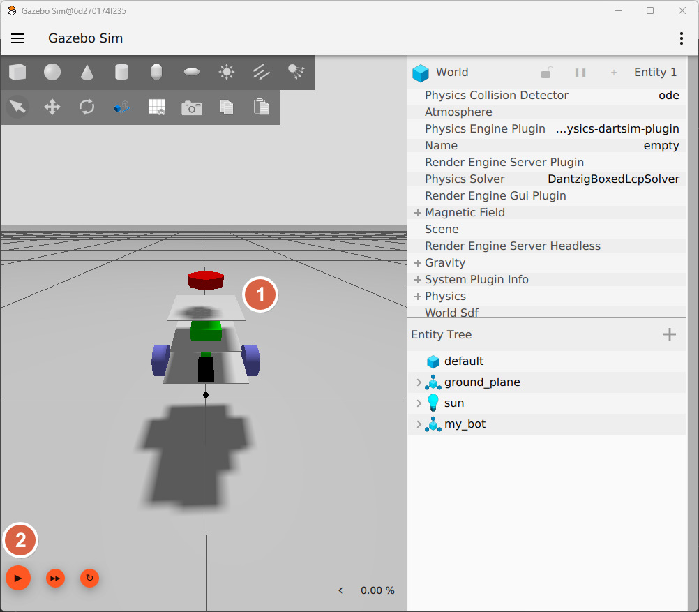

6. 로봇이 지면에 떨어지며 시뮬레이션이 시작됩니다.

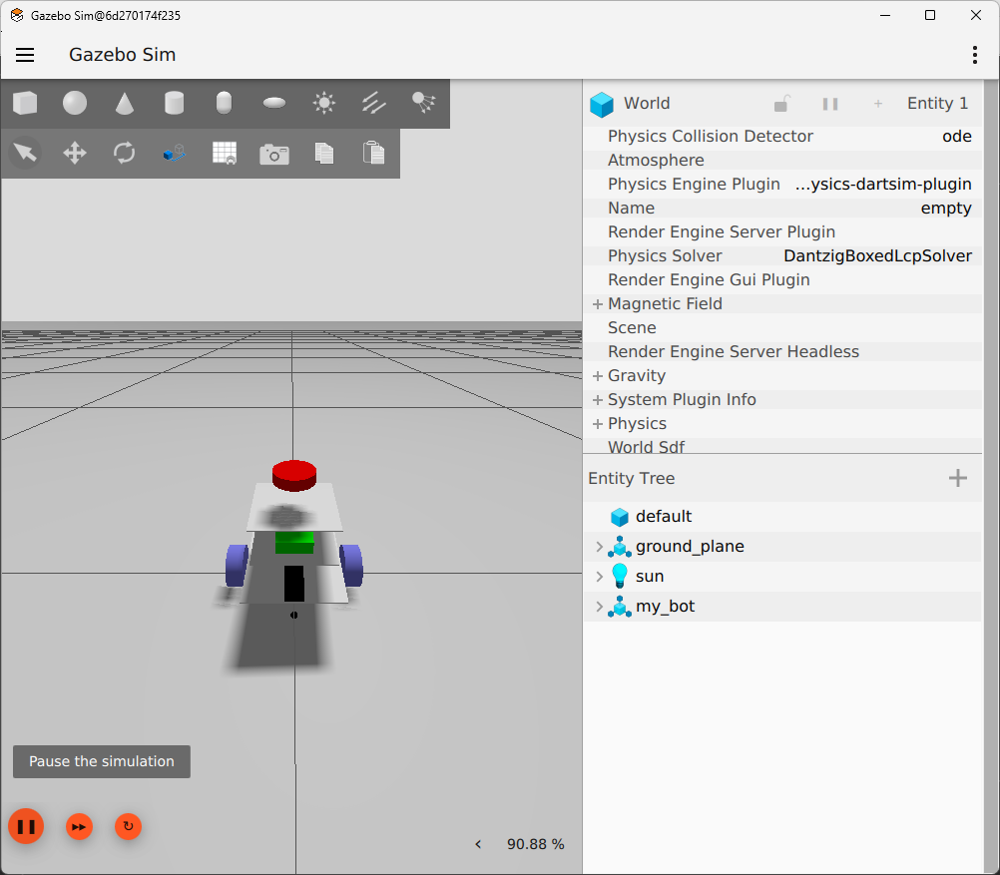

7. rviz2 창도 확인합니다.

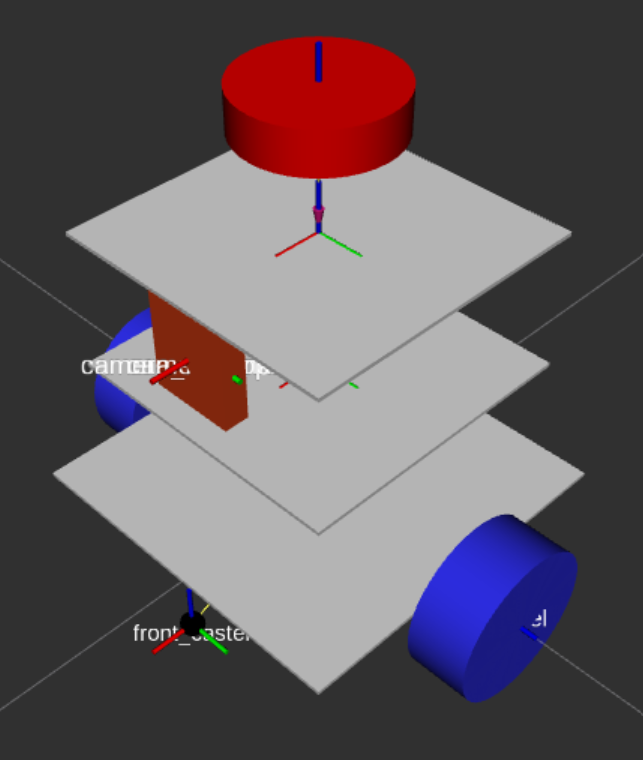

<br>

---

<br>

## 01_3 가제보 로봇 구동 준비하기

### CASTER 마찰 제거하기

먼저 caster의 마찰을 제거해서 ball 처럼 동작하게 합니다.

1. 예제를 수정합니다.

**robot_core_diffdrive.xacro**

```xml
    ... 

    <gazebo reference="front_caster">
        <mu1>0.001</mu1>
        <mu2>0.001</mu2>
    </gazebo>

    <gazebo reference="rear_caster">
        <mu1>0.001</mu1>
        <mu2>0.001</mu2>
    </gazebo>

</robot>
```
<br>

---

<br>

### 바퀴 속성 변경하기

다음은 바퀴를 구동하기 위한 토크와 속도를 실제 모터 사양에 맞춰 설정합니다. 또 가제보 시뮬레이션에서 바퀴 회전 시 마찰을 줄이기 위해 바퀴의 collision 속성을 cylinder에서 sphere로 변경합니다.

2. 계속해서 예제를 수정합니다.

**robot_core_diffdrive.xacro**

```xml
    <!-- LEFT WHEEL -->

    <joint name="left_wheel_joint" type="continuous">
        <parent link="base_link"/>
        <child link="left_wheel"/>
        <origin xyz="0 0.0907 0" rpy="-${pi/2} 0 0"/>
        <axis xyz="0 0 1"/>
        <limit effort="0.23" velocity="9.42"/>
    </joint>

    <link name="left_wheel">
        <visual>
            <geometry>
                <cylinder length="0.026" radius="0.0325" />
            </geometry>
            <material name="blue"/>
        </visual>
        <collision>
            <geometry>
                <!-- <cylinder length="0.026" radius="0.0325" /> -->
                <sphere radius="0.0325"/>
            </geometry>
        </collision>        
        <xacro:inertial_cylinder mass="0.06" length="0.026" radius="0.0325">
            <origin xyz="0 0 0" rpy="0 0 0"/>
        </xacro:inertial_cylinder>
    </link>

    <!-- RIGHT WHEEL -->

    <joint name="right_wheel_joint" type="continuous">
        <parent link="base_link"/>
        <child link="right_wheel"/>
        <origin xyz="0 -0.0907 0" rpy="${pi/2} 0 0"/>
        <axis xyz="0 0 -1"/>
        <limit effort="0.23" velocity="9.42"/>
    </joint>

    <link name="right_wheel">
        <visual>
            <geometry>
                <cylinder length="0.026" radius="0.0325" />
            </geometry>
            <material name="blue"/>
        </visual>
        <collision>
            <geometry>
                <!-- <cylinder length="0.026" radius="0.0325" /> -->
                <sphere radius="0.0325"/>
            </geometry>
        </collision>    
        <xacro:inertial_cylinder mass="0.06" length="0.026" radius="0.0325">
            <origin xyz="0 0 0" rpy="0 0 0"/>
        </xacro:inertial_cylinder>
    </link>
```

> 다음은 <limit> 태그로 Torque와 Velocity를 설정합니다. 이 부분에 대한 설정이 없으면 가제보 시뮬레이션 시 순간적으로 급격한 움직임이 발생할 수 있습니다. 

```xml
<limit effort="0.23" velocity="9.42"/>
```

**Velocity - 조인트의 회전 속도를 의미하며, 다음과 같이 구합니다.**

```
Velocity - 무부하 속도(90 RPM) 기준
<limit>은 "절대 넘을 수 없는 물리적 상한"을 의미하므로, 부하가 전혀 없을 때 낼 수 있는 최고 속도(무부하 속도)를 기준으로 잡습니다.
90 RPM → rad/s: 90 × 2π / 60 ≈ 9.42 rad/s
바퀴 반경 0.0325m 기준 선속도로 환산하면:
v = 9.42 × 0.0325 ≈ 0.31 m/s
```
Effort는 이 책에서 사용하는 N20 DC 모터의 사양을 기준으로 다음과 같이 구합니다.

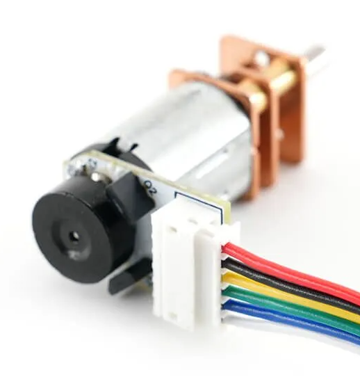

```
Effort — 정지 토크(2320 g·cm, 12V) 기준
먼저 g·cm를 N·m로 단위 변환을 하면
1 g·cm = 9.80665×10⁻⁵ N·m 입니다.
2320 g·cm × 9.80665×10⁻⁵ ≈ 0.2275 N·m
```
다음은 바퀴의 <collision> 속성을 <cylinder>에서 <sphere>로 변경합니다.

```xml
<sphere radius="0.0325"/>
```

> 이렇게 하면 가제보 시뮬레이션 시, 지면에 닿은 부분을 최소로 해서 차동 모션의 마찰로 인한 이상한 odometry issues를 줄일 수 있습니다. <br> 다만 sphere로 바꾸면, 접촉점이 사실상 하나뿐이라 그 지점을 축으로 한 회전(요 방향)에는 병진 마찰이 저항하지 못해, 정지 상태에서도 미세한 슬립이 발생할 수 있습니다.

3. 명령을 재구동합니다.

```
ros2 run robot_state_publisher robot_state_publisher --ros-args -p robot_description:="$(xacro /root/myros_sketch/robot.urdf.xacro)"
```

4. 다음과 같이 RobotModel에서 ➊ Visual Enabled 항목을 언체크하고, ➋ Collision Enabled 항목을 체크해 봅니다.

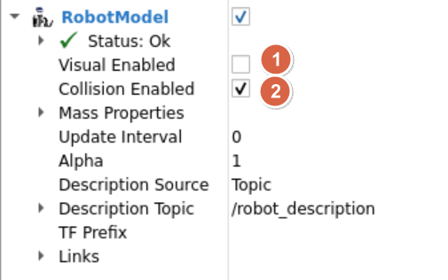

5. 표시되는 것을 확인합니다. (sphere 형태 확인)

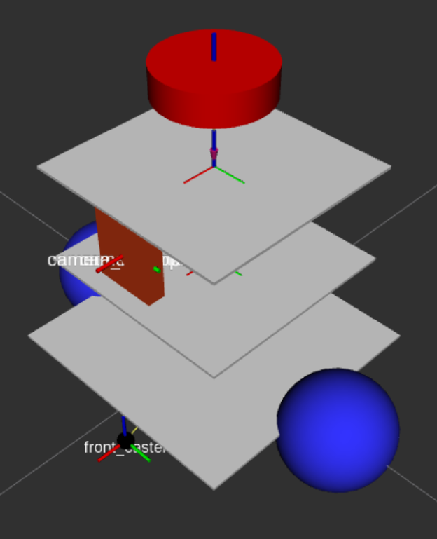

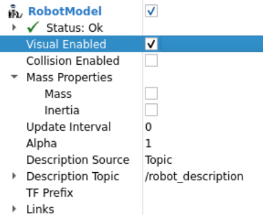

<br>

---

<br>

## 01_4 로봇 구동하기 (/cmd_vel, teleop_twist_keyboard)

먼저 로봇 구동을 위한 urdf 환경을 구성한 후, teleop_twist_keyboard 노드를 이용하여 로봇을 구동해 봅니다.

1. 파일을 수정합니다.

**robot.urdf.xacro**

```xml
<?xml version="1.0"?>
<robot xmlns:xacro="http://www.ros.org/wiki/xacro" name="robot">

    <xacro:include filename="robot_core_diffdrive.xacro" />
    <xacro:include filename="ros2_control_diffdrive_gz.xacro" />
    
</robot>
```

2. 파일을 작성합니다.

**ros2_control_diffdrive_gz.xacro**

```xml
<?xml version="1.0"?>
<robot xmlns:xacro="http://www.ros.org/wiki/xacro">

  <ros2_control name="myros_diffdrive" type="system">
    <hardware>
      <plugin>gz_ros2_control/GazeboSimSystem</plugin>
    </hardware>

    <joint name="left_wheel_joint">
      <command_interface name="velocity"/>
      <state_interface name="position"/>
      <state_interface name="velocity"/>
    </joint>
    <joint name="right_wheel_joint">
      <command_interface name="velocity"/>
      <state_interface name="position"/>
      <state_interface name="velocity"/>
    </joint>
  </ros2_control>

  <gazebo>
    <plugin name="gz_ros2_control::GazeboSimROS2ControlPlugin"
            filename="libgz_ros2_control-system">
      <parameters>/root/myros_sketch/diffdrive_controllers.yaml</parameters>
    </plugin>
  </gazebo>

</robot>
```

> 이 코드의 핵심은 로봇의 바퀴 조인트(Joint)를 ros2_control 프레임워크에 등록하고, 이를 Gazebo 시뮬레이션 환경 내의 시뮬레이션 플러그인과 연결하는 역할을 합니다.

**ros2_control 태그 영역**: 로봇의 하드웨어(또는 시뮬레이션 하드웨어)와 ROS 2 제어기(Controller) 사이의 인터페이스를 정의합니다.

- `name="myros_diffdrive"`: 이 제어 시스템의 이름
- `type="system"`: 여러 조인트를 통째로 제어하는 "System" 타입
- `<plugin>gz_ros2_control/GazeboSimSystem</plugin>`: Gazebo 시뮬레이터를 가상의 하드웨어로 사용하겠다고 선언하는 하드웨어 인터페이스 플러그인

```bash
find /opt/ros/jazzy/ -name libgz_hardware_plugins.so
```

- `<command_interface name="velocity"/>`: 속도(Velocity) 명령을 전달받도록 설정
- `<state_interface name="..."/>`: 시뮬레이터로부터 바퀴의 현재 속도와 위치(회전각) 피드백을 받아 전달

**Gazebo 플러그인 태그 영역**: Gazebo 시뮬레이터가 실행될 때 ros2_control 노드를 함께 로드하도록 연결

```bash
find /opt/ros/jazzy/ -name libgz_ros2_control-system.so
```

3. 파일을 작성합니다.

**diffdrive_controllers.yaml**

```yaml
controller_manager:
  ros__parameters:
    update_rate: 100

    joint_state_broadcaster:
      type: joint_state_broadcaster/JointStateBroadcaster

    diff_drive_controller:
      type: diff_drive_controller/DiffDriveController

diff_drive_controller:
  ros__parameters:
    left_wheel_names: ["left_wheel_joint"]
    right_wheel_names: ["right_wheel_joint"]

    wheel_separation: 0.1814
    wheel_radius: 0.0325

    position_feedback: false
    open_loop: false

    base_frame_id: base_footprint
    odom_frame_id: odom
    enable_odom_tf: true

    cmd_vel_timeout: 0.5
    
    linear.x.max_velocity: 0.306
    linear.x.min_velocity: -0.306
    angular.z.max_velocity: 3.38
    angular.z.min_velocity: -3.38
```

### Controller Manager 설정 (controller_manager)

- `update_rate: 100`: controller_manager 자체의 제어 루프 주기. 초당 100번 모든 활성 컨트롤러의 update()를 호출.
- `joint_state_broadcaster`: JointStateBroadcaster 클래스 등록
- `diff_drive_controller`: DiffDriveController 클래스 등록

### 차동 구동 제어기 상세 설정 (diff_drive_controller)

**① 조인트 및 규격 설정**

- `left_wheel_names / right_wheel_names`: 좌/우 바퀴 관절 이름 매핑
- `wheel_separation: 0.1814`: 윤거(0.1814m = 18.14cm)
- `wheel_radius: 0.0325`: 바퀴 반지름(3.25cm)

**② 제어 방식 설정**

- `position_feedback: false`: 속도(Velocity) 피드백 사용
- `open_loop: false`: 피드백을 사용하여 오도메트리 계산

| 조합 | 오도메트리 계산 방식 | 특징 |
|---|---|---|
| open_loop: true | cmd_vel 명령값만으로 계산 | 로봇이 끼어 있어도 RViz는 명령대로 주행 |
| open_loop: false / position_feedback: true | position(누적 각도) 센서 값으로 계산 | position state 구현 필요 |
| open_loop: false / position_feedback: false | velocity(현재 속도) 센서 값으로 계산 | velocity state 데이터 필수 |

**③ 위치 추정 (Odometry)**

- `base_frame_id / odom_frame_id`: odom 좌표계 기준으로 base_footprint 위치 추적
- `enable_odom_tf: true`: odom → base_footprint TF 자동 생성

**④ 안전 및 속도 제한 설정**

- `cmd_vel_timeout: 0.5`: 0.5초 동안 /cmd_vel 명령이 없으면 자동 정지
- `linear.x.*`: 직진/후진 최대 선속도 0.306m/s
- `angular.z.*`: 회전 최대 각속도 ±3.38rad/s

> 최대 선속도 계산: 90RPM → 1.5RPS → `1.5 × 2 × π × 0.0325m = 0.306m/s`
> 제자리 회전 최대 각속도: `0.306 × 2 / 0.1814 = 3.38rad/s ≈ 193°/s`

4. 파일을 작성합니다.

**gz_bridge.yaml**

```yaml
# Clock needed so ROS understand's Gazebo's time
- ros_topic_name: "clock"
  gz_topic_name: "clock"
  ros_type_name: "rosgraph_msgs/msg/Clock"
  gz_type_name: "gz.msgs.Clock"
  direction: GZ_TO_ROS
```

| 필드 | 값 | 의미 |
|---|---|---|
| ros_topic_name | "clock" | ROS2 쪽 토픽 이름 → /clock |
| gz_topic_name | "clock" | Gazebo Transport 쪽 원본 토픽 이름 |
| ros_type_name | "rosgraph_msgs/msg/Clock" | ROS2 메시지 타입 |
| gz_type_name | "gz.msgs.Clock" | Gazebo 쪽 원본 메시지 타입 |
| direction | GZ_TO_ROS | Gazebo에서 ROS2로만 흐름 |

> 1. Gazebo가 clock 토픽을 발행 → 2. ros_gz_bridge가 /clock으로 변환 → 3. use_sim_time:=true로 설정된 모든 ROS2 노드가 이 /clock을 구독해 시뮬레이션 시간으로 맞춤.

5. 6개의 명령창을 준비합니다.


> ※ 바로 다음에 이 6개의 명령창을 이용하여 다음 명령들을 수행하며 실습을 진행합니다.

```
① ros2 run robot_state_publisher robot_state_publisher --ros-args -p robot_description:="$(xacro /root/myros_sketch/robot.urdf.xacro)" -p use_sim_time:=true
② gz sim -r -v4 empty.sdf 
③ ros2 run ros_gz_bridge parameter_bridge --ros-args -p config_file:=/root/myros_sketch/gz_bridge.yaml
④ ros2 run ros_gz_sim create -topic robot_description -name my_bot -z 0.1
⑤ ros2 run controller_manager spawner joint_state_broadcaster
⑥ ros2 run controller_manager spawner diff_drive_controller
⑦ xterm -e ros2 run teleop_twist_keyboard teleop_twist_keyboard \
  --ros-args \
  -r cmd_vel:=/diff_drive_controller/cmd_vel \
  -p stamped:=true \
  -p use_sim_time:=true
⑧ rviz2 -d /root/myros_sketch/view_bot.rviz --ros-args -p use_sim_time:=true
```

> ④,⑤,⑥ 명령은 다음과 같이 &&로 묶어서 한 번에 실행합니다.

```
④+⑤+⑥ 
ros2 run ros_gz_sim create -topic robot_description -name my_bot -z 0.1 && \
ros2 run controller_manager spawner joint_state_broadcaster && \
ros2 run controller_manager spawner diff_drive_controller
```

> 속도 조절이 필요하면 `-p speed:=0.05 -p turn:=0.2` 옵션을 추가합니다.

6. 명령들을 실행합니다.


7. 실행되는 것을 확인합니다.


8. RViz2 상에서 [Fixed Frame]을 [odom]으로 설정합니다.


9. 키보드로 조종해 봅니다. (u, i, o, j, k, l, m, , , .)


## 01_5 가제보와 Rviz2 연동 테스트

여기서는 가제보 상에서 로봇을 5m 직진시켰을 때, rviz2 상에 제대로 표시되는지, 또 한 바퀴 회전 시켰을 때 rviz2 상에서도 한바퀴 돌아 최초 위치에 와 있는지 테스트해 봅니다.

1. 가제보 좌측 하단에서 버튼을 눌러줍니다.


2. [RESET] 버튼을 눌러줍니다.


3. 로봇이 제거되는 것을 확인합니다.

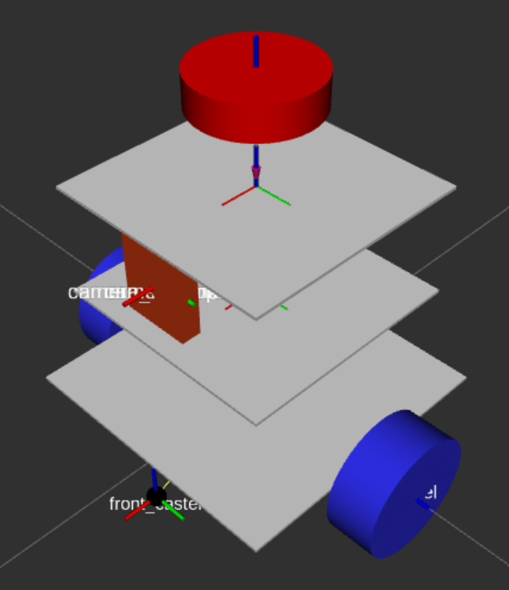

4. 가제보 시뮬레이션을 시작합니다.

5. 명령 입력창에서 [윗 방향키], [엔터 키]를 눌러 명령을 수행합니다.

6. View Angle 메뉴를 설정합니다.


7. View의 크기를 조절합니다.

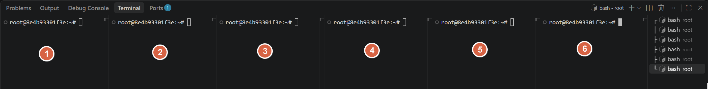

8. RViz2 상에서 [Fixed Frame]을 [odom]으로 설정합니다.

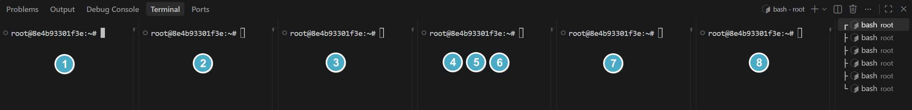

9. Views Type을 [TopDownOrtho]로 선택하고, [Zero] 버튼을 눌러 초기화해줍니다.

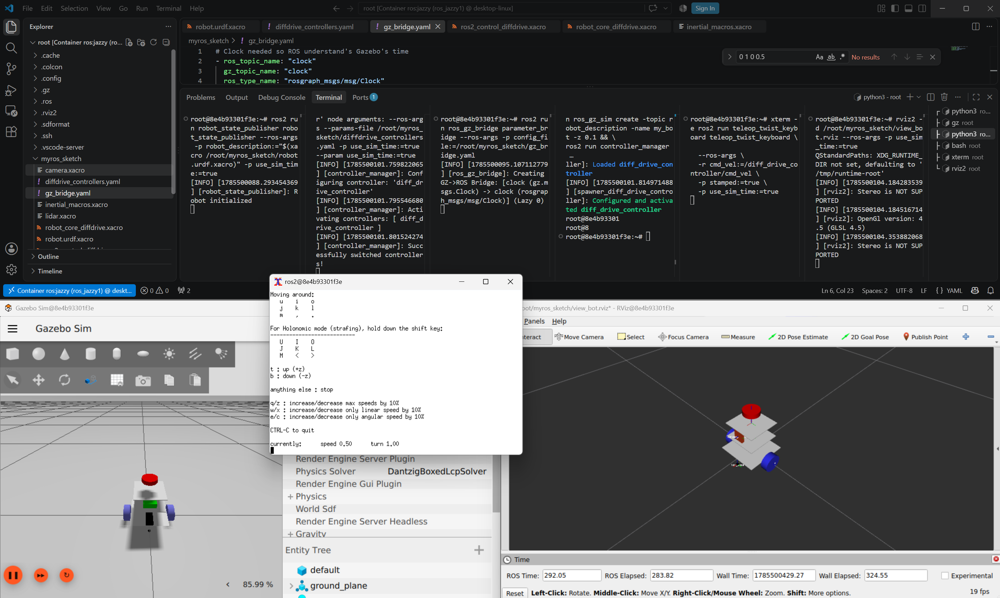

10. 마우스 휠을 이용하여 로봇이 보이게 합니다.

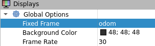

11. 키보드 입력 창을 활성화한 후, i 키를 입력하여 정주행을 수행합니다.

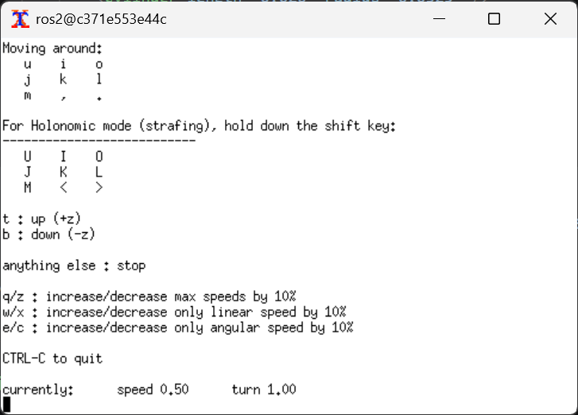

12. 5m 전진 시킵니다. 가제보와 rviz2에서 로봇의 위치를 확인합니다.

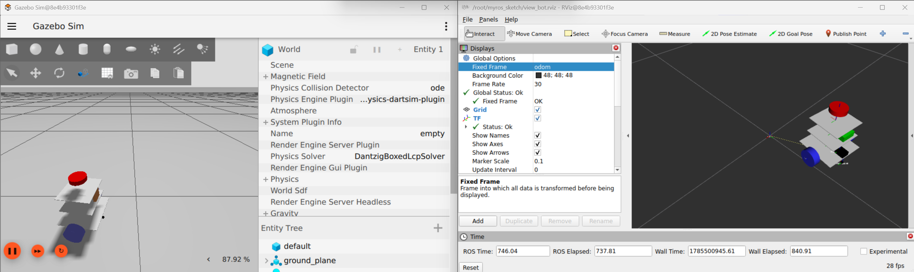

> ※ rviz2에서 약간의 오차는 있을 수 있습니다.

13. ,(컴마) 키를 눌러 5m 후진시켜 봅니다.

14. u키를 눌러 한바퀴를 돈 후, 비교해 봅니다.


15. 마지막으로 m키를 눌러 뒤로 한바퀴 돈 후, 비교해 봅니다.

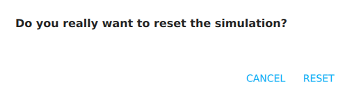

## 01_6 로봇 상태 확인하기 (/joint_states, /odom, /tf)

이번엔 조인트 상태, 오도메트리, TF를 명령행과 RViz2를 이용하여 확인해 봅니다.

1. 새 터미널을 열어줍니다.


2. 터미널이 열립니다.

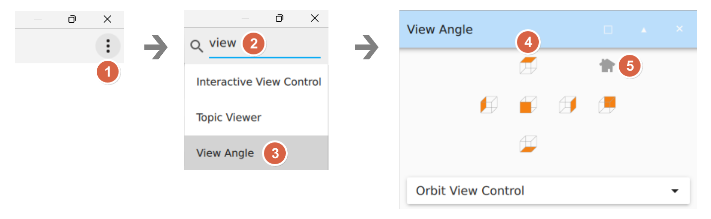

3. 명령을 실행합니다.

```bash
ros2 control list_hardware_interfaces
```

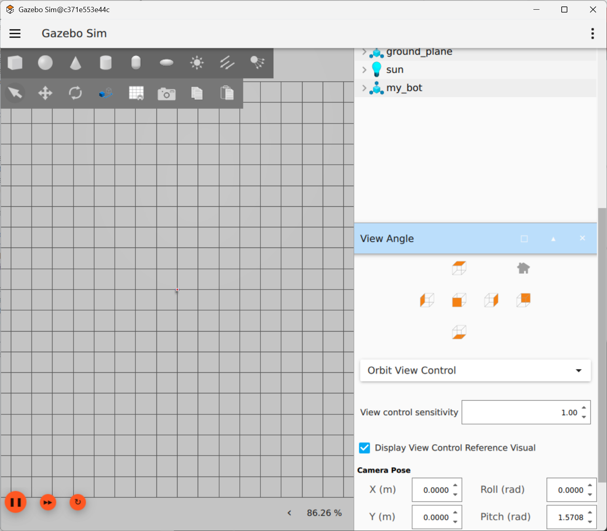

4. 명령을 실행합니다.

```bash
ros2 node list
```

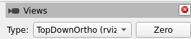

5. 명령을 실행합니다.

```bash
ros2 topic list
```

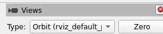

6. joint_states 토픽을 살펴봅니다.

```bash
ros2 topic echo /joint_states
```

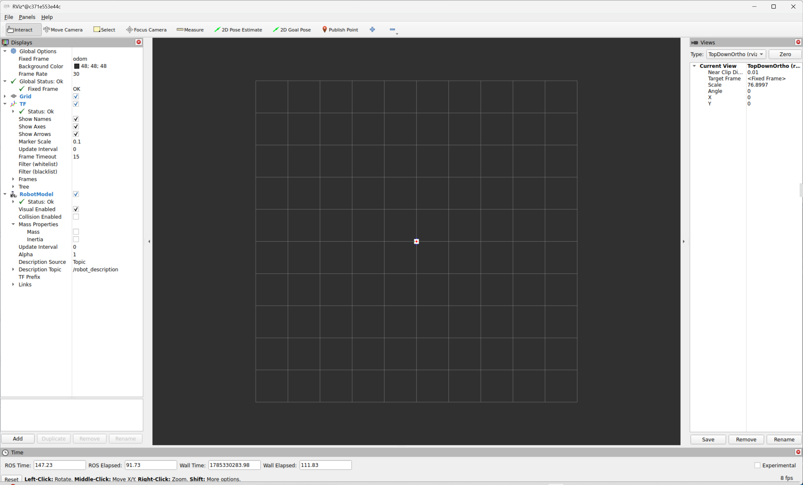

7. odom 토픽을 살펴봅니다.

```bash
ros2 topic echo /diff_drive_controller/odom --no-arr
```

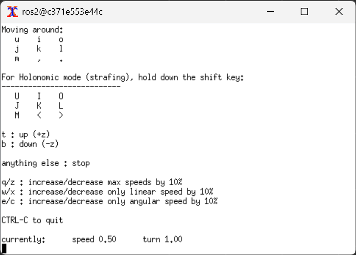

8. tf 토픽을 살펴봅니다.

```bash
ros2 topic echo /tf
```

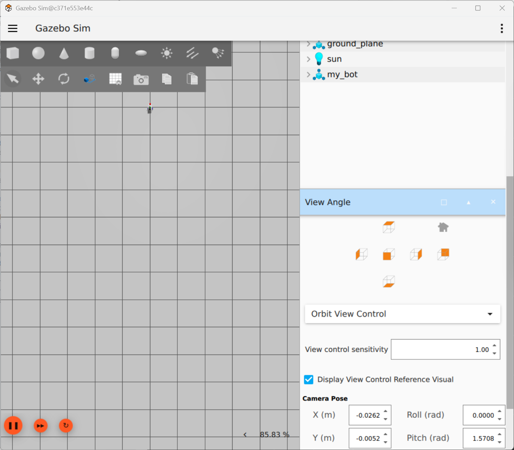

9. rviz2 창을 선택한 후, 설정합니다.

10. [Add] 버튼을 클릭합니다.

11. Odometry 항목을 선택합니다.


12. 설정합니다.

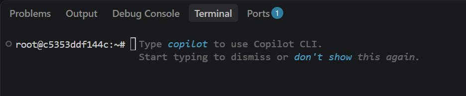

> Position Tolerance와 Angle Tolerance는 화살표 갱신 기준입니다. Position Tolerance는 1cm 이동 시, Angle Tolerance는 0.01rad(약 0.57도) 회전 시 갱신합니다.

13. 표시되는 것을 확인합니다.

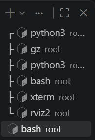

14. 키보드 입력창을 선택한 후, 로봇을 이동, 회전시켜 봅니다.

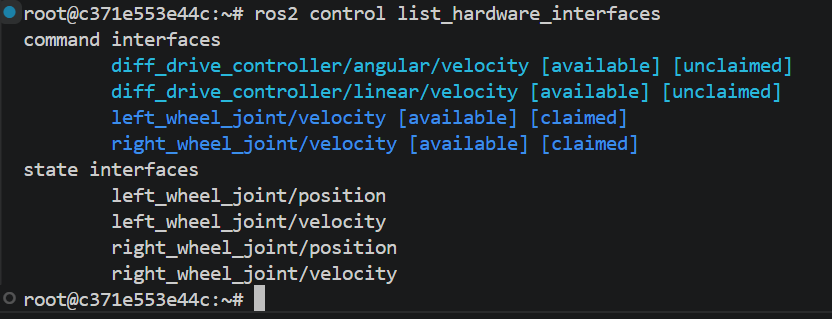

> ※ odom 토픽은 odom 좌표계를 기준으로 로봇의 위치와 방향을 나타내고, 로봇의 자체 좌표계(base_footprint)를 기준으로 선속도와 회전속도를 나타내는 토픽입니다.

## 01_7 라이다 구동하기

다음은 라이다 구동을 위한 urdf 환경을 구성한 후, 라이다 데이터를 확인해 봅니다. empty.sdf 파일에 모든 센서(카메라, IMU, LiDAR 등)를 시뮬레이션하는 Sensors 시스템 플러그인을 추가해 줍니다.

1. empty.sdf 파일을 찾습니다.

```bash
find /opt/ros/jazzy/ -name empty.sdf
```

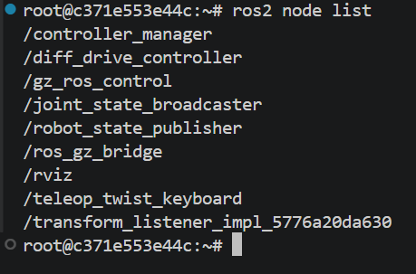

2. empty.sdf 파일을 복사해 줍니다.

```bash
cp /opt/ros/jazzy/opt/gz_sim_vendor/share/gz/gz-sim8/worlds/empty.sdf /root/myros_sketch/
```

3. 복사해 온 empty.sdf 파일을 열어줍니다.

```bash
nano /root/myros_sketch/empty.sdf
```

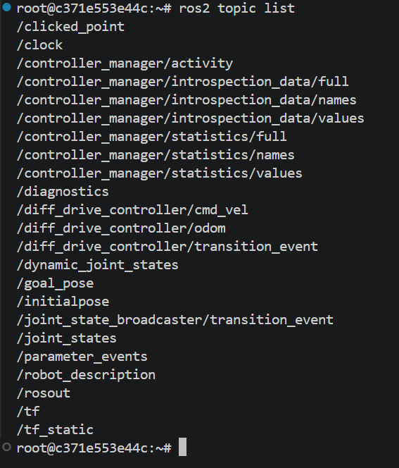

4. 다음 부분을 찾습니다.

```xml
    ...
    <plugin
      filename="gz-sim-physics-system"
      name="gz::sim::systems::Physics">
    </plugin>
    <plugin
      filename="gz-sim-user-commands-system"
      name="gz::sim::systems::UserCommands">
    </plugin>
    <plugin
      filename="gz-sim-scene-broadcaster-system"
      name="gz::sim::systems::SceneBroadcaster">
    </plugin>
    <plugin
      filename="gz-sim-contact-system"
      name="gz::sim::systems::Contact">
    </plugin>
    ...
```

5. 다음을 이어서 추가합니다.

```xml
<plugin filename="gz-sim-sensors-system" name="gz::sim::systems::Sensors"/>
```

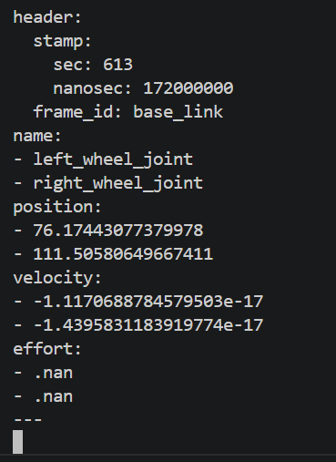

6. ctrl+x, y, 엔터키를 차례대로 눌러 저장 후 종료합니다.

7. 예제를 수정합니다.

**robot.urdf.xacro**

```xml
<?xml version="1.0"?>
<robot xmlns:xacro="http://www.ros.org/wiki/xacro"  name="robot">

    <xacro:include filename="robot_core_diffdrive.xacro" />
    <xacro:include filename="ros2_control_diffdrive_gz.xacro"/>
    <xacro:include filename="lidar.xacro"/>

</robot>
```

8. 예제를 작성합니다.

**lidar.xacro**

```xml
<?xml version="1.0"?>
<robot xmlns:xacro="http://www.ros.org/wiki/xacro" >
    
    <gazebo reference="laser_frame">
        <sensor name="laser" type="gpu_lidar">
            <pose> 0 0 0 0 0 0 </pose>
            <visualize>true</visualize>
            <update_rate>10</update_rate>
            <lidar>
                <scan>
                    <horizontal>
                        <samples>360</samples>
                        <min_angle>-3.14</min_angle>
                        <max_angle>3.14</max_angle>
                    </horizontal>
                </scan>
                <range>
                    <min>0.15</min>
                    <max>8</max>
                </range>
            </lidar>
            <topic>scan</topic>
            <gz_frame_id>laser_frame</gz_frame_id>
        </sensor>
    </gazebo>

</robot>
```

9. gz_bridge.yaml에 다음 내용을 추가합니다.

**gz_bridge.yaml**

```yaml
...

# Laser Scan Topics
- ros_topic_name: "scan"
  gz_topic_name: "scan"
  ros_type_name: "sensor_msgs/msg/LaserScan"
  gz_type_name: "gz.msgs.LaserScan"
  direction: GZ_TO_ROS
```

10. 모든 프로그램을 종료하고 재실행합니다.

```
① ros2 run robot_state_publisher robot_state_publisher --ros-args -p robot_description:="$(xacro /root/myros_sketch/robot.urdf.xacro)" -p use_sim_time:=true
② gz sim -r -v4 /root/myros_sketch/empty.sdf
③ ros2 run ros_gz_bridge parameter_bridge --ros-args -p config_file:=/root/myros_sketch/gz_bridge.yaml
④+⑤+⑥ 
ros2 run ros_gz_sim create -topic robot_description -name my_bot -z 0.1 && \
ros2 run controller_manager spawner joint_state_broadcaster && \
ros2 run controller_manager spawner diff_drive_controller
⑦ xterm -e ros2 run teleop_twist_keyboard teleop_twist_keyboard \
  --ros-args \
  -r cmd_vel:=/diff_drive_controller/cmd_vel \
  -p stamped:=true \
  -p use_sim_time:=true
⑧ rviz2 -d /root/myros_sketch/view_bot.rviz --ros-args -p use_sim_time:=true
```

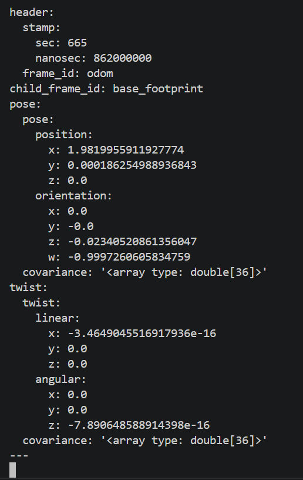

11. 가제보에서 [Visualize Lidar] 플러그인을 추가해줍니다.

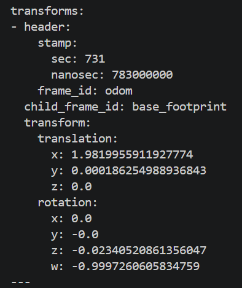

12. 라이다 스캔 범위를 표시해 봅니다.

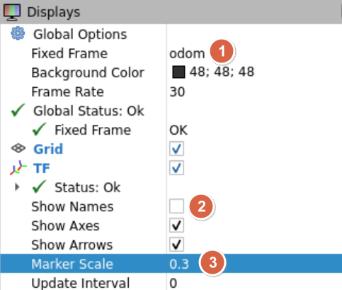

13. 창을 하나 더 분리한 후, 명령을 실행합니다.

```bash
ros2 topic list
```

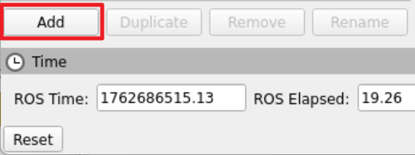

14. 명령을 실행합니다.

```bash
ros2 topic echo /scan --no-arr
```

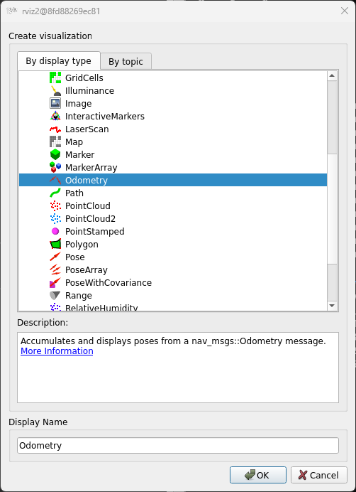

확인 후, ctrl+c를 눌러 종료합니다.

> ※ 출력이 안될 경우 시뮬레이션 시작 버튼을 눌러줍니다.

## 01_8 가제보에 장애물 추가하기

여기서는 가제보에 간단한 장애물을 추가한 후, 라이다 관련 동작을 살펴봅니다. 또, sdf 파일로 저장해 봅니다.

1. 가제보 좌측 상단에서 도형들을 마우스로 선택하여 로봇 주변에 배치해 봅니다.

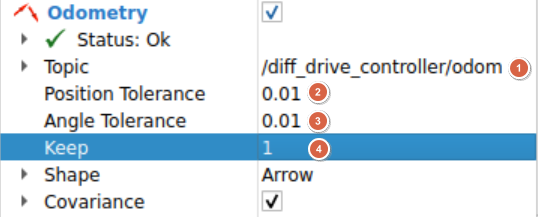

2. [Show Non Hitting Rays] 메뉴를 비활성화해 봅니다.

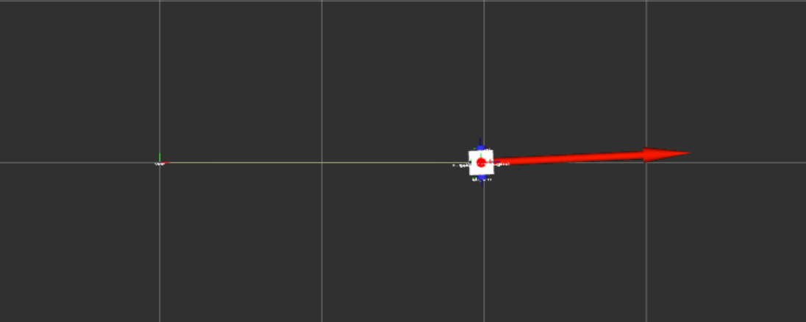

3. [Entity Tree]에서 [my_bot]을 선택한 후, 마우스 오른쪽 버튼을 눌러 [Remove]를 해줍니다.

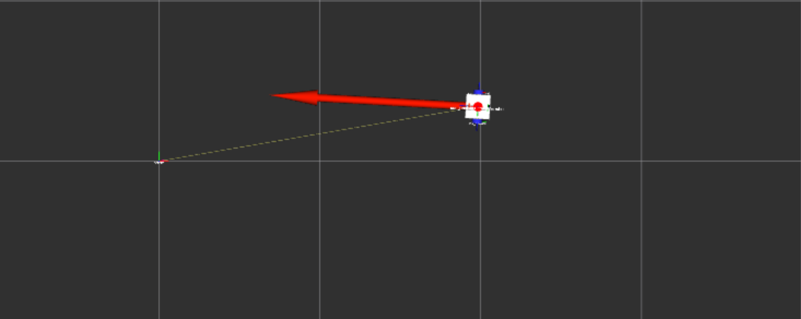

4. 장애물이 추가된 파일을 저장합니다.

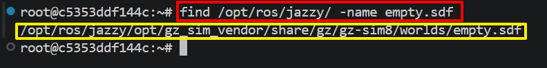

5. myros_sketch/obstacles.sdf로 저장합니다.

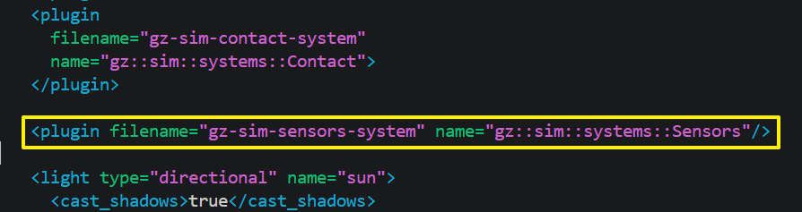

6. [OK] 버튼을 눌러 저장을 완료합니다.

7. 가제보를 종료한 후, 명령을 실행합니다.

```bash
gz sim -r -v4 /root/myros_sketch/obstacles.sdf
```

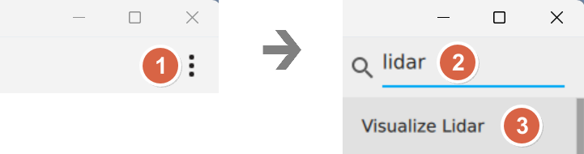

8. 로봇을 생성합니다.

```bash
ros2 run ros_gz_sim create -topic robot_description -name my_bot -z 0.1 && \
ros2 run controller_manager spawner joint_state_broadcaster && \
ros2 run controller_manager spawner diff_drive_controller
```

9. 라이다 시각화를 한 후, 키보드를 이용하여 로봇을 조종해 봅니다.

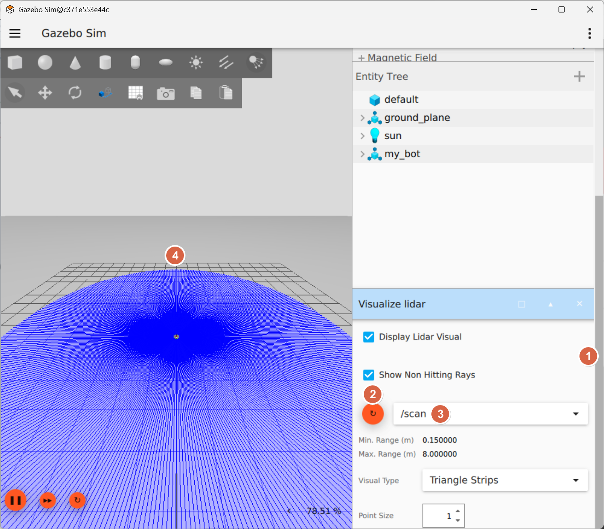

## 01_9 라이다 데이터 확인하기 (/scan, RViz2 LaserScan)

다음은 rviz2 상에서 라이다의 동작을 확인해 봅니다.

1. Displays 창에서 Fixed Frame을 odom으로 설정해 줍니다.

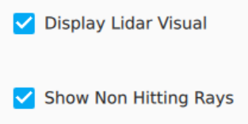

2. [Add] 버튼을 클릭합니다.

3. LaserScan 항목을 선택합니다.

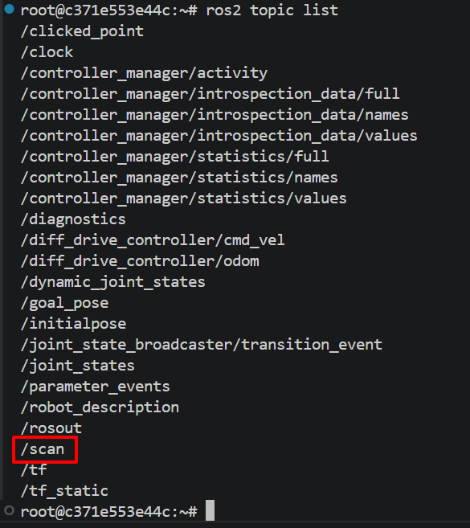

4. 설정합니다.

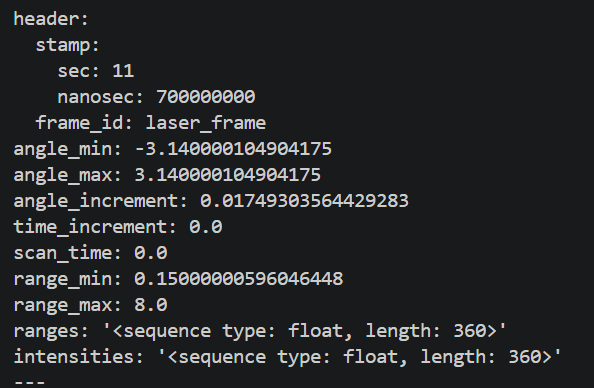

5. ctrl+s 키를 눌러 view_bot.rviz 파일을 저장합니다.

6. 표시되는 것을 확인합니다.


7. 로봇을 조종해 봅니다.

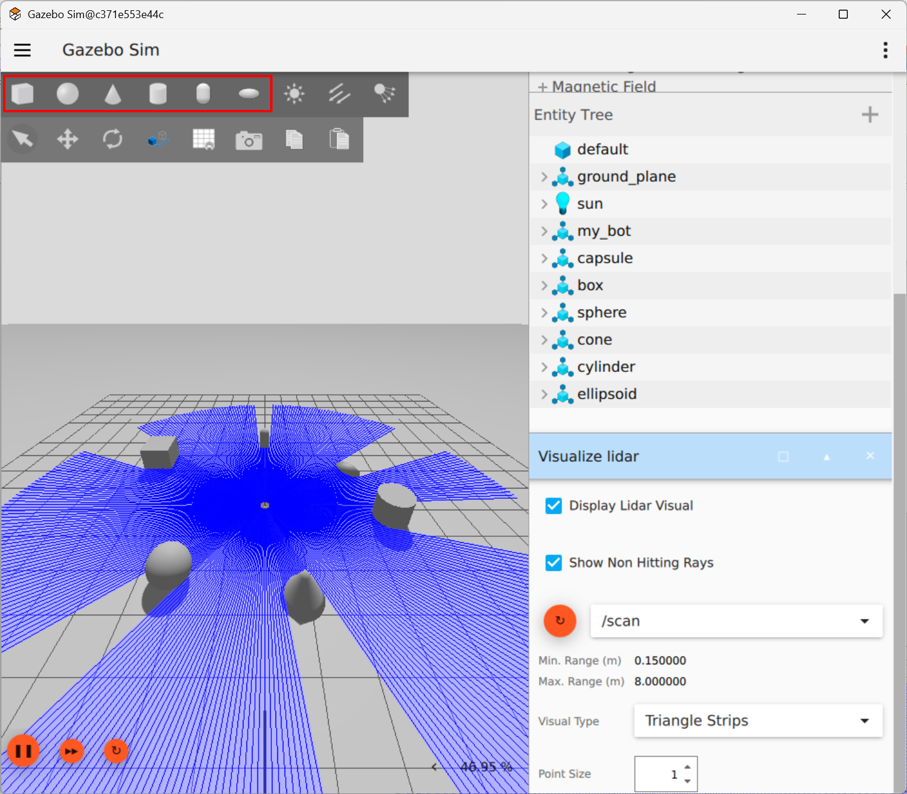

## 01_10 카메라 구동하기

다음은 카메라 구동을 위한 urdf 환경을 구성해 봅니다.

1. 예제를 수정합니다.

**robot.urdf.xacro**

```xml
<?xml version="1.0"?>
<robot xmlns:xacro="http://www.ros.org/wiki/xacro"  name="robot">

    <xacro:include filename="robot_core_diffdrive.xacro" />
    <xacro:include filename="ros2_control_diffdrive_gz.xacro"/>
    <xacro:include filename="lidar.xacro"/>
    <xacro:include filename="camera.xacro"/>

</robot>
```

2. 예제를 작성합니다.

**camera.xacro**

```xml
<?xml version="1.0"?>
<robot xmlns:xacro="http://www.ros.org/wiki/xacro">

    <gazebo reference="camera_link">
        <sensor name="camera" type="camera">
            <pose> 0 0 0 0 0 0 </pose>
            <visualize>true</visualize>
            <update_rate>10</update_rate>
            <camera>
                <camera_info_topic>camera/camera_info</camera_info_topic>
                <horizontal_fov>1.089</horizontal_fov>
                <image>
                    <format>R8G8B8</format>
                    <width>640</width>
                    <height>480</height>
                </image>
                <clip>
                    <near>0.05</near>
                    <far>8.0</far>
                </clip>
            </camera>
            <topic>camera/image_raw</topic>
            <gz_frame_id>camera_link_optical</gz_frame_id>
        </sensor>
    </gazebo>

</robot>
```

3. 카메라 데이터를 ROS2로 보내기 위해 gz_bridge.yaml에 다음 내용을 추가합니다.

**gz_bridge.yaml**

```yaml
...

# Camera topics (main camera data handled by dedicated image bridge)
- ros_topic_name: "camera/camera_info"
  gz_topic_name: "camera/camera_info"
  ros_type_name: "sensor_msgs/msg/CameraInfo"
  gz_type_name: "gz.msgs.CameraInfo"
  direction: GZ_TO_ROS
```

4. 기존 프로그램을 종료한 후, 7개의 명령창을 준비합니다.

5. 다음 명령들을 수행합니다.

```
① ros2 run robot_state_publisher robot_state_publisher --ros-args -p robot_description:="$(xacro /root/myros_sketch/robot.urdf.xacro)" -p use_sim_time:=true
② gz sim -r -v4 /root/myros_sketch/obstacles.sdf 
③ ros2 run ros_gz_bridge parameter_bridge --ros-args -p config_file:=/root/myros_sketch/gz_bridge.yaml
④ ros2 run ros_gz_image image_bridge /camera/image_raw
⑤+⑥+⑦ 
ros2 run ros_gz_sim create -topic robot_description -name my_bot -z 0.1 && \
ros2 run controller_manager spawner joint_state_broadcaster && \
ros2 run controller_manager spawner diff_drive_controller
⑧ xterm -e ros2 run teleop_twist_keyboard teleop_twist_keyboard \
  --ros-args \
  -r cmd_vel:=/diff_drive_controller/cmd_vel \
  -p stamped:=true \
  -p use_sim_time:=true
⑨ rviz2 -d /root/myros_sketch/view_bot.rviz --ros-args -p use_sim_time:=true
```

> ④ Gazebo 카메라 영상을 ROS 2의 sensor_msgs/Image 토픽(/camera/image_raw)으로 변환하는 브리지 프로그램입니다.

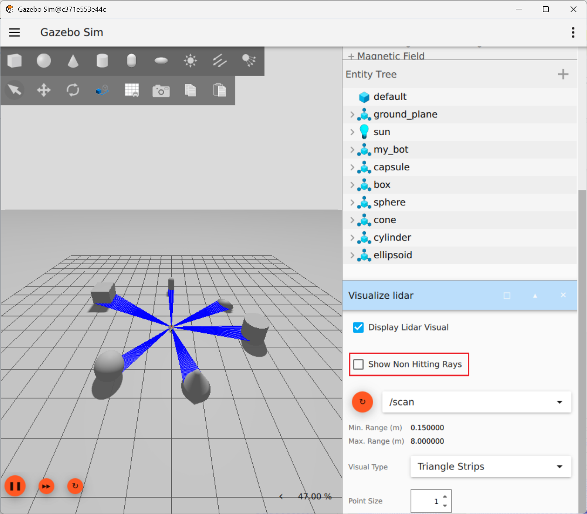

7. 가제보에서 [Image Display] 플러그인을 실행합니다.

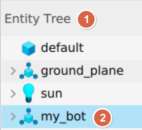

8. [Image Display] 플러그인에 카메라 영상이 뜹니다.

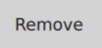

9. 창을 새로 띄운 후, 명령을 실행합니다.

```bash
ros2 topic list
```

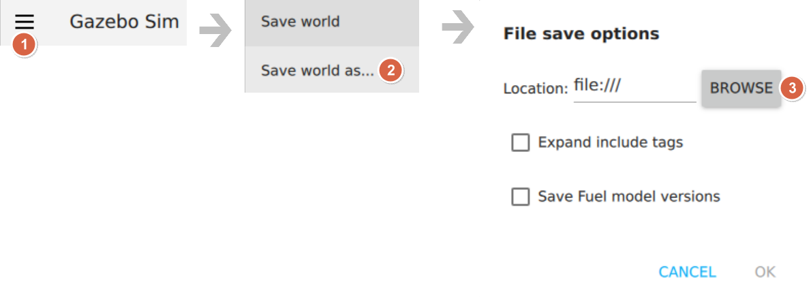

## 01_11 카메라 데이터 확인 (/camera/image_raw)

다음은 rviz2 상에서 카메라 토픽을 확인해 봅니다.

1. rviz2에서 Add 버튼을 누른 후, Camera를 선택하고 [OK] 버튼을 누릅니다.

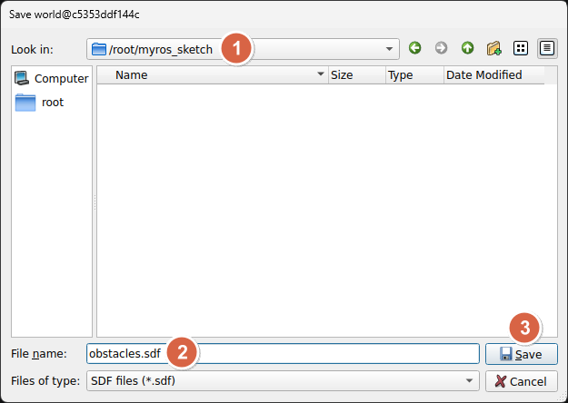

2. Camera의 Topic을 /camera/image_raw로 선택해 줍니다.

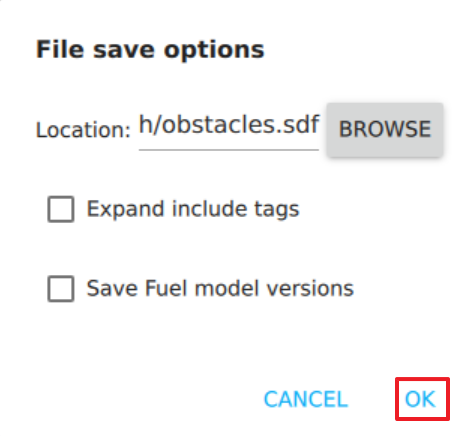

3. 표시되는 것을 확인합니다.

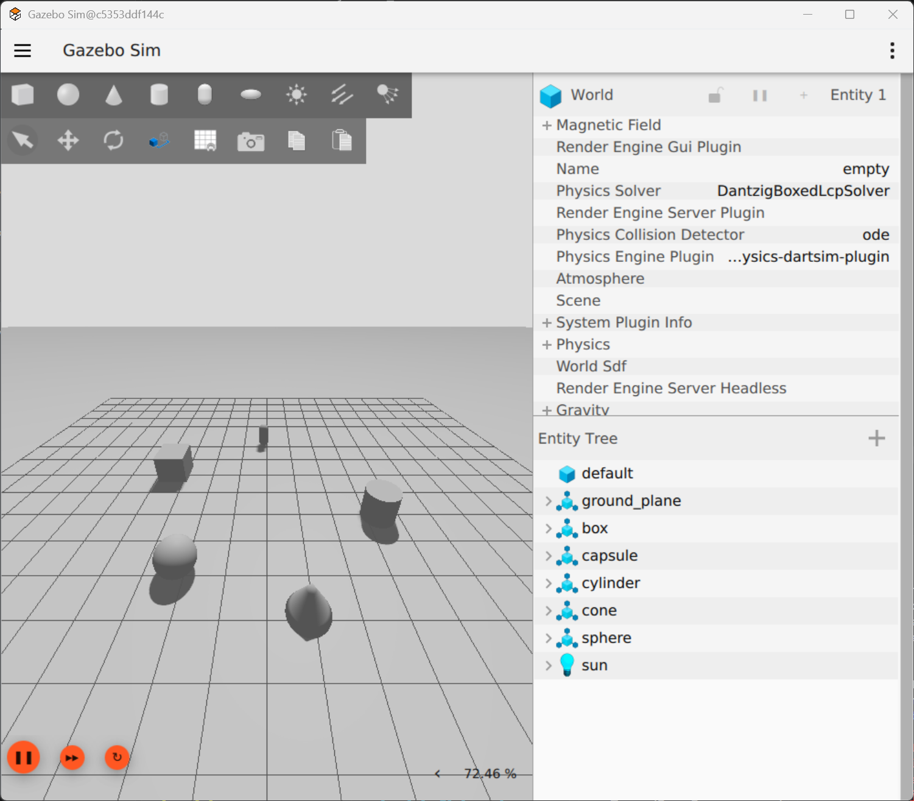
