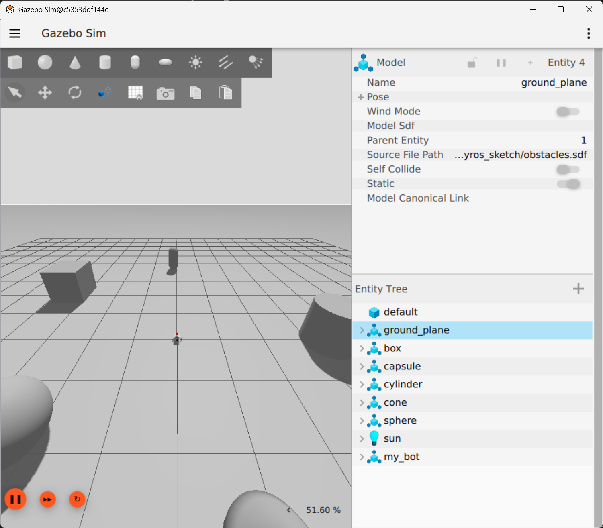
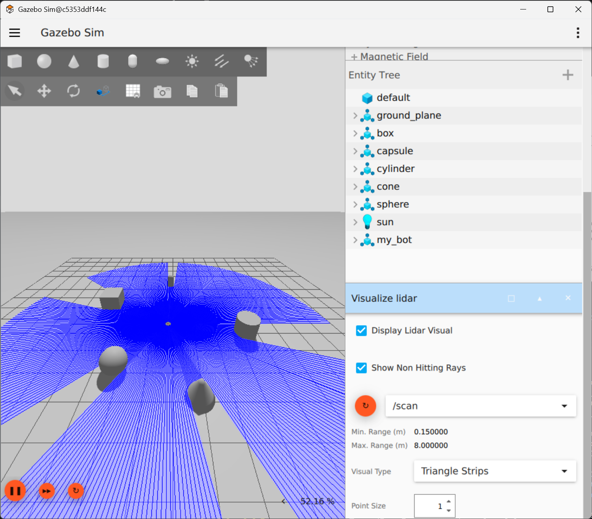
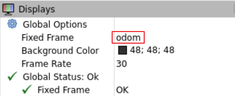

# 02 월드 파일 사용해 보기

다음은 소스와 같이 제공되는 apartment_world.sdf 파일입니다. 이 파일은 제공되는 소스의 myros_sketch 폴더 내에 있습니다.



1. 제공되는 소스에서 apartment_world.sdf 파일을 VS Code의 myros_sketch 폴더로 복사합니다.

2. 앞에서 실행한 가제보를 ctrl+c 키를 눌러 종료한 후, 명령을 실행해 봅니다.

```bash
gz sim -r -v4 /root/myros_sketch/apartment_world.sdf 
```

3. 실행되는 것을 확인합니다.



4. 기존에 실행되던 모든 프로그램을 ctrl+c 키를 눌러 종료한 후 창을 8개 준비합니다.

5. 명령을 수행합니다.

```
① ros2 run robot_state_publisher robot_state_publisher --ros-args -p robot_description:="$(xacro /root/myros_sketch/robot.urdf.xacro)" -p use_sim_time:=true
② gz sim -r -v4 /root/myros_sketch/apartment_world.sdf 
③ ros2 run ros_gz_bridge parameter_bridge --ros-args -p config_file:=/root/myros_sketch/gz_bridge.yaml
④ ros2 run ros_gz_image image_bridge /camera/image_raw
⑤+⑥+⑦ 
ros2 run ros_gz_sim create -topic robot_description -name my_bot -z 0.1 -x -2 && \
ros2 run controller_manager spawner joint_state_broadcaster && \
ros2 run controller_manager spawner diff_drive_controller
⑧ xterm -e ros2 run teleop_twist_keyboard teleop_twist_keyboard \
  --ros-args \
  -r cmd_vel:=/diff_drive_controller/cmd_vel \
  -p stamped:=true \
  -p use_sim_time:=true
⑨ rviz2 -d /root/myros_sketch/view_bot.rviz  --ros-args -p use_sim_time:=true
```

> ⑤ 명령의 경우 `-x -2`를 추가하여 로봇을 중심으로부터 x축 기준으로 -2m 위치에 생성합니다.

6. 프로그램이 실행되는 것을 확인합니다.



7. 키보드를 이용하여 로봇을 움직여 봅니다.


