# 03 패키지 생성 및 launch 파일 작성

앞에서 우리는 다음 명령들을 수행하여 로봇과 RViz2를 연동하여 시뮬레이션을 수행해 보았습니다. ROS2는 로봇을 위한 통신 환경을 제공하며, 기본적으로 여러 개의 프로그램이 통신을 통해 연결되어 실행됩니다.

```
① ros2 run robot_state_publisher robot_state_publisher --ros-args -p robot_description:="$(xacro /root/myros_sketch/robot.urdf.xacro)" -p use_sim_time:=true
② gz sim -r -v4 /root/myros_sketch/apartment_world.sdf  
③ ros2 run ros_gz_bridge parameter_bridge --ros-args -p config_file:=/root/myros_sketch/gz_bridge.yaml
④ ros2 run ros_gz_image image_bridge /camera/image_raw
⑤+⑥+⑦ 
ros2 run ros_gz_sim create -topic robot_description -name my_bot -z 0.1 -x -2 && \
ros2 run controller_manager spawner joint_state_broadcaster && \
ros2 run controller_manager spawner diff_drive_controller
⑧ xterm -e ros2 run teleop_twist_keyboard teleop_twist_keyboard \
  --ros-args \
  -r cmd_vel:=/diff_drive_controller/cmd_vel \
  -p stamped:=true \
  -p use_sim_time:=true
⑨ rviz2 -d /root/myros_sketch/view_bot.rviz --ros-args -p use_sim_time:=true
```

여기에서는 파이썬 패키지를 생성한 후 관련 명령들을 launch 파일로 묶어 한 번에 실행하는 방법을 소개합니다.

> 앞서 반복했던 명령들의 경로와 순서를 정확히 파악하고 있다면, launch 파일 자체의 문법은 몰라도 됩니다. 아래 각 절에서는 '어떤 명령을, 어떤 디렉토리의 어떤 파일을 사용해서, 어떤 순서로 실행해야 하는지'를 LLM에게 명확히 전달하는 프롬프트 작성법을 보여드립니다.

## 03_1 myros_ws 워크스페이스 생성하기

1. 터미널 창을 준비합니다.

2. myros_ws 워크스페이스를 생성합니다.

```bash
mkdir -p ~/myros_ws/src
```

> `-p` 옵션은 myros_ws 디렉토리와 그 아래 src 디렉토리를 동시에 생성하는 옵션입니다.

## 03_2 파이썬 메인 패키지 생성하기

### myrosbot_one 패키지 생성하기

1. VS Code 터미널에서 명령을 실행합니다.

```bash
cd ~/myros_ws/src
ros2 pkg create myrosbot_one --build-type ament_python
```

2. 생성된 패키지를 확인합니다.

```bash
tree myrosbot_one/
```

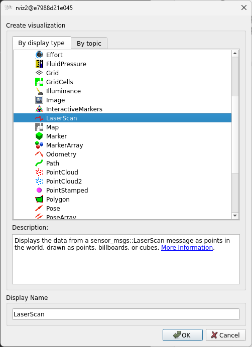

3. VS Code 상에서도 확인합니다.

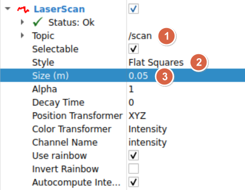

> 생성한 패키지를 지우고 처음부터 다시 하려면:
> ```
> cd ~/myros_ws/src
> rm -rf myrosbot_one
> cd ~/myros_ws
> rm -rf build/myrosbot_one install/myrosbot_one log
> ```

### 하위 디렉토리 구성하기

1. 하위 디렉토리를 추가합니다.

```bash
cd myrosbot_one
mkdir config urdf launch rviz worlds
```

2. VS Code 상에서 추가된 것을 확인합니다.

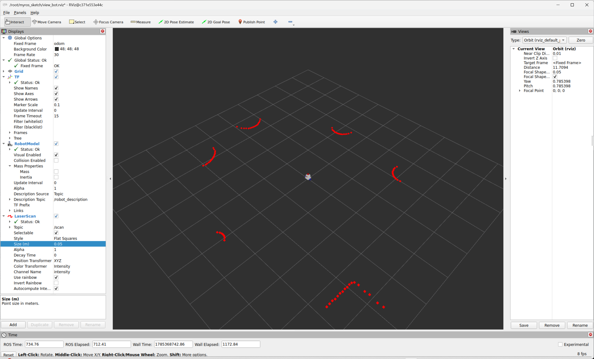

### launch 파일 생성하기

1. 다음 명령을 수행합니다.

```bash
touch launch/robot_bringup.launch.py
touch launch/robot_teleop.launch.py
touch launch/robot_teleop_rviz.launch.py
```

2. VS Code 상에서 생성한 launch 파일들을 확인합니다.

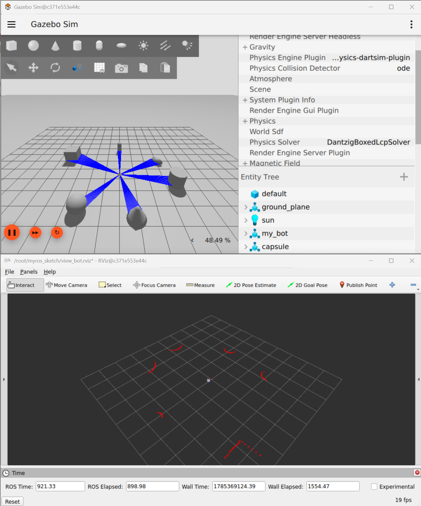

### 파일 복사하기

1. myros_sketch 폴더 내의 파일들을 복사합니다.

```bash
cp ~/myros_sketch/*.xacro urdf/
cp ~/myros_sketch/*.yaml config/
cp ~/myros_sketch/*.rviz rviz/
cp ~/myros_sketch/*.sdf worlds/
```

2. VS Code 상에서 확인합니다.

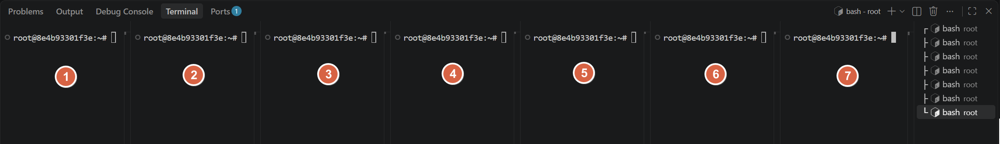

### setup.py 수정하기

1. setup.py 파일을 선택합니다.

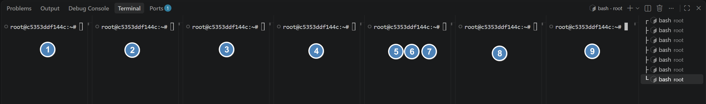

2. 다음과 같이 수정합니다.

**setup.py**

```python
from setuptools import find_packages, setup
import os
from glob import glob

package_name = 'myrosbot_one'

setup(
    name=package_name,
    version='0.0.0',
    packages=find_packages(exclude=['test']),
    data_files=[
        ('share/ament_index/resource_index/packages',
            ['resource/' + package_name]),
        ('share/' + package_name, ['package.xml']),
        # launch 파일
        (os.path.join('share', package_name, 'launch'),
            glob('launch/*.py')),
        # urdf 파일
        (os.path.join('share', package_name, 'urdf'),
            glob('urdf/*')),
        # config 파일
        (os.path.join('share', package_name, 'config'),
            glob('config/*')),
        # rviz 파일
        (os.path.join('share', package_name, 'rviz'),
            glob('rviz/*')),
        # world 파일
        (os.path.join('share', package_name, 'worlds'),
            glob('worlds/*')),
    ],
    install_requires=['setuptools'],
    zip_safe=True,
    maintainer='root',
    maintainer_email='root@todo.todo',
    description='TODO: Package description',
    license='TODO: License declaration',
    tests_require=['pytest'],
    entry_points={
        'console_scripts': [
        ],
    },
)
```

> 이렇게 하면 colcon build 명령으로 패키지를 빌드할 때, launch, urdf, config, rviz, worlds 디렉토리가 install 디렉토리에 포함됩니다.

### package.xml 수정하기

1. VS Code에서 package.xml 파일을 선택합니다.

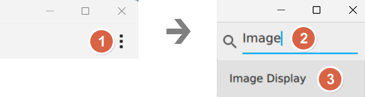

2. 다음과 같이 수정합니다.

**package.xml**

```xml
<?xml version="1.0"?>
<package format="3">
  <name>myrosbot_one</name>
  <version>0.0.1</version>
  <description>DiffDrive Robot</description>

  <maintainer email="you@example.com">Your Name</maintainer>
  <license>Apache-2.0</license>

  <buildtool_depend>ament_python</buildtool_depend>

  <!-- Launch -->
  <exec_depend>launch</exec_depend>
  <exec_depend>launch_ros</exec_depend>

  <!-- Robot Description -->
  <exec_depend>xacro</exec_depend>
  <exec_depend>robot_state_publisher</exec_depend>

  <!-- Gazebo (gz-sim / Harmonic) -->
  <exec_depend>ros_gz_sim</exec_depend>
  <exec_depend>ros_gz_bridge</exec_depend>
  <exec_depend>ros_gz_image</exec_depend>

  <!-- ros2_control -->
  <exec_depend>controller_manager</exec_depend>
  <exec_depend>joint_state_broadcaster</exec_depend>
  <exec_depend>diffdrive_controller</exec_depend>
  <exec_depend>gz_ros2_control</exec_depend>

  <!-- Python launch에서 package 경로를 찾을 때 사용 -->
  <exec_depend>ament_index_python</exec_depend>

  <!-- launch 파일에서 xacro 실행 시 사용 -->
  <exec_depend>python3-xacro</exec_depend>

  <export>
    <build_type>ament_python</build_type>
  </export>
</package>
```

### 패키지 빌드 및 설치하기 (colcon build)

```bash
cd ~/myros_ws
colcon build --packages-select myrosbot_one
```

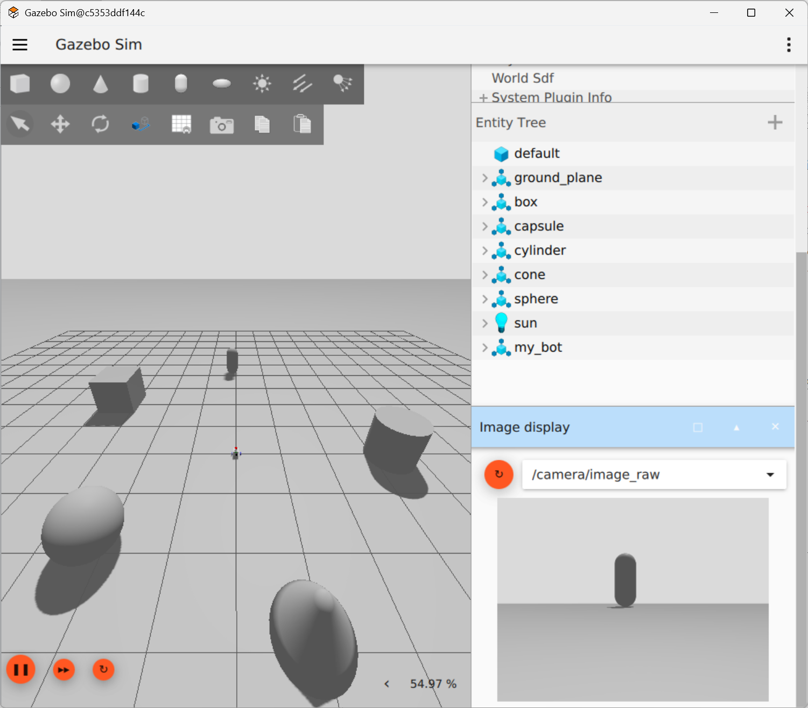

## 03_3 robot_bringup.launch.py 파일 작성 및 실행하기

여기서는 다음 명령을 묶어서 수행하는 launch 파일을 LLM을 이용하여 작성하고 실행해 봅니다.

```
① ros2 run robot_state_publisher robot_state_publisher --ros-args -p robot_description:="$(xacro /root/myros_sketch/robot.urdf.xacro)" -p use_sim_time:=true
② gz sim -r -v4 /root/myros_sketch/apartment_world.sdf  
③ ros2 run ros_gz_bridge parameter_bridge --ros-args -p config_file:=/root/myros_sketch/gz_bridge.yaml
④ ros2 run ros_gz_image image_bridge /camera/image_raw
⑤ ros2 run ros_gz_sim create -topic robot_description -name my_bot -z 0.1 -x -2
⑥ ros2 run controller_manager spawner joint_state_broadcaster
⑦ ros2 run controller_manager spawner diff_drive_controller
```

### Vibe Coding 프롬프트

> myrosbot_one 패키지에서 다음 명령을 수행하는 launch 파일을 작성해줘.
> 파일의 이름은 robot_bringup.launch.py야.
> robot.urdf.xacro 파일은 myrosbot_one/urdf 디렉토리에 있어.
> apartment_world.sdf 파일은 myrosbot_one/worlds 디렉토리에 있어.
> gz_bridge.yaml 파일은 myrosbot_one/config 디렉토리에 있어.

### LLM이 생성한 launch 파일

**robot_bringup.launch.py**

```python
#!/usr/bin/env python3
"""
myrosbot_one/launch/robot_bringup.launch.py

실행 순서:
  ① robot_state_publisher  (xacro -> robot_description)
  ② gz sim (world 로드)
  ③ ros_gz_bridge parameter_bridge (gz_bridge.yaml)
  ④ ros_gz_image image_bridge (/camera/image_raw)
  ⑤ ros_gz_sim create (엔티티 스폰)
  ⑥ joint_state_broadcaster spawner   (⑤ 종료 후)
  ⑦ diff_drive_controller spawner     (⑥ 종료 후)
"""

import os

from ament_index_python.packages import get_package_share_directory

from launch import LaunchDescription
from launch.actions import (
    DeclareLaunchArgument,
    ExecuteProcess,
    RegisterEventHandler,
)
from launch.event_handlers import OnProcessExit
from launch.substitutions import Command, FindExecutable, LaunchConfiguration, PathJoinSubstitution
from launch_ros.actions import Node


def generate_launch_description():
    pkg_share = get_package_share_directory('myrosbot_one')

    xacro_path = os.path.join(pkg_share, 'urdf', 'robot.urdf.xacro')
    world_path = os.path.join(pkg_share, 'worlds', 'apartment_world.sdf')
    bridge_config_path = os.path.join(pkg_share, 'config', 'gz_bridge.yaml')

    use_sim_time = LaunchConfiguration('use_sim_time')

    declare_use_sim_time = DeclareLaunchArgument(
        'use_sim_time',
        default_value='true',
        description='Use simulation (Gazebo) clock if true',
    )

    # ① robot_state_publisher
    robot_description_content = Command(
        [FindExecutable(name='xacro'), ' ', xacro_path]
    )
    robot_state_publisher_node = Node(
        package='robot_state_publisher',
        executable='robot_state_publisher',
        name='robot_state_publisher',
        output='screen',
        parameters=[
            {'robot_description': robot_description_content},
            {'use_sim_time': use_sim_time},
        ],
    )

    # ② gz sim 실행 (world 로드)
    gz_sim = ExecuteProcess(
        cmd=['gz', 'sim', '-r', '-v4', world_path],
        output='screen',
    )

    # ③ ros_gz_bridge parameter_bridge
    gz_bridge_node = Node(
        package='ros_gz_bridge',
        executable='parameter_bridge',
        name='parameter_bridge',
        output='screen',
        parameters=[{'config_file': bridge_config_path}],
    )

    # ④ ros_gz_image image_bridge
    image_bridge_node = Node(
        package='ros_gz_image',
        executable='image_bridge',
        name='image_bridge',
        output='screen',
        arguments=['/camera/image_raw'],
    )

    # ⑤ ros_gz_sim create (엔티티 스폰)
    spawn_entity_node = Node(
        package='ros_gz_sim',
        executable='create',
        name='spawn_my_bot',
        output='screen',
        arguments=[
            '-topic', 'robot_description',
            '-name', 'my_bot',
            '-z', '0.1',
            '-x', '-2',
        ],
    )

    # ⑥ joint_state_broadcaster spawner
    joint_state_broadcaster_spawner = Node(
        package='controller_manager',
        executable='spawner',
        name='joint_state_broadcaster_spawner',
        output='screen',
        arguments=['joint_state_broadcaster'],
    )

    # ⑦ diff_drive_controller spawner
    diff_drive_controller_spawner = Node(
        package='controller_manager',
        executable='spawner',
        name='diff_drive_controller_spawner',
        output='screen',
        arguments=['diff_drive_controller'],
    )

    # ⑤ 종료 후 ⑥ 실행
    delay_joint_state_broadcaster_after_spawn = RegisterEventHandler(
        event_handler=OnProcessExit(
            target_action=spawn_entity_node,
            on_exit=[joint_state_broadcaster_spawner],
        )
    )

    # ⑥ 종료 후 ⑦ 실행
    delay_diff_drive_controller_after_joint_state_broadcaster = RegisterEventHandler(
        event_handler=OnProcessExit(
            target_action=joint_state_broadcaster_spawner,
            on_exit=[diff_drive_controller_spawner],
        )
    )

    return LaunchDescription([
        declare_use_sim_time,
        robot_state_publisher_node,
        gz_sim,
        gz_bridge_node,
        image_bridge_node,
        spawn_entity_node,
        delay_joint_state_broadcaster_after_spawn,
        delay_diff_drive_controller_after_joint_state_broadcaster,
    ])
```

1. VS Code 터미널에서 빌드를 수행합니다.

```bash
cd ~/myros_ws
colcon build --packages-select myrosbot_one
```

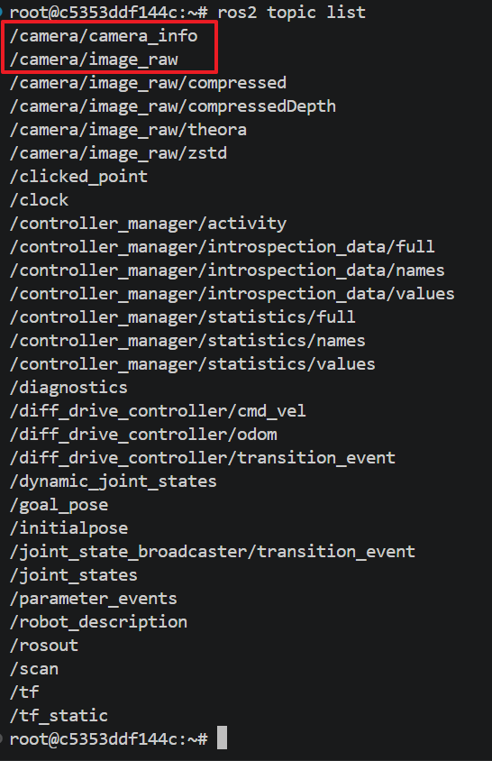

2. 기존 프로그램을 종료합니다.

3. launch 파일을 실행합니다.

```bash
source install/setup.bash
ros2 launch myrosbot_one robot_bringup.launch.py
```


4. 창을 하나 추가하여 명령을 수행합니다.

```bash
rviz2 -d /root/myros_sketch/view_bot.rviz --ros-args -p use_sim_time:=true
```

5. 창을 하나 추가하여 키보드로 조종을 해 봅니다.

```bash
xterm -e ros2 run teleop_twist_keyboard teleop_twist_keyboard \
  --ros-args \
  -r cmd_vel:=/diff_drive_controller/cmd_vel \
  -p stamped:=true \
  -p use_sim_time:=true
```

## 03_4 키보드 활성화 launch 파일 작성 및 실행하기

여기서는 다음 두 가지 명령을 묶어서 수행하는 launch 파일을 LLM을 이용하여 작성하고 실행해 봅니다.

```
ros2 launch myrosbot_one robot_bringup.launch.py
xterm -e ros2 run teleop_twist_keyboard teleop_twist_keyboard \
  --ros-args \
  -r cmd_vel:=/diff_drive_controller/cmd_vel \
  -p stamped:=true \
  -p use_sim_time:=true
```

### Vibe Coding 프롬프트

> myrosbot_one 패키지에서 다음 명령을 수행하는 launch 파일을 작성해줘. 파일의 이름은 robot_teleop.launch.py야.
> ```
> ros2 launch myrosbot_one robot_bringup.launch.py
> xterm -e ros2 run teleop_twist_keyboard teleop_twist_keyboard \
>   --ros-args \
>   -r cmd_vel:=/diff_drive_controller/cmd_vel \
>   -p stamped:=true \
>   -p use_sim_time:=true
> ```

> ※ xterm을 이용하면 teleop_twist_keyboard 입력창을 별도로 띄울 수 있으며 키보드 입력이 편리합니다.

### LLM이 생성한 launch 파일

**robot_teleop.launch.py**

```python
import os

from ament_index_python.packages import get_package_share_directory
from launch import LaunchDescription
from launch.actions import ExecuteProcess, IncludeLaunchDescription
from launch.launch_description_sources import PythonLaunchDescriptionSource


def generate_launch_description():
    pkg_share = get_package_share_directory('myrosbot_one')

    bringup_launch_file = os.path.join(pkg_share, 'launch', 'robot_bringup.launch.py')

    # robot_bringup.launch.py 포함 실행
    # (robot_state_publisher, gz sim, bridge, 로봇 스폰, 컨트롤러 spawner 전부 포함)
    bringup = IncludeLaunchDescription(
        PythonLaunchDescriptionSource(bringup_launch_file)
    )

    # xterm 창에서 teleop_twist_keyboard 실행
    teleop = ExecuteProcess(
        cmd=[
            'xterm', '-e',
            'ros2', 'run', 'teleop_twist_keyboard', 'teleop_twist_keyboard',
            '--ros-args',
            '-r', 'cmd_vel:=/diff_drive_controller/cmd_vel',
            '-p', 'stamped:=true',
            '-p', 'use_sim_time:=true',
        ],
        output='screen',
    )

    return LaunchDescription([
        bringup,
        teleop,
    ])
```

1. 기존 프로그램을 종료합니다.

2. 빌드를 수행합니다.

```bash
cd ~/myros_ws
colcon build --packages-select myrosbot_one
```

3. launch 파일을 실행합니다.

```bash
source install/setup.bash
ros2 launch myrosbot_one robot_teleop.launch.py
```

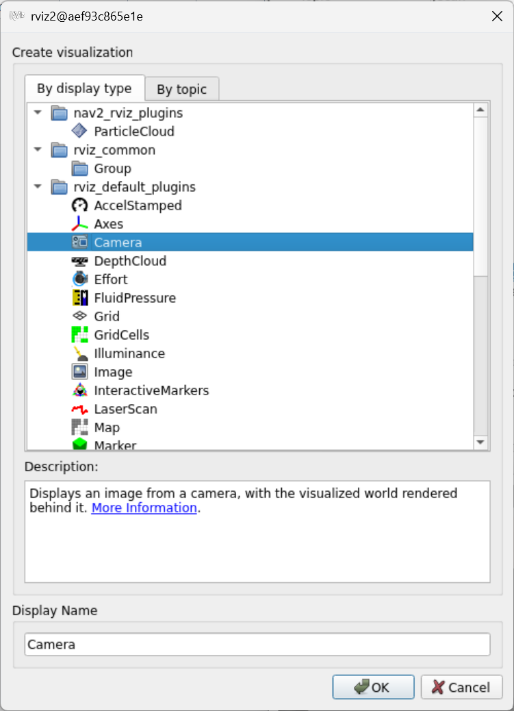

4. 키보드를 이용하여 로봇을 움직여 봅니다.

## 03_5 rviz2 동시 실행하기

여기서는 다음 두 가지 명령을 묶어서 수행하는 launch 파일을 LLM을 이용하여 작성하고 실행해 봅니다.

```
ros2 launch myrosbot_one robot_teleop.launch.py
rviz2 -d /root/myros_sketch/view_bot.rviz --ros-args -p use_sim_time:=true
```

### Vibe Coding 프롬프트

> myrosbot_one 패키지에서 다음 명령을 수행하는 launch 파일을 작성해줘. 파일의 이름은 robot_teleop_rviz.launch.py야.
> view_bot.rviz 파일은 myrosbot_one 패키지의 rviz 디렉토리에 있어.
> ```
> ros2 launch myrosbot_one robot_teleop.launch.py
> rviz2 -d /root/myros_sketch/view_bot.rviz --ros-args -p use_sim_time:=true
> ```

### LLM이 생성한 launch 파일

**robot_teleop_rviz.launch.py**

```python
import os

from ament_index_python.packages import get_package_share_directory
from launch import LaunchDescription
from launch.actions import IncludeLaunchDescription
from launch.launch_description_sources import PythonLaunchDescriptionSource
from launch_ros.actions import Node


def generate_launch_description():
    pkg_share = get_package_share_directory('myrosbot_one')

    teleop_launch_file = os.path.join(pkg_share, 'launch', 'robot_teleop.launch.py')
    rviz_config_file = os.path.join(pkg_share, 'rviz', 'view_bot.rviz')

    # robot_teleop.launch.py 포함 실행
    # (robot_bringup 전체 + xterm teleop_twist_keyboard)
    teleop = IncludeLaunchDescription(
        PythonLaunchDescriptionSource(teleop_launch_file)
    )

    # rviz2 실행
    rviz2 = Node(
        package='rviz2',
        executable='rviz2',
        arguments=['-d', rviz_config_file],
        parameters=[{'use_sim_time': True}],
        output='screen',
    )

    return LaunchDescription([
        teleop,
        rviz2,
    ])
```

1. 기존 프로그램을 종료합니다.

2. 빌드를 수행합니다.

```bash
cd ~/myros_ws
colcon build --packages-select myrosbot_one
```

3. launch 파일을 실행합니다.

```bash
source install/setup.bash
ros2 launch myrosbot_one robot_teleop_rviz.launch.py
```

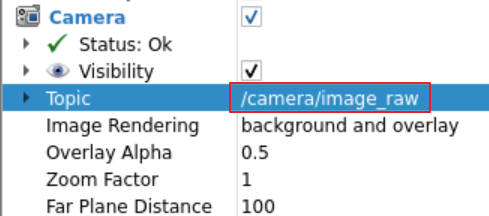

4. 키보드를 이용하여 로봇을 움직여 봅니다.

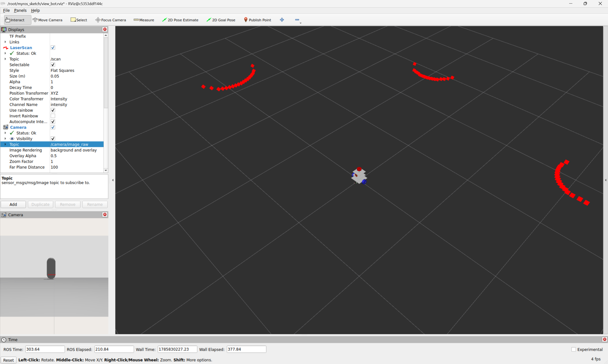
