# 04 SLAM으로 맵 그리기

> 여기서는 SLAM에 대해 소개하고 SLAM을 이용하여 지도를 그려 봅니다.

## 04_1 SLAM 개요

SLAM은 **Simultaneous Localization And Mapping**의 약자로, Localization(자기 위치 추정)과 Mapping(지도 생성)을 동시에 수행하는 기술입니다.

- **Mapping**: LiDAR 등을 사용해 주변 환경을 스캔하며 지도를 만드는 과정
- **Localization**: 만들어진 지도에서 로봇의 현재 위치를 찾아내는 과정
- **Navigation**: 로봇의 위치와 지도 정보를 이용해 목적지까지 이동할 경로를 생성하고 따라가는 과정

SLAM 알고리즘은 크게 Feature(Landmark) SLAM과 Grid SLAM 두 가지로 나눌 수 있습니다.

| 방식 | 설명 |
|---|---|
| Feature SLAM | 주변의 특정 특징(랜드마크)을 인식하여 위치 추정 |
| Grid SLAM | 환경을 격자(grid) 형태로 나누고, 각 셀을 점유됨(occupied) / 비어 있음(unoccupied) / 불확실로 구분하여 지도 구성 |

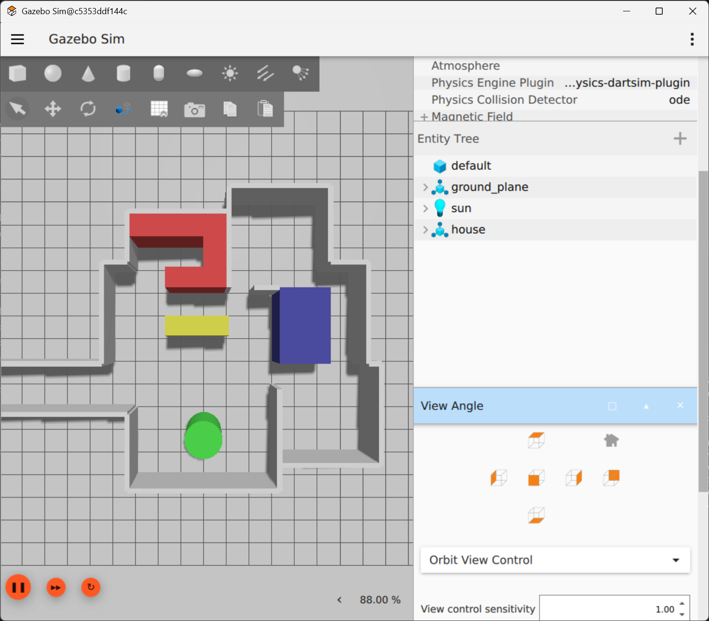

우리는 앞에서 world origin을 odom frame으로 사용했고, wheel odometry를 통해 odom → base_footprint 방향으로 TF를 제공했습니다. Odometry는 움직임이 부드럽게 계산되지만, 휠 속도를 적분하여 위치를 계산하기 때문에 시간이 지나면 drift error(드리프트 오차)가 발생합니다.

- **odom → base_footprint**: 부드럽지만 시간이 지나면 drift 발생
- **map → odom**: drift를 잡아주지만 업데이트 시 jump 발생 가능

> 결국 map frame을 세계의 기준(world origin)으로 사용하고, odom frame을 odometry 기반의 단기적 기준으로 사용함으로써 드리프트는 잡고, 움직임도 부드럽게 유지하는 구조가 완성됩니다.

- `/odom` 토픽(nav_msgs/msg/Odometry)은 odom → base_footprint 변환(tf)과 휠 기반 속도(wheel velocity) 정보를 제공합니다.
- `/map` 토픽(nav_msgs/msg/OccupancyGrid)은 SLAM이 생성한 Grid map의 점유(occupancy) 데이터를 포함한 지도 정보를 제공합니다.

앞에서 robot.urdf.xacro 파일에 다음 코드를 추가해주었습니다.

```xml
    <!-- BASE_FOOTPRINT LINK -->

    <joint name="base_footprint_joint" type="fixed">
        <parent link="base_footprint"/>
        <child link="base_link"/>
        <origin xyz="0 0 0.0325" rpy="0 0 0"/>
    </joint>

    <link name="base_footprint">
    </link>
```

> 이 글에서는 Steve Macenski가 개발한 slam_toolbox를 사용합니다. 다음 글에서 다룰 Nav2 또한 그가 개발한 패키지를 기반으로 하고 있습니다.

## 04_2 Nav2 + SLAM Toolbox로 맵 생성하기

여기서는 다음 명령들을 이용하여 맵을 그리고 저장해 봅니다.

```
① ros2 launch myrosbot_one robot_teleop.launch.py
② ros2 launch nav2_bringup bringup_launch.py slam:=True params_file:=/root/myros_sketch/nav2_params.yaml use_sim_time:=True
③ rviz2 -d /root/myros_sketch/nav2_default_view.rviz --ros-args -p use_sim_time:=true
④ ros2 run nav2_map_server map_saver_cli -f ~/maps/map --ros-args -p save_map_timeout:=60.0
```

1. nav2_params.yaml, nav2_default_view.rviz 파일을 myros_sketch 폴더로 복사합니다.

```bash
cp /opt/ros/jazzy/share/nav2_bringup/params/nav2_params.yaml /root/myros_sketch/
cp /opt/ros/jazzy/share/nav2_bringup/rviz/nav2_default_view.rviz /root/myros_sketch/
```

2. 첫 번째 명령창에서 명령을 수행합니다.

```bash
ros2 launch myrosbot_one robot_teleop.launch.py
```

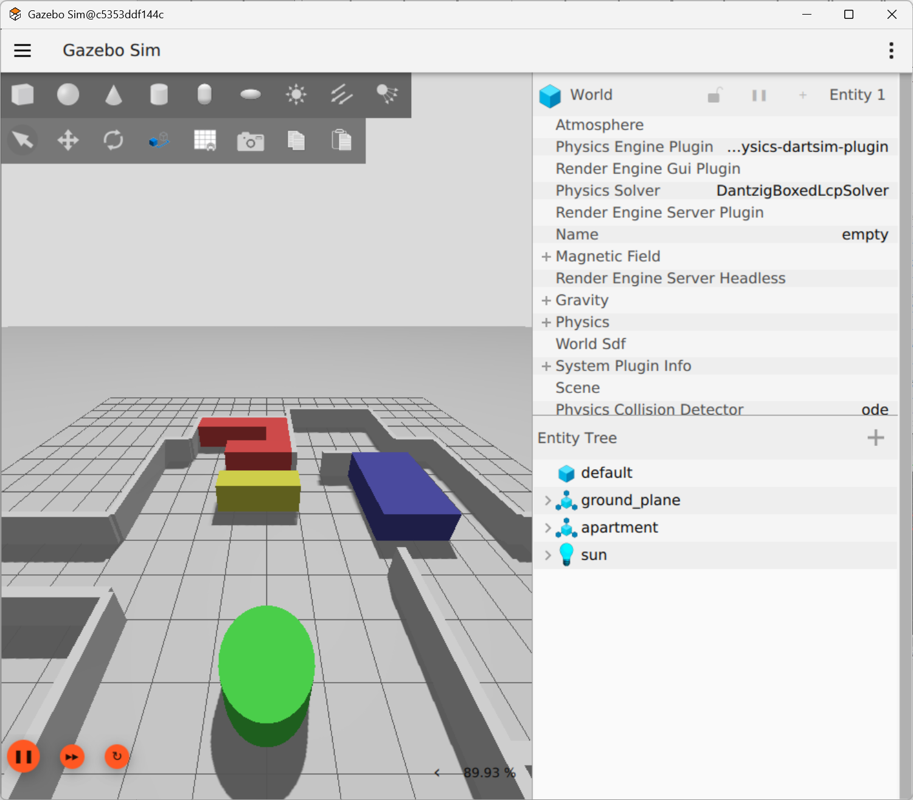

3. 두 번째 명령창을 준비하여 명령을 수행합니다.

```bash
ros2 launch nav2_bringup bringup_launch.py slam:=True params_file:=/root/myros_sketch/nav2_params.yaml use_sim_time:=True
```

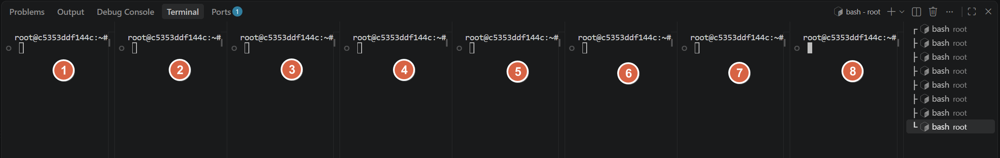

4. 세 번째 명령창을 준비하여 명령을 수행합니다.

```bash
rviz2 -d /root/myros_sketch/nav2_default_view.rviz --ros-args -p use_sim_time:=true
```

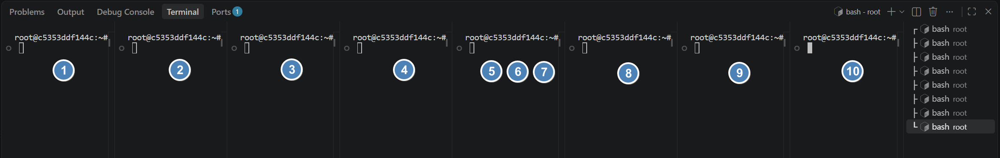

5. 프로그램이 실행됩니다. RViz2에 SLAM 결과가 표시됩니다.

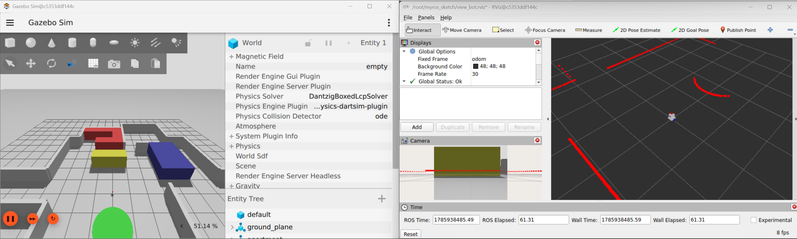

6. View Angle과 [TopDownOrtho]--[Zero]를 누른 후, 두 프로그램의 View를 설정합니다.

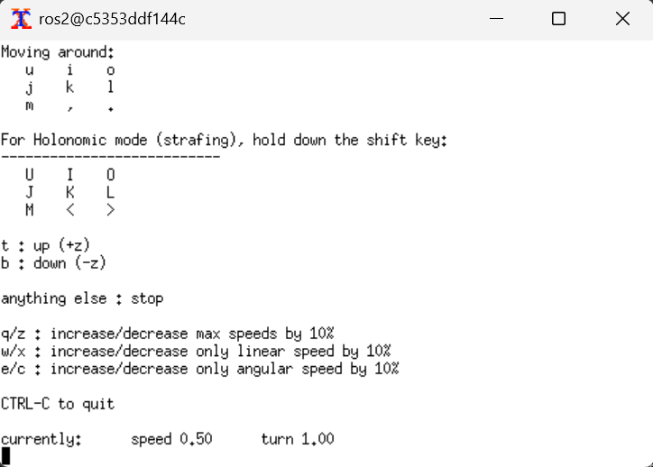

7. 가제보, RViz2의 View를 확대합니다.

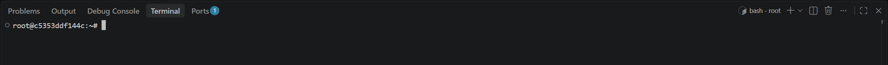

8. 키보드로 로봇을 조종하며 주변을 돌아다녀 봅니다. 맵이 그려집니다.

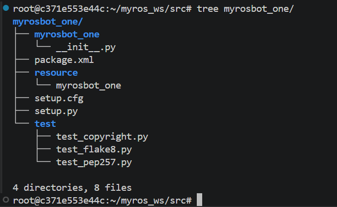

9. 지도를 다 그려준 후에 로봇을 마지막 자리에 둡니다.

10. 네 번째 명령창을 준비하여 명령을 수행합니다.

```bash
mkdir ~/maps
ros2 run nav2_map_server map_saver_cli -f ~/maps/map --ros-args -p save_map_timeout:=60.0
```

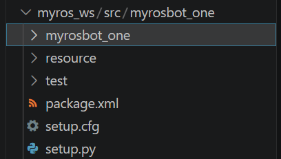

11. 저장한 맵을 확인합니다.

```bash
display ~/maps/map.pgm
```

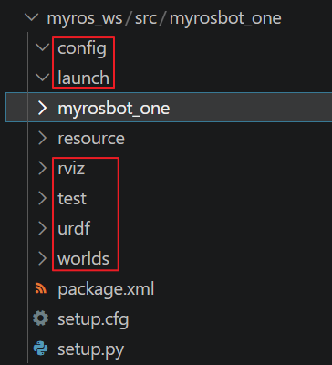

## 04_3 slam_with_nav2.launch.py 파일 작성하기

LLM을 이용하여 앞에서 수행한 다음 명령들을 하나로 묶어 수행할 수 있는 launch 파일을 작성합니다.

```
① ros2 launch myrosbot_one robot_teleop.launch.py
② ros2 launch nav2_bringup bringup_launch.py slam:=True params_file:=/root/myros_sketch/nav2_params.yaml use_sim_time:=True
③ rviz2 -d /root/myros_sketch/nav2_default_view.rviz --ros-args -p use_sim_time:=true
```

1. nav2_params.yaml, nav2_default_view.rviz 파일을 myros_ws의 패키지로 복사합니다.

```bash
cp /root/myros_sketch/nav2_params.yaml /root/myros_ws/src/myrosbot_one/config
cp /root/myros_sketch/nav2_default_view.rviz /root/myros_ws/src/myrosbot_one/rviz
```

2. launch 파일을 생성합니다.

```bash
touch /root/myros_ws/src/myrosbot_one/launch/slam_with_nav2.launch.py
```

### Vibe Coding 프롬프트

> myrosbot_one 패키지에서 다음 명령을 수행하는 launch 파일을 작성해줘.
> nav2_params.yaml 파일은 하위 config 폴더에 있어.
> nav2_default_view.rviz 파일은 하위 rviz 폴더에 있어.
> 파일의 이름은 slam_with_nav2.launch.py야.
> ```
> ros2 launch myrosbot_one robot_teleop.launch.py
> ros2 launch nav2_bringup bringup_launch.py slam:=True params_file:=/root/myros_sketch/nav2_params.yaml use_sim_time:=True
> rviz2 -d /root/myros_sketch/nav2_default_view.rviz --ros-args -p use_sim_time:=true
> ```

### LLM이 생성한 launch 파일

**slam_with_nav2.launch.py**

```python
import os

from ament_index_python.packages import get_package_share_directory
from launch import LaunchDescription
from launch.actions import IncludeLaunchDescription
from launch.launch_description_sources import PythonLaunchDescriptionSource
from launch_ros.actions import Node


def generate_launch_description():
    # 패키지 경로 탐색
    myrosbot_one_dir = get_package_share_directory('myrosbot_one')
    nav2_bringup_dir = get_package_share_directory('nav2_bringup')

    # 설정 파일 및 RViz 설정 파일 경로 설정
    nav2_params_path = os.path.join(myrosbot_one_dir, 'config', 'nav2_params.yaml')
    rviz_config_path = os.path.join(myrosbot_one_dir, 'rviz', 'nav2_default_view.rviz')

    # 1. robot_teleop.launch.py 포함
    robot_teleop_launch = IncludeLaunchDescription(
        PythonLaunchDescriptionSource(
            os.path.join(myrosbot_one_dir, 'launch', 'robot_teleop.launch.py')
        )
    )

    # 2. nav2_bringup bringup_launch.py 포함 (SLAM 활성화 및 파라미터 전달)
    nav2_bringup_launch = IncludeLaunchDescription(
        PythonLaunchDescriptionSource(
            os.path.join(nav2_bringup_dir, 'launch', 'bringup_launch.py')
        ),
        launch_arguments={
            'slam': 'True',
            'params_file': nav2_params_path,
            'use_sim_time': 'True',
        }.items(),
    )

    # 3. RViz2 노드 실행 (설정 파일 및 use_sim_time 적용)
    rviz_node = Node(
        package='rviz2',
        executable='rviz2',
        name='rviz2',
        arguments=['-d', rviz_config_path],
        parameters=[{'use_sim_time': True}],
        output='screen',
    )

    return LaunchDescription([
        robot_teleop_launch,
        nav2_bringup_launch,
        rviz_node,
    ])
```

1. 이전에 수행했던 명령을 ctrl+c 키를 눌러 종료합니다.

2. 빌드를 수행합니다.

```bash
cd ~/myros_ws
colcon build
```

> colcon build를 수행해야 nav2_params.yaml, nav2_default_view.rviz 파일이 myros_ws/install 폴더 아래로 복사됩니다.

3. launch 파일을 실행합니다.

```bash
cd ~/myros_ws
source install/setup.bash
ros2 launch myrosbot_one slam_with_nav2.launch.py 
```

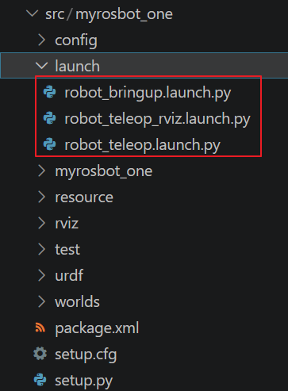

4. 키보드로 조종하며 지도를 그릴 수 있습니다.

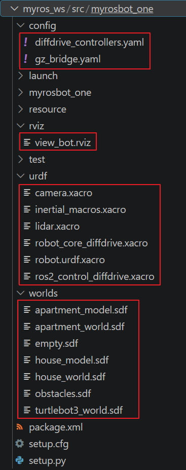
