# 05 Nav2로 자율주행 실습하기

> 여기서는 로봇의 Navigation 기능을 수행하는 Nav2에 대해 다룹니다.

## 05_1 Nav2 개요

Nav2는 ROS2에서 내비게이션 기능을 제공하는 대표적인 패키지입니다. 내비게이션을 수행하려면 먼저 로봇 위치 추정(Robot Position Estimate)이 필요합니다. 로봇이 어디에 있는지 알아야 경로(Path)를 계획할 수 있기 때문입니다. 이 위치 정보는 SLAM을 통해 제공됩니다.

또 하나 필요한 요소는 **장애물 인식(Obstacle Awareness)**입니다. 경로를 만들 때 장애물을 피해야 하기 때문입니다. 장애물 정보를 얻는 방법은 크게 두 가지가 있습니다.

1. **SLAM으로 생성한 Static Map** — 기존에 존재하는 벽이나 고정된 구조물
2. **실시간 Lidar 데이터** — 움직이는 사람, 새로 등장한 장애물 등 즉각 감지해야 하는 대상

Nav2는 이 두 가지 정보를 활용하여 /costmap 토픽을 발행합니다.

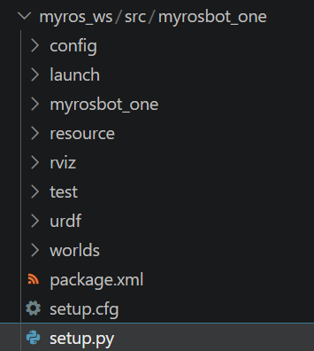

costmap은 각 셀(cell)에 비용(cost)을 할당하는데, 장애물 주변은 높은 cost, 안전한 공간은 낮은 cost가 부여됩니다. cost는 단순히 0과 1의 이진 값이 아니라, 장애물에서 멀어질수록 연속적으로(cost gradient) 낮아지는 형태를 갖습니다.

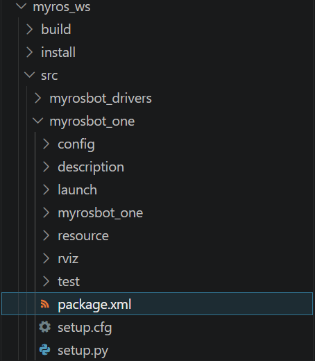

Nav2는 이러한 costmap을 기반으로 가장 효율적이고 안전한 경로를 판단하여, 초기 위치(initial pose)에서 목표 위치(goal pose)까지의 path를 생성합니다.

## 05_2 nav2_bringup으로 자율주행하기

여기서는 이전에 생성한 맵을 이용하여 자율주행을 해 봅니다.

1. 네 개의 명령 창을 띄운 후, 차례대로 명령을 수행합니다.

```
① ros2 launch myrosbot_one robot_bringup.launch.py
② ros2 launch nav2_bringup bringup_launch.py map:=$HOME/maps/map.yaml params_file:=/root/myros_sketch/nav2_params.yaml use_sim_time:=True
③ rviz2 -d /root/myros_sketch/nav2_default_view.rviz \
 --ros-args -p use_sim_time:=true
④ ros2 run twist_stamper twist_stamper \
  --ros-args \
  -r cmd_vel_in:=/cmd_vel \
  -r cmd_vel_out:=/diff_drive_controller/cmd_vel \
  -p frame_id:=base_link \
  -p use_sim_time:=true
```

2. Nav2 시각화가 나타납니다.

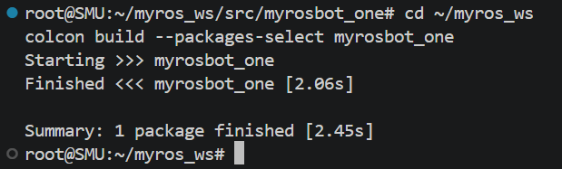

3. 창을 준비합니다.

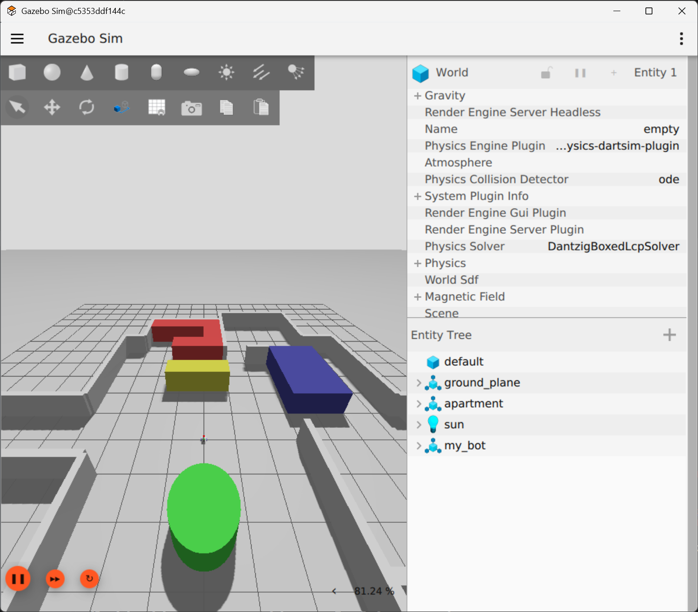

4. [2D Pose Estimate]를 클릭한 후, 지도상에서 로봇의 위치와 방향을 설정합니다.

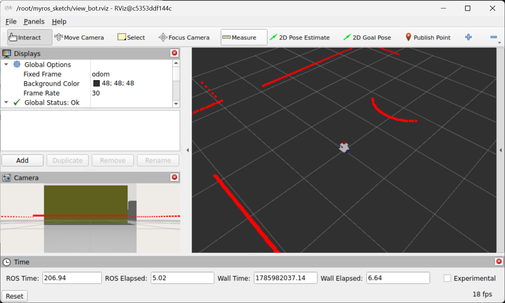

5. costmap이 표시됩니다.

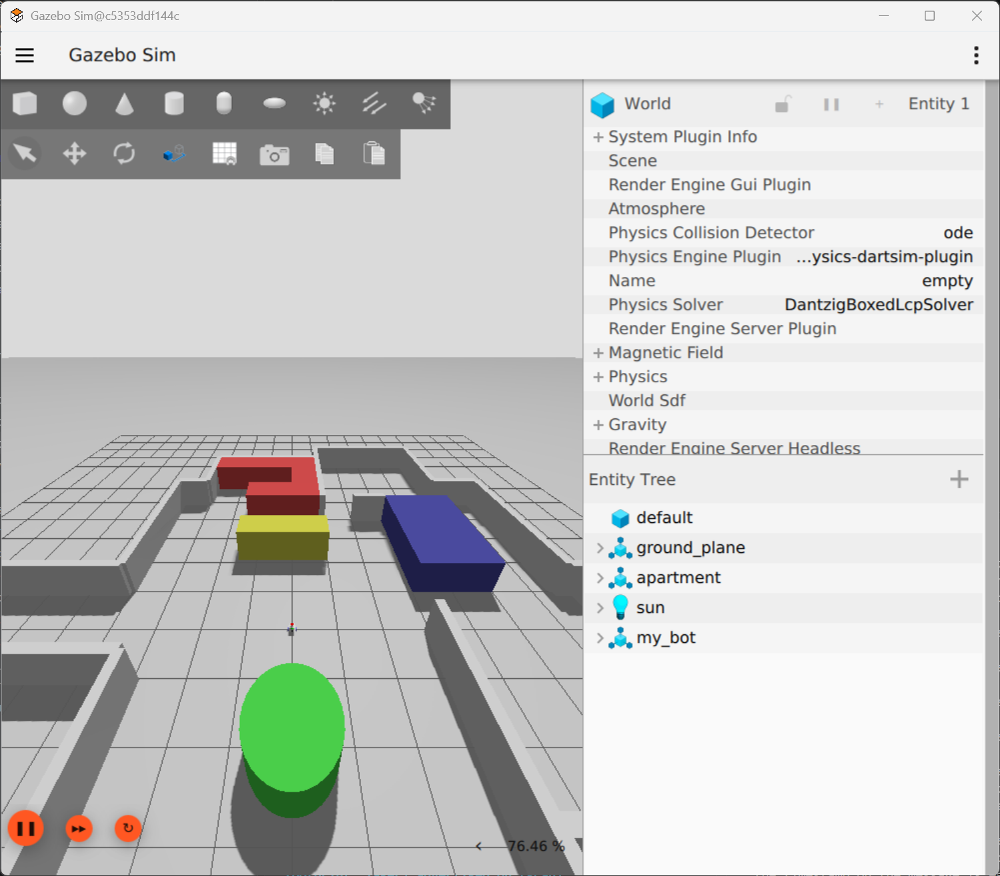

6. [Nav2 Goal]을 클릭한 후, 로봇이 가야할 목표 위치와 방향을 지정해 줍니다.

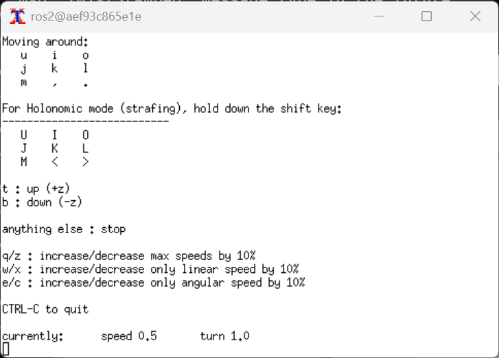

7. 로봇이 이동 경로를 계획하고, 이동을 시작합니다.

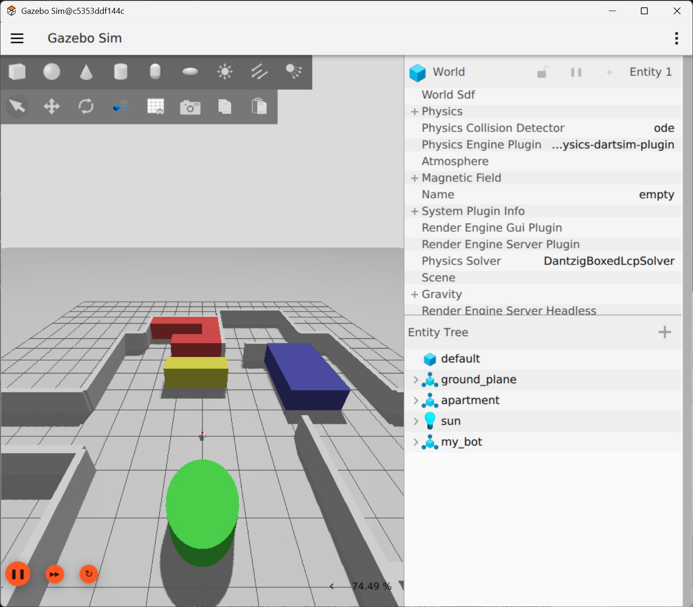

8. 이동이 완료된 그림입니다.

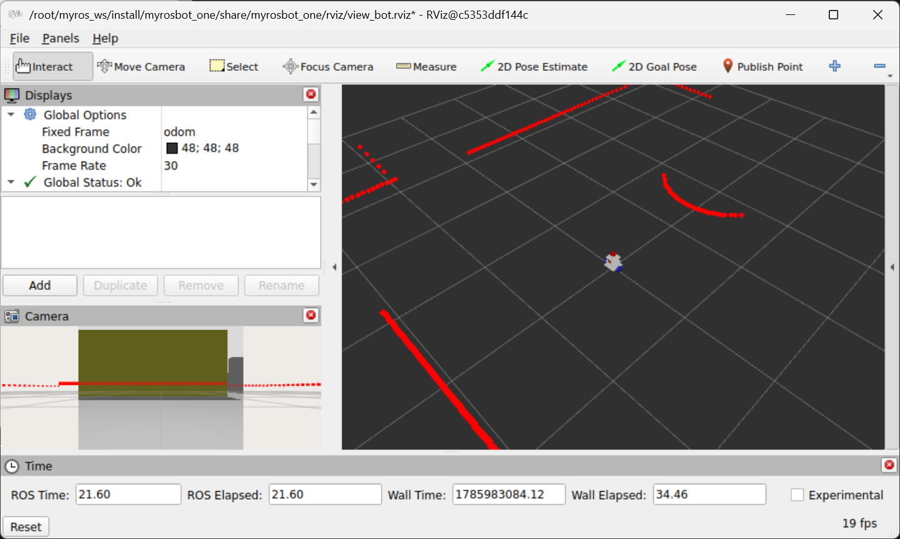

## 05_3 WayPoint 설정으로 다중 목표점 자율주행하기

[WayPoint] 기능을 사용하여 여러 개의 목표 지점을 순차적으로 이동하는 자율주행을 수행해 보겠습니다.

1. 이전에 수행했던 명령을 ctrl+c 키를 눌러 종료합니다.

2. 차례대로 명령을 수행합니다.

```
① ros2 launch myrosbot_one robot_bringup.launch.py
② ros2 launch nav2_bringup bringup_launch.py map:=$HOME/maps/map.yaml params_file:=/root/myros_sketch/nav2_params.yaml use_sim_time:=True
③ rviz2 -d /root/myros_sketch/nav2_default_view.rviz \
 --ros-args -p use_sim_time:=true
④ ros2 run twist_stamper twist_stamper \
  --ros-args \
  -r cmd_vel_in:=/cmd_vel \
  -r cmd_vel_out:=/diff_drive_controller/cmd_vel \
  -p frame_id:=base_link \
  -p use_sim_time:=true
```

3. [2D Pose Estimate]를 클릭한 후, 지도상에서 로봇의 위치와 방향을 설정합니다.

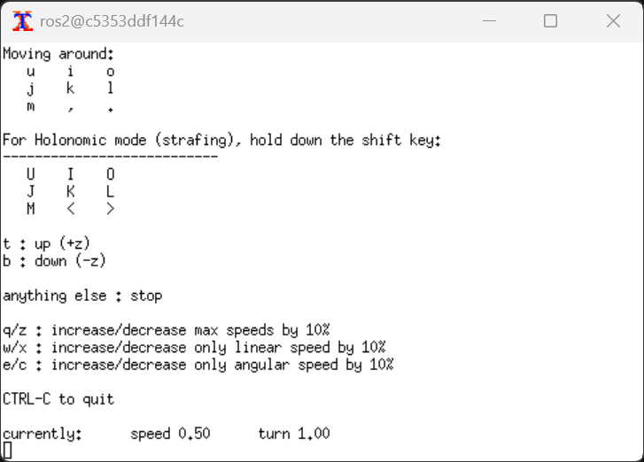

4. costmap이 표시됩니다.

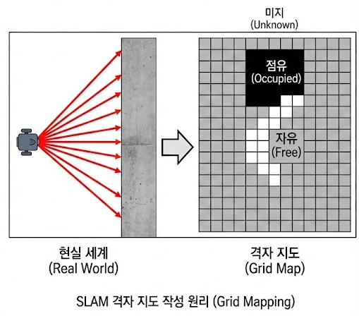

5. WayPoint 메뉴로 전환합니다.

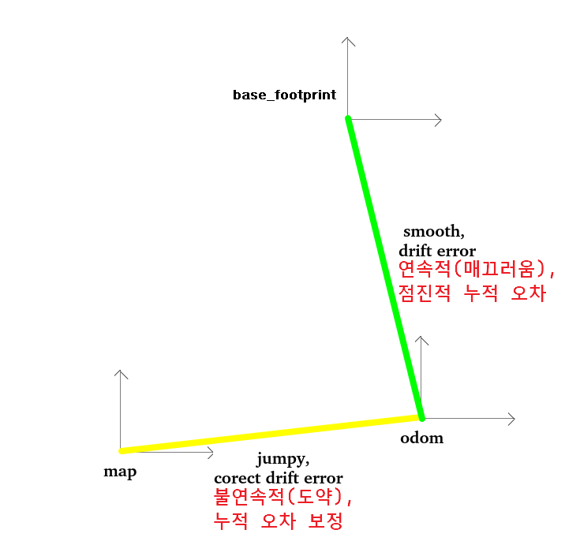

6. [Nav2 Goal]을 클릭한 후, 첫 번째 목표 위치와 방향을 지정합니다.

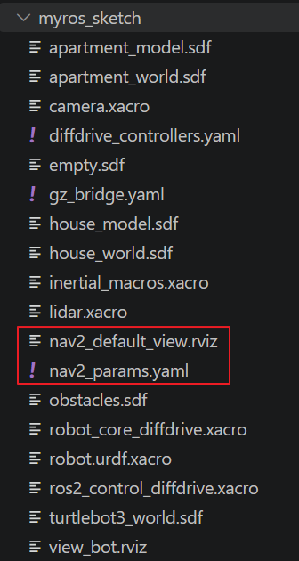

7. 두 번째 목표 위치를 설정합니다.

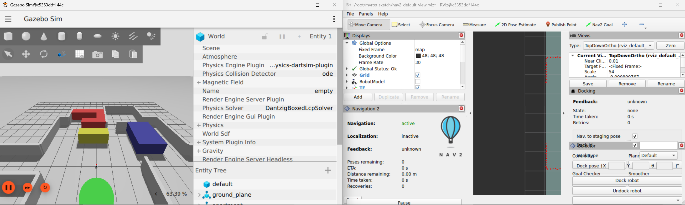

8. 세 번째 목표 위치를 설정합니다.

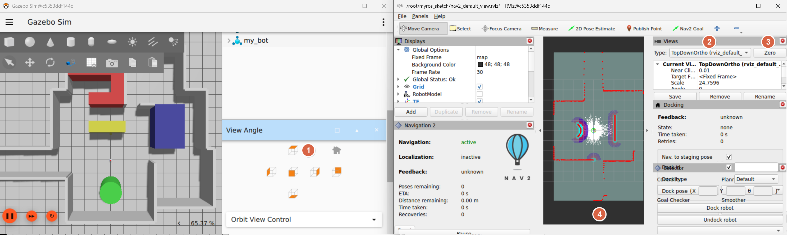

9. waypoint 저장 버튼을 눌러줍니다.

10. myros_sketch 디렉토리 아래 my_waypoints로 저장해 줍니다.

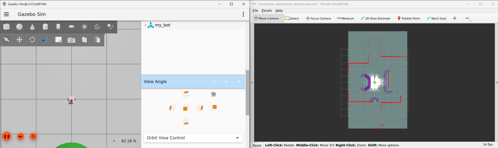

11. 파일의 내용을 살펴봅니다.

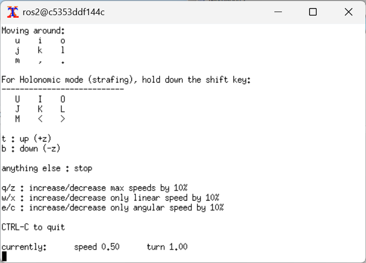

> 파일의 내용은 각 waypoint에서의 위치/방향 정보로 구성됩니다. 이 파일은 이후에 [Load WPs] 버튼을 이용하여 재사용할 수 있습니다. 또, 순찰 미션 로봇 등을 프로그래밍할 때 활용할 수 있습니다.

12. 다음 ① 또는 ② 버튼 중 하나를 눌러줍니다. 여기서는 ② 버튼을 눌러줍니다.

- **① Start Nav Through Poses**: 여러 지점을 정지 없이 하나의 경로로 매끄럽게 통과 → 경유용
- **② Start Waypoint Following**: 지점마다 완전히 멈춰서 도착 후, 대기·촬영 같은 동작까지 수행 가능 → 순찰용

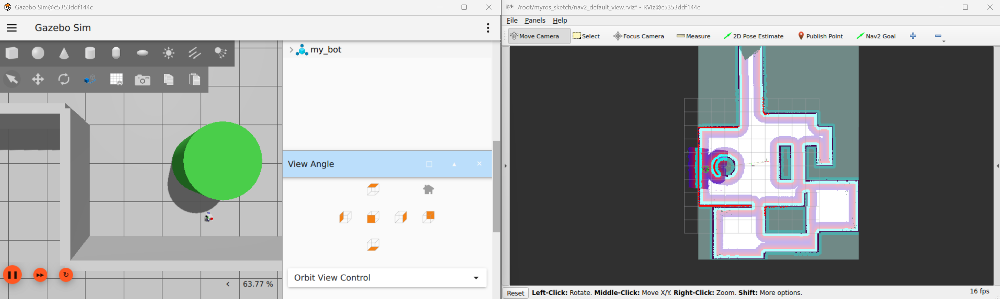

13. 로봇이 이동하기 시작합니다.

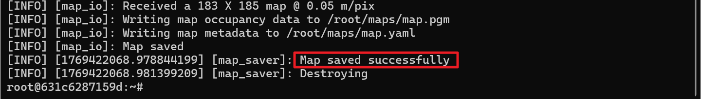

14. 로봇이 목표 지점에 도착한 상태를 표시합니다.

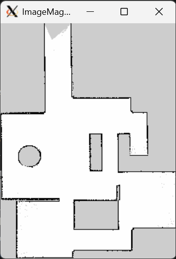

> ※ 목표 지점에 도착하면 waypoint는 사라집니다. waypoint는 다음 버튼을 이용하여 다시 로드할 수 있습니다.
> ※ 다중 목표점 자율주행은 시간이 많이 걸리기도 합니다. 또, 중간에 실패하기도 합니다.

## 05_4 nav2_with_map.launch.py 파일 작성하기

LLM을 이용하여 앞에서 수행한 다음 명령들을 하나로 묶어 수행할 수 있는 launch 파일을 작성해 봅니다.

```
① ros2 launch myrosbot_one robot_bringup.launch.py
② ros2 launch nav2_bringup bringup_launch.py map:=$HOME/maps/map.yaml params_file:=/root/myros_sketch/nav2_params.yaml use_sim_time:=True
③ rviz2 -d /root/myros_sketch/nav2_default_view.rviz \
 --ros-args -p use_sim_time:=true
④ ros2 run twist_stamper twist_stamper \
  --ros-args \
  -r cmd_vel_in:=/cmd_vel \
  -r cmd_vel_out:=/diff_drive_controller/cmd_vel \
  -p frame_id:=base_link \
  -p use_sim_time:=true
```

1. launch 파일을 생성합니다.

```bash
touch /root/myros_ws/src/myrosbot_one/launch/nav2_with_map.launch.py
```

### Vibe Coding 프롬프트

> myrosbot_one 패키지에서 다음 명령을 수행하는 launch 파일을 작성해줘.
> nav2_params.yaml 파일은 하위 config 폴더에 있어.
> nav2_default_view.rviz 파일은 하위 rviz 폴더에 있어.
> 파일의 이름은 nav2_with_map.launch.py야.
> ```
> ros2 launch myrosbot_one robot_bringup.launch.py
> ros2 launch nav2_bringup bringup_launch.py map:=$HOME/maps/map.yaml params_file:=/root/myros_sketch/nav2_params.yaml use_sim_time:=True
> rviz2 -d /root/myros_sketch/nav2_default_view.rviz \
>  --ros-args -p use_sim_time:=true
> ros2 run twist_stamper twist_stamper \
>   --ros-args \
>   -r cmd_vel_in:=/cmd_vel \
>   -r cmd_vel_out:=/diff_drive_controller/cmd_vel \
>   -p frame_id:=base_link \
>   -p use_sim_time:=true
> ```

2. LLM이 생성해 준 파일의 내용을 nav2_with_map.launch.py 파일에 복사합니다.

3. 기존에 실행 중인 프로그램들을 ctrl+c를 눌러 모두 종료합니다.

4. 빌드를 수행합니다.

```bash
cd ~/myros_ws
colcon build --packages-select myrosbot_one
```

5. launch 파일을 실행합니다.

```bash
source install/setup.bash
ros2 launch myrosbot_one nav2_with_map.launch.py
```

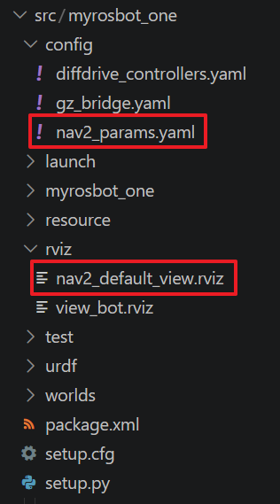

## 05_5 WayPoint에서 사진 찍기

여기서는 waypoint에서 사진을 찍어 저장하는 동작을 수행해 봅니다.

1. VS Code에서 [myrosbot_one]--[config]--[nav2_params.yaml] 파일을 열어줍니다.

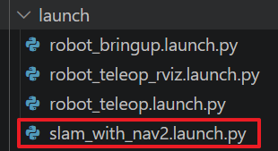

2. waypoint_follower 라벨을 찾은 후, photo_action 및 duration을 추가/수정해 줍니다.


> waypoint에서 사용할 수 있는 동작은 **WaitAtWaypoint, PhotoAtWaypoint, InputAtWaypoint**의 3가지입니다. 각각 일정 시간 대기, 사진 찍기, 일정 시간 사용자 입력 대기 동작을 수행합니다. 이 동작들 중 하나만 선택할 수 있으며, 모든 waypoint에 공통 적용됩니다.

3. 빌드를 수행합니다.

```bash
cd ~/myros_ws
colcon build --packages-select myrosbot_one
```

4. 사진을 저장할 디렉토리를 생성합니다.

```bash
mkdir /root/patrol_photos
```

5. launch 파일을 실행합니다.

```bash
source install/setup.bash
ros2 launch myrosbot_one nav2_with_map.launch.py
```

6. Nav2 시각화가 나타납니다.

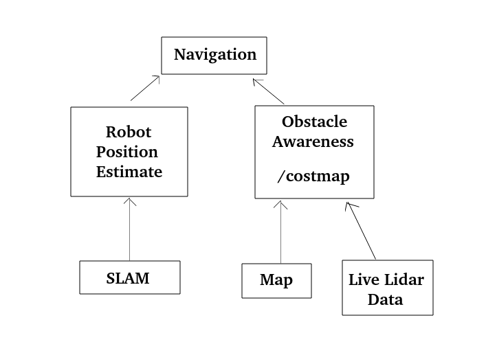

7. [2D Pose Estimate]를 클릭한 후, 로봇의 위치와 방향을 설정합니다.

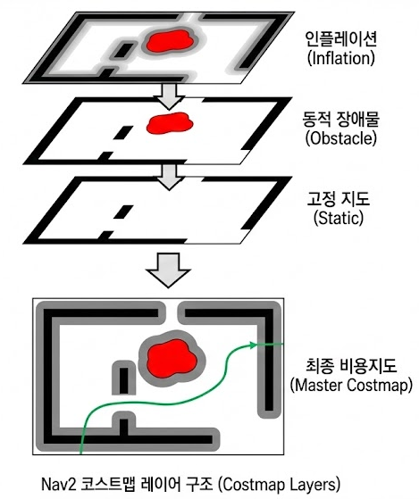

8. costmap이 표시됩니다.

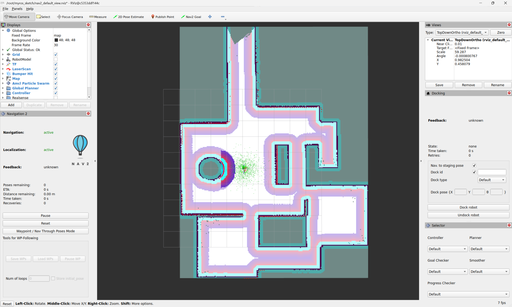

9. WayPoint 메뉴로 전환합니다.

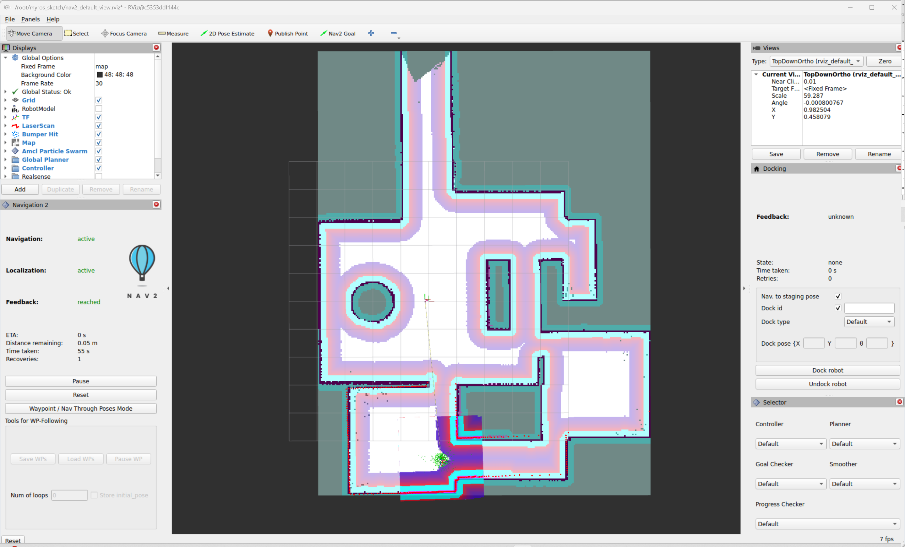

10. [my_waypoints.yaml] 파일을 선택합니다.

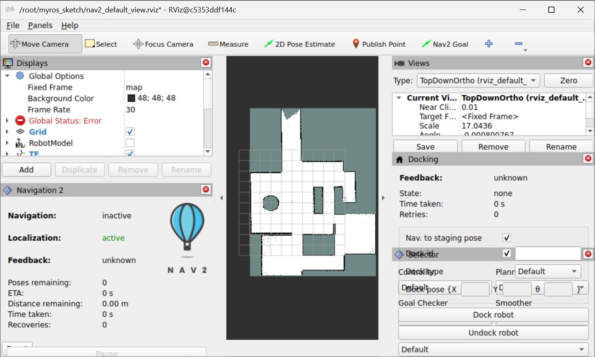

11. waypoint가 적용됩니다.

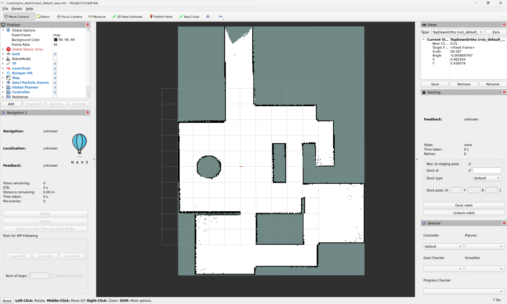

12. 시작 버튼을 눌러줍니다.

13. waypoint마다 사진 파일이 생성되는 것을 확인합니다.

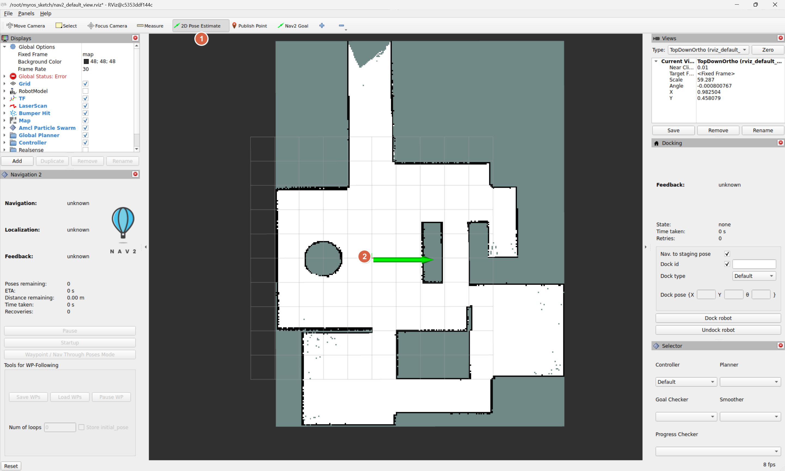

14. 그림 파일을 열어보면 다음과 같습니다.


> ※ rviz2의 waypoint 기능은 waypoint마다 수행할 수 있는 동작이 같습니다. 예를 들어, 지점에 따라 사진을 찍거나, 일정 시간 대기하거나 하는 동작을 섞을 수 없습니다.

## 05_6 Waypoint별 사용자 정의 미션 수행하기

여기서는 RViz2에서 저장한 waypoint 정보를 이용하여 각 waypoint에 도착한 후 사용자 정의 미션을 수행하는 방법을 알아봅니다.

### 파일 생성하기

1. 파일을 생성합니다.

```bash
cd ~/myros_sketch
touch my_waypoints.yaml
touch my_waypoints_missions.yaml
touch my_waypoints_patrol.py
```

### waypoint 파일 준비하기

2. 앞에서 [Save WPs] 버튼을 이용하여 저장했던 파일을 새로 생성한 my_waypoints.yaml로 복사합니다.

**my_waypoints.yaml**

```yaml
waypoints:
  waypoint0:
    pose:
      - 0.52060890197753906
      - -5.717714786529541
      - 0
    orientation:
      - 0.99999991971102986
      - 0
      - 0
      - -0.00040072176609573225
  waypoint1:
    pose:
      - 5.9298391342163086
      - -3.4442670345306396
      - 0
    orientation:
      - 0.41358036896694689
      - 0
      - 0
      - 0.91046761524238962
  waypoint2:
    pose:
      - 0.067566998302936554
      - 6.6715421676635742
      - 0
    orientation:
      - 0.70682360791746024
      - 0
      - 0
      - -0.70738984109933645
```

waypoint의 구조는 다음과 같습니다.

```yaml
waypoint0:
  pose:          # 위치 (x, y, z)
    - x
    - y
    - z
  orientation:   # 자세 quaternion (qx, qy, qz, qw)
    - qx
    - qy
    - qz
    - qw
```

### mission 파일 준비하기

3. waypoint별로 수행할 mission을 작성합니다.

**my_waypoints_missions.yaml**

```yaml
missions:
  waypoint0:
    task: photo
  waypoint1:
    task: wait
    duration: 5.0
  waypoint2:
    task: photo
```

> waypoint0에서는 사진 찍기, waypoint1에서는 5초간 대기, waypoint2에서는 사진 찍기를 수행하는 경우입니다.
> ※ task는 photo, wait 외에도 inspect, pickup, deliver, charge 등을 정의할 수 있습니다.

### mission 수행 노드 작성하기

4. waypoint별로 mission을 수행하는 노드를 작성합니다.

**my_waypoints_patrol.py**

```python
import yaml
import rclpy

from rclpy.node import Node
from rclpy.action import ActionClient
from nav2_msgs.action import NavigateToPose

class MyWaypointNode(Node):
	def __init__(self):
		super().__init__("my_waypoint_node")

		# 1. waypoint 파일 읽기
		with open("my_waypoints.yaml") as f:
			waypoint_config = yaml.safe_load(f)

		self.waypoints = waypoint_config["waypoints"]

		# 2. mission 파일 읽기
		with open("my_waypoints_missions.yaml") as f:
			mission_config = yaml.safe_load(f)

		self.missions = mission_config["missions"]

		# 3. Nav2 Action Client
		self.nav_client = ActionClient(
			self,
			NavigateToPose,
			"/navigate_to_pose"
		)

	def run(self):
		
		self.nav_client.wait_for_server()

		for name, waypoint in self.waypoints.items():

			self.get_logger().info(
				f"Navigate to {name}"
			)

			# -------------------------
			# NavigateToPose Goal
			# -------------------------

			goal = NavigateToPose.Goal()

			goal.pose.header.frame_id = "map"
			goal.pose.header.stamp = self.get_clock().now().to_msg()

			goal.pose.pose.position.x = float(waypoint["pose"][0])
			goal.pose.pose.position.y = float(waypoint["pose"][1])
			goal.pose.pose.position.z = float(waypoint["pose"][2])

			goal.pose.pose.orientation.x = float(waypoint["orientation"][0])
			goal.pose.pose.orientation.y = float(waypoint["orientation"][1])
			goal.pose.pose.orientation.z = float(waypoint["orientation"][2])
			goal.pose.pose.orientation.w = float(waypoint["orientation"][3])

			# -------------------------
			# Navigation
			# -------------------------

			send_goal_future = self.nav_client.send_goal_async(goal)

			rclpy.spin_until_future_complete(
				self,
				send_goal_future
			)

			goal_handle = send_goal_future.result()

			if not goal_handle.accepted:
				self.get_logger().error(
					f"Goal rejected: {name}"
				)
				return

			result_future = goal_handle.get_result_async()

			rclpy.spin_until_future_complete(
				self,
				result_future
			)

			# -------------------------
			# Mission
			# -------------------------

			mission = self.missions.get(name)

			if mission is None:
				continue

			task = mission["task"]

			if task == "photo":
				self.take_photo()

			elif task == "wait":
				duration = float(mission["duration"])
				self.wait(duration)

	def take_photo(self):
		self.get_logger().info("Take photo")

		# TODO:
		# camera 처리

	def wait(self, duration):
		self.get_logger().info(
			f"Wait {duration} seconds"
		)

		# TODO:
		# 실제 대기 구현


def main(args=None):

	rclpy.init(args=args)
	node = MyWaypointNode()
	node.run()
	node.destroy_node()
	rclpy.shutdown()

if __name__ == "__main__":
	main()
```

> take_photo()와 wait()의 실제 수행 동작을 구현해야 합니다. 여기서는 구체적인 구현을 생략합니다.

### 실행하기

5. launch 파일을 실행합니다.

```bash
cd ~/myros_ws
source install/setup.bash
ros2 launch myrosbot_one nav2_with_map.launch.py
```

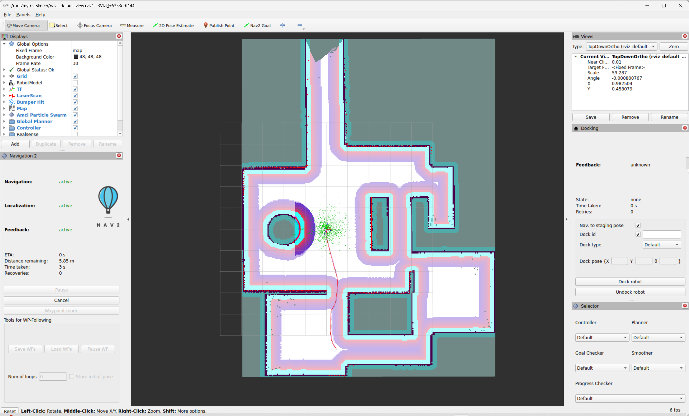

6. [2D Pose Estimate]를 클릭한 후, 로봇의 위치와 방향을 설정합니다.

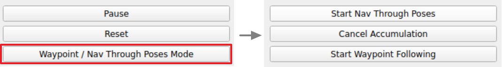

7. costmap이 표시됩니다.

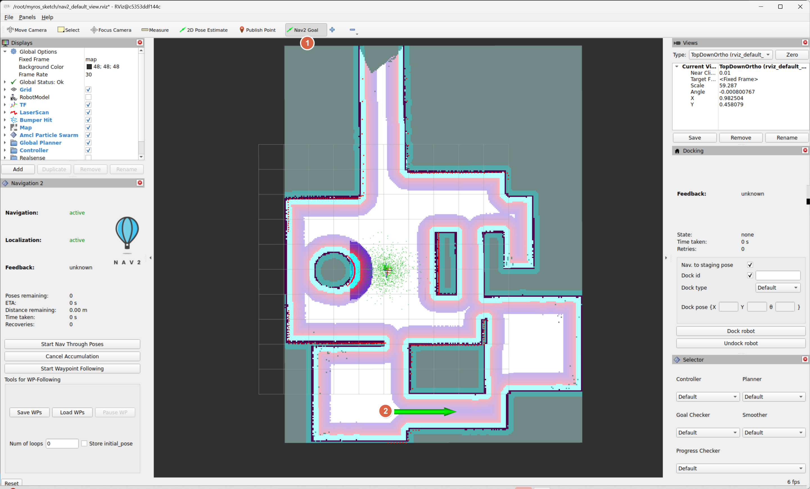

8. 새로운 VS Code 터미널에서 mission 노드를 실행합니다.

```bash
cd ~/myros_sketch
python3 my_waypoints_patrol.py
```

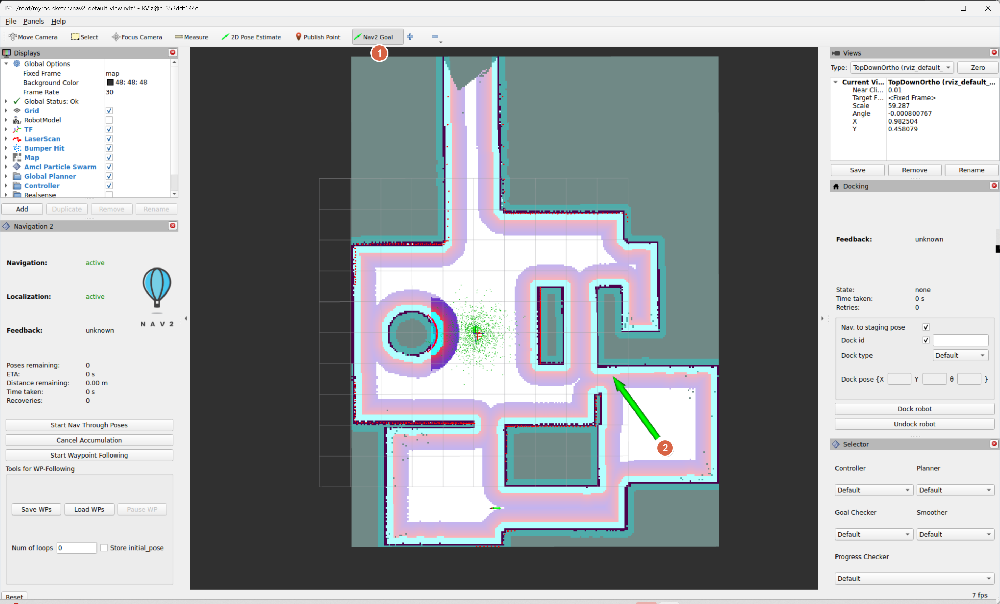

9. mission 수행을 확인합니다.

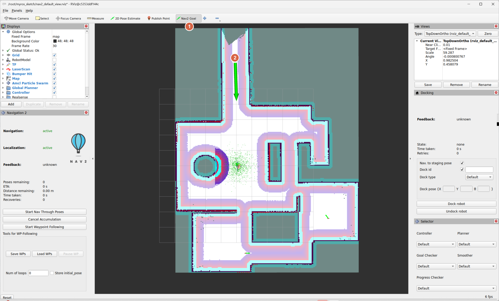

10. mission 완료 후, 출력 결과를 확인합니다.

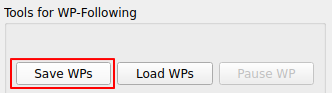
